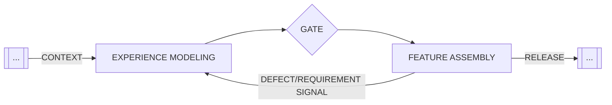
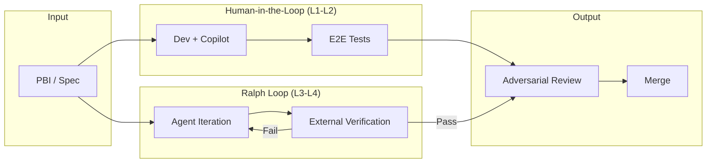
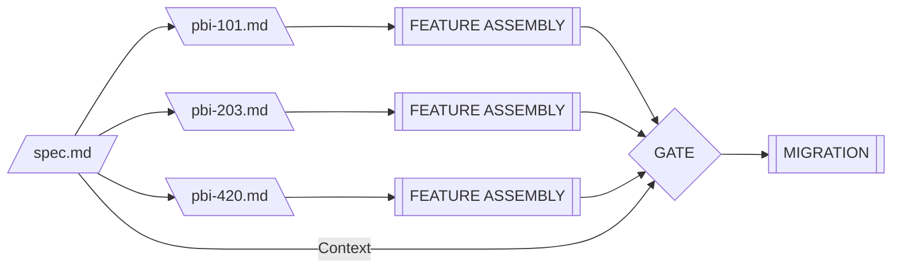
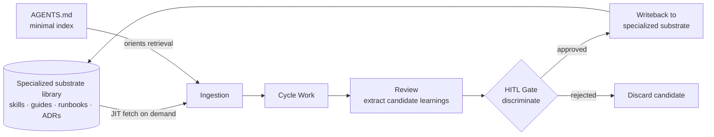
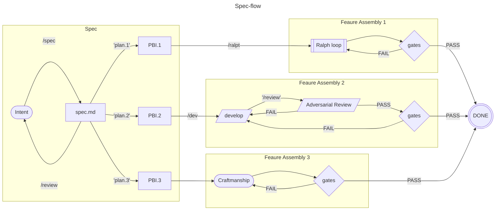
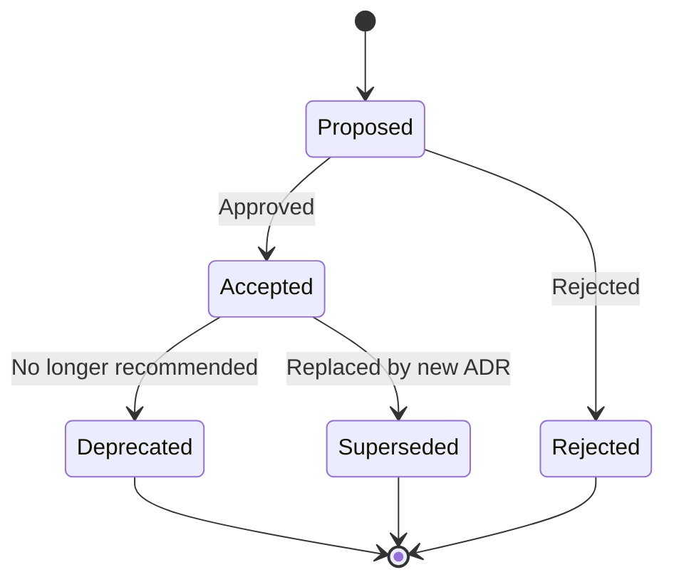
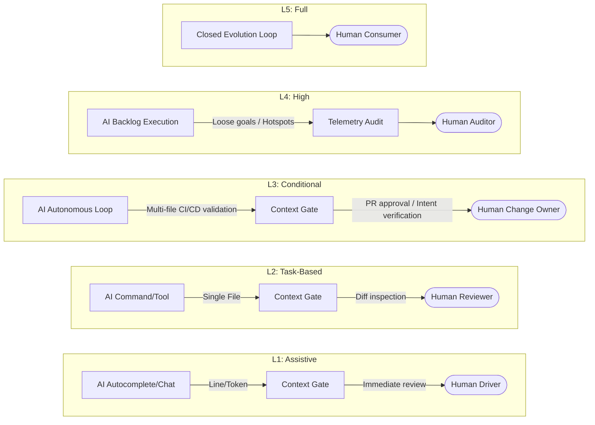
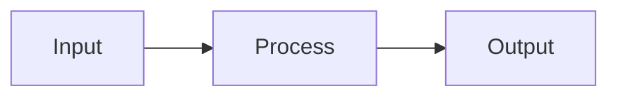
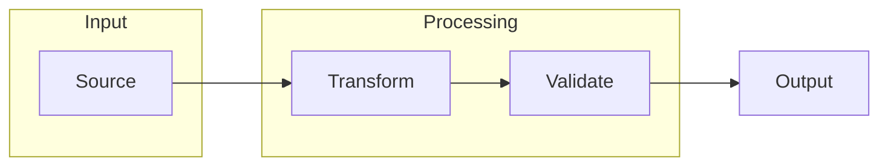
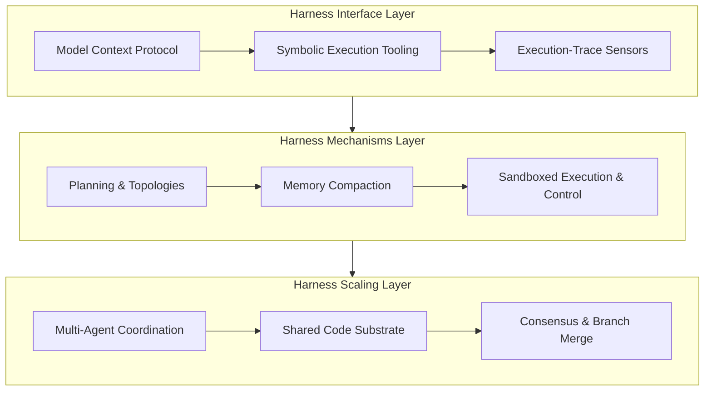

# ASDLC.io — Field Manual

- **Source**: https://asdlc.io/fieldmanual/
- **Type**: Web reference (scraped via Firecrawl)

---

# ASDLC.io   Field Manual

Version: 0.24.1

Generated: 2026-05-28

## Table of Contents

### Part I: Patterns

- [Adversarial Code Review](https://asdlc.io/fieldmanual/#adversarial-code-review)
- [Agent Constitution](https://asdlc.io/fieldmanual/#agent-constitution)
- [Constitutional Review](https://asdlc.io/fieldmanual/#constitutional-review)
- [Experience Modeling](https://asdlc.io/fieldmanual/#experience-modeling)
- [Model Routing](https://asdlc.io/fieldmanual/#model-routing)
- [Product Vision](https://asdlc.io/fieldmanual/#product-vision)
- [Ralph Loop](https://asdlc.io/fieldmanual/#ralph-loop)
- [Specs](https://asdlc.io/fieldmanual/#the-spec)
- [The ADR](https://asdlc.io/fieldmanual/#the-adr)
- [The Compound Loop](https://asdlc.io/fieldmanual/#compound-loop)
- [The PBI](https://asdlc.io/fieldmanual/#the-pbi)
- [Agent Optimization Loop](https://asdlc.io/fieldmanual/#agent-optimization-loop)
- [Agentic Double Diamond](https://asdlc.io/fieldmanual/#agentic-double-diamond)
- [Artifact Import](https://asdlc.io/fieldmanual/#artifact-import)
- [Context Gates](https://asdlc.io/fieldmanual/#context-gates)
- [Context Map](https://asdlc.io/fieldmanual/#context-map)
- [Spec Reversing](https://asdlc.io/fieldmanual/#spec-reversing)

### Part II: Practices

- [ADR Authoring](https://asdlc.io/fieldmanual/#adr-authoring)
- [Adversarial Code Review](https://asdlc.io/fieldmanual/#adversarial-code-review)
- [Agent Personas](https://asdlc.io/fieldmanual/#agent-personas)
- [AGENTS.md Specification](https://asdlc.io/fieldmanual/#agents-md-spec)
- [Living Specs](https://asdlc.io/fieldmanual/#living-specs)
- [Micro-Commits](https://asdlc.io/fieldmanual/#micro-commits)
- [PBI Authoring](https://asdlc.io/fieldmanual/#pbi-authoring)
- [Adversarial Requirement Review](https://asdlc.io/fieldmanual/#adversarial-requirement-review)
- [Constitutional Review Implementation](https://asdlc.io/fieldmanual/#constitutional-review-implementation)
- [Context Mapping](https://asdlc.io/fieldmanual/#context-mapping)
- [Context Offloading](https://asdlc.io/fieldmanual/#context-offloading)
- [Workflow as Code](https://asdlc.io/fieldmanual/#workflow-as-code)

### Appendix: Concepts

- [Agentic SDLC](https://asdlc.io/fieldmanual/#agentic-sdlc)
- [Architecture Decision Record](https://asdlc.io/fieldmanual/#architecture-decision-record)
- [Behavior-Driven Development](https://asdlc.io/fieldmanual/#behavior-driven-development)
- [Compound Engineering](https://asdlc.io/fieldmanual/#compound-engineering)
- [Context Anchoring](https://asdlc.io/fieldmanual/#context-anchoring)
- [Context Engineering](https://asdlc.io/fieldmanual/#context-engineering)
- [Extreme Programming](https://asdlc.io/fieldmanual/#extreme-programming)
- [Gherkin](https://asdlc.io/fieldmanual/#gherkin)
- [Levels of Autonomy](https://asdlc.io/fieldmanual/#levels-of-autonomy)
- [Mermaid](https://asdlc.io/fieldmanual/#mermaid)
- [Model Context Protocol (MCP)](https://asdlc.io/fieldmanual/#model-context-protocol)
- [Model-Driven Development](https://asdlc.io/fieldmanual/#model-driven-development)
- [OODA Loop](https://asdlc.io/fieldmanual/#ooda-loop)
- [Provenance](https://asdlc.io/fieldmanual/#provenance)
- [ReAct Pattern](https://asdlc.io/fieldmanual/#react-pattern)
- [Request for Comments](https://asdlc.io/fieldmanual/#request-for-comments)
- [Spec-Driven Development](https://asdlc.io/fieldmanual/#spec-driven-development)
- [The 4D Framework (Anthropic)](https://asdlc.io/fieldmanual/#4d-framework)
- [The Learning Loop](https://asdlc.io/fieldmanual/#learning-loop)
- [Triple Debt Model](https://asdlc.io/fieldmanual/#triple-debt-model)
- [Vibe Coding](https://asdlc.io/fieldmanual/#vibe-coding)
- [YAML](https://asdlc.io/fieldmanual/#yaml)
- [AI Software Factory](https://asdlc.io/fieldmanual/#ai-software-factory)
- [Digital Twins](https://asdlc.io/fieldmanual/#digital-twins)
- [Event Modeling](https://asdlc.io/fieldmanual/#event-modeling)
- [Feedback Loop Compression](https://asdlc.io/fieldmanual/#feedback-loop-compression)
- [Harness Engineering](https://asdlc.io/fieldmanual/#harness-engineering)
- [PR Slop](https://asdlc.io/fieldmanual/#pr-slop)
- [Product Requirement Prompt (PRP)](https://asdlc.io/fieldmanual/#product-requirement-prompt)
- [Product Thinking](https://asdlc.io/fieldmanual/#product-thinking)
- [Production Readiness Gap](https://asdlc.io/fieldmanual/#production-readiness-gap)
- [Theory of LLM Constraints](https://asdlc.io/fieldmanual/#theory-of-llm-constraints)

# Part I: Patterns

## Adversarial Code Review

Consensus verification pattern using a secondary Critic Agent to review Builder Agent output against the Spec.

Status: Live \|
 Last Updated: 2026-01-31

## Definition

**Adversarial Code Review** is a verification pattern where a distinct AI session—the **Critic Agent**—reviews code produced by the **Builder Agent** against the [Spec](https://asdlc.io/patterns/the-spec) before human review.

This extends the [Critic (Hostile Agent)](https://asdlc.io/patterns/agentic-double-diamond) pattern from the design phase into the implementation phase, creating a verification checkpoint that breaks the “echo chamber” where a model validates its own output.

The Builder Agent (optimized for speed and syntax) generates code. The Critic Agent (optimized for reasoning and logic) attempts to reject it based on spec violations.

## The Problem: Self-Validation Ineffectiveness

LLMs are probabilistic text generators trained to be helpful. When asked “Check your work,” a model that just generated code will often:

**Hallucinate correctness** — Confidently affirm that buggy logic is correct because it matches the plausible pattern in training data.

**Double down on errors** — Explain why the bug is actually a feature, reinforcing the original mistake.

**Share context blindness** — Miss gaps because it operates within the same context window and reasoning path that produced the original output.

If the same computational session writes and reviews code, the “review” provides minimal independent validation.

## The Solution: Separated Roles (and Parallel Critique)

To create effective verification, separate the generation and critique roles. Advanced implementations also utilize **parallel multi-model critique** to find overlapping issues before synthesizing the results.

**The Builder** — Optimizes for implementation throughput (e.g., Gemini 3 Flash, Claude Haiku 4.5). Generates code from the PBI and Spec.

**The Critic Lanes** — A set of independent models (e.g., an illustrative “Tri-Model Lane” approach with independent Architect, SecOps, and QA personas) optimized for specific validation dimensions. Models must have strict [Provenance](https://asdlc.io/concepts/provenance) identity separation so their actions are audited independently.

The Critics do not generate alternative implementations. They act as gatekeepers, producing either **PASS** or a list of **spec violations** that must be addressed.

## The Workflow

### 1\. Build Phase

The Builder Agent implements the PBI according to the Spec.

**Output:** Code changes, implementation notes.

**Example:** “Updated `auth.ts` to support OAuth login flow.”

### 2\. Context Swap (Fresh Eyes)

**Critical:** Start a new AI session or chat thread for critique. This clears conversation drift and forces the Critic to evaluate only the artifacts (Spec + Diff), not the Builder’s reasoning process.

If using the same model, close the current chat and open a fresh session. If using [Model Routing](https://asdlc.io/patterns/model-routing), switch to High Reasoning models for parallel critique.

### 3\. Critique Phase

Feed the Spec and the code diff to the Critic Agents with adversarial framing. Advanced factories run these in parallel lanes using specialized prompts (for example, the Architect persona below):

**System Prompt (Architect Critic Example):**

```plaintext
You are a rigorous Code Reviewer validating implementation against contracts.

Input:
- Spec: specs/auth-system.md
- Code Changes: src/auth.ts (diff)

Task:
Compare the code strictly against the Spec's Blueprint (constraints) and Contract (quality criteria).

Identify:
1. Spec violations (missing requirements, violated constraints)
2. Security issues (injection vulnerabilities, auth bypasses)
3. Edge cases not handled (error paths, race conditions)
4. Anti-patterns explicitly forbidden in the Spec

Output Format:
- PASS (if no violations)
- For each violation, provide:
  1. Violation Description (what contract was broken)
  2. Impact Analysis (why this matters: performance, security, maintainability)
  3. Remediation Path (ordered list of fixes, prefer standard patterns, escalate if needed)
  4. Test Requirements (what tests would prevent regression)

This transforms critique from "reject" to "here's how to fix it."
```

### 3b. Moderator Synthesis (For Parallel Critique)

When a pattern incorporates multiple parallel Critics, a **Moderator** role becomes an architectural requirement to prevent alert fatigue and conflicting directives.

The essential shape of this architecture structurally separates the read-only analysis (performed by the parallel Critics) from the synthesis and write actions (performed exclusively by the Moderator). The Moderator acts as a deduplication and prioritization layer, ensuring the Builder agent receives a single, unified checklist of violations rather than a barrage of uncoordinated feedback.

### 4\. Verdict

**If PASS (or resolved by Synthesis):** Code moves to human Acceptance Gate (L3 review for strategic fit).

**If FAIL:** Violations are fed back to Builder as a new task: “Address these spec violations before proceeding.”

This creates a [Context Gate](https://asdlc.io/patterns/context-gates) between code generation and human review.

## Relationship to Context Gates

Adversarial Code Review implements a **Review Gate** as defined in [Context Gates](https://asdlc.io/patterns/context-gates):

**Quality Gates** (deterministic) — Verify syntax, compilation, linting, test passage.

**Review Gates** (probabilistic, adversarial) — Verify semantic correctness, spec compliance, architectural consistency. **This is where Adversarial Code Review operates.**

**Acceptance Gates** (subjective, HITL) — Verify strategic fit and product vision alignment.

The Critic sits between automated tooling and human review, catching issues that compilers miss but that don’t require human strategic judgment.

## Integration with Model Routing

Use [Model Routing](https://asdlc.io/patterns/model-routing) to assign models by capability profile:

| Role | Model Profile | Rationale |
| --- | --- | --- |
| Builder | High Throughput | Fast code generation with strong syntax knowledge |
| Critic(s) | High Reasoning | Deep logic evaluation, constraint satisfaction, edge case discovery. Can be broken into specialized lanes (Arch, QA, SecOps). |

This leverages the strengths of each model class: speed for generation, reasoning depth for validation.

## Strategic Value

**Reduces L3 Cognitive Load** — Human reviewers focus on “Is this the right product?” rather than catching spec deviations or missing error handling.

**Catches Regression to Mediocrity** — Coding models gravitate toward average solutions. The Critic enforces novelty and architectural intent from the Spec.

**Enforces Spec Quality** — If the Critic can’t determine whether code is correct, the Spec is ambiguous. This surfaces specification gaps.

**Prevents Silent Failures** — The Critic catches implementation shortcuts (skipped validation, missing edge cases) that pass tests but violate contracts.

## Validated in Practice

**Case Study: Claudio Lassala (January 2026)**

A production implementation validated this pattern’s effectiveness:

**Context:** A user story required filtering audit logs by date range. The Builder Agent implemented the requirement, tests passed, and the code compiled without errors.

**Issue Detected:** The Critic Agent identified a silent performance violation:

```csharp
// Implementation passed all Quality Gates but violated architectural constraint
var logs = await repository.LoadAll(); // Loads entire table into memory
return logs.Where(log => log.Date > startDate); // Filters in-memory
```

**Critic Output:**

```plaintext
VIOLATION: Performance - Data Access Pattern

Spec requires database-level filtering for datasets exceeding 1k records.
Implementation loads full table then filters in-memory.

Impact: Works with small data; fails at scale (10k+ records cause memory issues)

Remediation Path:
1. Push filtering to database: repository.FindWhere(x => x.Date > startDate)
2. If ORM doesn't support this filter, use raw SQL
3. Add performance test with 10k+ mock records to prevent regression
4. Document the constraint in the repository interface
```

**Key Learnings:**

1. **Silent Performance Risks** — Code that passes all tests can still violate architectural constraints. The Critic caught the `LoadAll().Filter()` anti-pattern before production.

2. **Iterative Refinement** — The Critic initially flagged “missing E2E tests,” which were actually present but structured differently. The team updated the Critic’s instructions to recognize the project’s test architecture, demonstrating the pattern’s adaptability.

3. **Tone Calibration** — Using “Approve with suggestions” framing prevented blocking valid code while surfacing genuine risks. The Critic didn’t reject the PR—it flagged optimization opportunities with clear remediation paths.


This validates the pattern’s core thesis: adversarial review catches architectural violations that pass deterministic checks but violate semantic contracts.

## Example: The Silent Performance Bug

**Spec Contract:** “All database retries must use exponential backoff to prevent thundering herd during outages.”

**Builder Output:** Clean code with a simple retry loop using fixed 1-second delays. Tests pass.

```typescript
// src/db.ts
async function queryWithRetry(sql: string) {
  for (let i = 0; i < 5; i++) {
    try {
      return await db.query(sql);
    } catch (err) {
      await sleep(1000); // Fixed delay
    }
  }
}
```

**Critic Response:**

```plaintext
VIOLATION: src/db.ts Line 45

Spec requires exponential backoff. Implementation uses constant sleep(1000).

Impact: During database outages, this will cause thundering herd problems
as all clients retry simultaneously.

Required: Implement delay = baseDelay * (2 ** attemptNumber)
```

Without the Critic, a human skimming the PR might miss the constant delay. The automated tests wouldn’t catch it (the code works). The Critic, reading against the contract, identifies the violation.

## Implementation Constraints

**Not Automated (Yet)** — As of December 2025, this requires manual orchestration. Engineers must manually switch sessions/models and feed context to the Critic.

**Context Window Limits** — Large diffs may exceed even Massive Context models. Use [Context Gates](https://asdlc.io/patterns/context-gates) filtering to provide only changed files + relevant Spec sections.

**Critic Needs Clear Contracts** — The Critic can only enforce what’s documented in the Spec. Vague specs produce vague critiques.

**Negation Blindness** — LLMs are statistically predisposed to underweight negation (Truong et al., 2023). Spec constraints framed as “DO NOT” clauses are the weakest link in probabilistic review — the Critic is most likely to false-negative on exactly the violations that are expressed as negations. This is a structural property of autoregressive prediction, not a model-specific deficiency, and is the primary reason adversarial review requires deterministic [Context Gate](https://asdlc.io/patterns/context-gates) backing rather than relying on the Critic alone.

**Model Capability Variance** — Not all “reasoning” models perform equally at code review. Validate your model’s performance on representative examples.

## Relationship to Agent Constitution

The [Agent Constitution](https://asdlc.io/patterns/agent-constitution) defines behavioral directives for agents. For Adversarial Code Review:

**Builder Constitution:** “Implement the Spec’s contracts. Prioritize clarity and correctness over cleverness.”

**Critic Constitution:** “You are skeptical. Your job is to reject code that violates the Spec, even if it ‘works.’ Favor false positives over false negatives.”

This frames the Critic’s role as adversarial by design—it’s explicitly told to be rigorous and skeptical, counterbalancing the Builder’s helpfulness bias.

## Future Automation Potential

This pattern is currently manual but has clear automation paths:

**CI/CD Integration** — Run Critic automatically on PR creation, posting violations as review comments.

**IDE Integration** — Real-time critique as code is written, similar to linting but spec-aware.

**Multi-Agent Orchestration** — Automated handoff between Builder and Critic until PASS is achieved.

### Programmatic Orchestration (Workflow as Code)

To scale this pattern, move from manual prompt-pasting to code-based orchestration (e.g., using the Claude Code SDK).

**Convention-Based Loading:**
Store reviewer agent prompts in a standard directory (e.g., `.claude/agents/`) and load them dynamically:

```typescript
// Load the specific reviewer agent
const reviewerPrompt = await fs.readFile(`.claude/agents/${agentName}.md`);

// Spawn subagent via SDK
const reviewResult = await claude.query({
  prompt: reviewerPrompt,
  context: { spec, diff },
  outputFormat: { type: 'json_schema', schema: ReviewSchema }
});
```

This allows you to treat Critic Agents as **standardized, version-controlled functions** in your build pipeline.

As agent orchestration tooling matures, this pattern may move from Experimental to Standard.

See also:

- [Context Gates](https://asdlc.io/patterns/context-gates) — The architectural checkpoint pattern this implements
- [The Spec](https://asdlc.io/patterns/the-spec) — The source of truth the Critic validates against
- [Model Routing](https://asdlc.io/patterns/model-routing) — How to assign different models to Builder and Critic roles
- [Agentic Double Diamond](https://asdlc.io/patterns/agentic-double-diamond) — The design-phase Critic pattern this extends
- [Adversarial Requirement Review](https://asdlc.io/patterns/adversarial-requirement-review) — The upstream verification pattern for problem definitions
- [Agent Constitution](https://asdlc.io/patterns/agent-constitution) — How to frame Critic behavior as adversarial
- [Artifact Import](https://asdlc.io/patterns/artifact-import) — The audit step at the enterprise checkpoint is structurally equivalent to this pattern

### Related Concepts

- [Agentic SDLC](https://asdlc.io/concepts/agentic-sdlc) — The Verification phase where this pattern operates
- [Levels of Autonomy](https://asdlc.io/concepts/levels-of-autonomy) — L3 autonomy requires verification before human review

## Agent Constitution

Persistent, high-level directives that shape agent behavior and decision-making before action.

Status: Live \|
 Last Updated: 2026-02-18

## Definition

An **Agent Constitution** is a set of high-level principles or “Prime Directives” injected into an agent’s system prompt to align its intent and behavior with system goals.

The concept originates from Anthropic’s [Constitutional AI](https://arxiv.org/abs/2212.08073) research, which proposed training models to be “Helpful, Honest, and Harmless” (HHH) using a written constitution rather than human labels alone. In the ASDLC, we adapt this alignment technique to **System Prompt Engineering**—using the Constitution to define the “Superego” of our coding agents.

## The Problem: Infinite Flexibility

Without a Constitution, an Agent is purely probabilistic. It will optimize for being “helpful” to the immediate prompt user, often sacrificing long-term system integrity.

If a prompt says “Implement this fast,” a helpful agent might skip tests. A Constitutional Agent would refuse: “I cannot skip tests because Principle #3 forbids merging unverified code.”

## The Solution: Proactive Behavioral Alignment

The Constitution shapes agent behavior **before** action occurs—unlike reactive mechanisms (tests, gates) that catch problems after the fact.

### The Driver Training Analogy

To understand the difference between a Constitution and other control mechanisms, consider the analogy of driving a car:

- **The Spec**: The Destination. “Drive to 123 Main St.”
- **Context Gates**: The Brakes/Guardrails. Hard limits that stop the car if it’s about to hit a wall (e.g., “Stop if compilation fails”). These are reactive.
- **Agent Constitution**: The Driver Training. The internalized rules (“Drive defensively,” “Yield to pedestrians”) that shape how the driver steers _before_ any danger arises. This is proactive.

## The “Orient” Phase

In the [OODA Loop](https://asdlc.io/concepts/ooda-loop) (Observe-Orient-Decide-Act), the Constitution lives squarely in the **Orient** phase.

When an agent **Observes** the world (reads code, sees a user request), the Constitution acts as a filter for how it interprets those observations.

- A “Helpful” Constitution might interpret a vague request as an opportunity to guess and assist.
- A “Skeptical” Constitution might interpret the same vague request as a risk to be flagged.

## Taxonomy: Steering vs. Deterministic Constraints

It is critical to distinguish what the Constitution _can_ enforce (Steering) from what external systems enforce deterministically (Hard). Hard constraints split into two distinct categories:

### 1\. Steering Constraints (Probabilistic)

Live in the **system prompt / agents.md**. Influence the model’s reasoning, tone, and risk preference. The agent self-polices these — they are probabilistic, not guaranteed.

- “Ask before guessing on ambiguous specs.”
- “Explain your plan before writing code.”
- “Prefer composition over inheritance.”

### 2\. Toolchain Constraints (Deterministic — Repo)

Live in **tool configuration files** (biome.json, tsconfig, .golangci.yml, ESLint, etc.). Enforced by the toolchain on every run, regardless of agent behavior. The tool is the enforcement mechanism — not the agent.

- No `var` in TypeScript → tsconfig / Biome
- Import order → ESLint / Biome
- Type errors → tsconfig strict mode
- Formatting → Prettier / Biome

**Restating Toolchain Constraints in agents.md is an antipattern.** It implies the agent is the enforcement mechanism when it is not, and research shows agents will follow these instructions faithfully — adding reasoning cost and broader exploration without improving outcomes (Gloaguen et al., 2026).

### 3\. Orchestration Constraints (Deterministic — Runtime)

Live in the **runtime environment** (hooks, CI pipelines, Docker containers, API limits). Physically prevent the agent from taking restricted actions.

- Cannot push without passing automated tests
- Cannot access production database credentials
- Cannot access files outside `/src`

## The Decision Rule

Before adding any rule to agents.md, ask: **can a tool or runtime already enforce this?**

```plaintext
Can a linter/formatter enforce it?  → put it in tool config, not agents.md
Can a CI gate enforce it?           → put it in the pipeline, not agents.md
Can a hook enforce it?              → put it in the hook, not agents.md
None of the above?                  → agents.md is the right home
```

The Constitution is for the judgment layer — the things that require reasoning to uphold. Everything else has a more reliable home.

## Anatomy of a Constitution

Research into effective system prompts suggests a constitution should have four distinct components:

### 1\. Identity (The Persona)

Who is the agent? This prunes the search space of the model (e.g., “You are a Senior Rust Engineer” vs “You are a poetic assistant”).

- _See [Agent Personas](https://asdlc.io/practices/agent-personas)_

### 2\. The Mission (Objectives)

What is the agent trying to achieve?

- _Example:_ “Your goal is to maximize code maintainability, even at the cost of slight verbosity.”

### 3\. The Boundaries (Negative Constraints)

What must the agent _never_ do? These are “Soft Gates”—instructions to avoid bad paths before hitting the hard [Context Gates](https://asdlc.io/patterns/context-gates). Note: negative constraints are the **least reliable** form of constitutional steering. Autoregressive models are statistically predisposed to underweight negation (Truong et al., 2023), so “NEVER do X” clauses activate the concept of X in the attention window while relying on the model to suppress it — a structural tension. Critical negative constraints should always be backed by deterministic gates.

- _Example:_ “Never output code that swallows errors. Never use `var` in TypeScript.”

### 4\. The Process (Step-by-Step)

How should the agent think? This enforces Chain-of-Thought reasoning.

- _Example:_ “Before writing code, listing the files you intend to modify. Then, explain your plan.”

## Constitution vs. Spec

A common failure mode is mixing functional requirements with behavioral guidelines. Separation is critical:

| Feature | Agent Constitution | The Spec |
| :-- | :-- | :-- |
| **Scope** | Global / Persona-wide | Local / Task-specific |
| **Lifespan** | Persistent (Project Lifecycle) | Ephemeral (Feature Lifecycle) |
| **Content** | Values, Style, Ethics, Safety | Logic, Data Structures, Routes |
| **Example** | ”Prioritize Type Safety over Brevity." | "User `id` must be a UUID.” |

## Self-Correction Loop

One of the most powerful applications of a Constitution is the **Critique-and-Refine** loop (derived from Anthropic’s Supervised Learning phase):

1. **Draft**: Agent generates a response to the user’s task.
2. **Critique**: Agent (or a separate Critic agent) compares the draft against the **Constitution**.
3. **Refine**: Agent rewrites the draft to address the critique.

This allows the agent to fix violations (e.g., “I used `any` type, but the Constitution forbids it”) _before_ the user ever sees the code.

## Periodic Auditing

As the toolchain evolves (dependency upgrades, new linter rules, stricter tsconfig), previously necessary Constitution rules may become redundant. Auditing agents.md for toolchain-redundant rules should be part of dependency upgrade reviews.

## Relationship to Other Patterns

**[Constitutional Review](https://asdlc.io/patterns/constitutional-review)** — The pattern for using a Critic agent to review code specifically against the Agent Constitution.

**[Context Gates](https://asdlc.io/patterns/context-gates)** — The deterministic checks that back up the probabilistic Constitution. Hard Constraints implemented via orchestration.

**[Adversarial Code Review](https://asdlc.io/patterns/adversarial-code-review)** — Uses persona-specific Constitutions (Builder vs Critic) to create dialectic review processes.

**[The Spec](https://asdlc.io/patterns/the-spec)** — Defines task-specific requirements, while the Constitution defines global behavioral guidelines.

**[AGENTS.md Specification](https://asdlc.io/practices/agents-md-spec)** — The practice for documenting and maintaining your Agent Constitution.

**[Workflow as Code](https://asdlc.io/practices/workflow-as-code)** — Implements Hard Constraints programmatically, complementing the Constitution’s Steering Constraints.

## Constitutional Review

Verification pattern that validates implementation against both functional requirements (Spec) and architectural values (Constitution).

Status: Live \|
 Last Updated: 2026-01-31

## Definition

**Constitutional Review** is a verification pattern that validates code against two distinct contracts:

1. **The Spec** (functional requirements) — Does it do what was asked?
2. **The Constitution** (architectural values) — Does it do it _the right way_?

This pattern extends [Adversarial Code Review](https://asdlc.io/patterns/adversarial-code-review) by adding a second validation layer. Code can pass all tests and satisfy the Spec’s functional requirements while still violating the project’s architectural principles documented in the [Agent Constitution](https://asdlc.io/patterns/agent-constitution).

## The Problem: Technically Correct But Architecturally Wrong

Standard verification catches functional bugs:

- **Tests**: Does the code produce expected outputs?
- **Spec Compliance**: Does it implement all requirements?
- **Type Safety**: Does it compile without errors?

But code can pass all these checks and still violate architectural constraints:

**Example: The Performance Violation**

```typescript
// Spec requirement: "Filter audit logs by date range"
async function getAuditLogs(startDate: Date) {
  const logs = await db.auditLogs.findAll(); // ❌ Loads entire table
  return logs.filter(log => log.date > startDate); // ❌ Filters in memory
}
```

**Quality Gates**: ✅ Tests pass (small dataset)

**Spec Compliance**: ✅ Returns filtered logs

**Constitutional Review**: ❌ Violates “push filtering to database layer”

The code is **functionally correct** but **architecturally unsound**. It works fine with 100 records but fails catastrophically at 10,000+.

## The Solution: Dual-Contract Validation

Constitutional Review solves this by validating against **two sources of truth**:

### Traditional Review (Functional)

- **Input**: Spec + Code Diff
- **Question**: “Does the code implement the requirements?”
- **Validates**: Functional correctness

### Constitutional Review (Architectural)

- **Input**: Constitution + Spec + Code Diff
- **Question**: “Does the code exhibit our architectural values?”
- **Validates**: Architectural consistency

The Critic Agent validates against BOTH contracts:

1. **Functional correctness** (from the Spec)
2. **Architectural consistency** (from the Constitution)

## Anatomy

Constitutional Review consists of three key components:

### The Dual-Contract Input

**Spec Contract** — Defines functional requirements, API contracts, and data schemas. Answers “what should it do?”

**Constitution Contract** — Defines architectural patterns, performance constraints, and security rules. Answers “how should it work?”

Both contracts are fed to the Critic Agent for validation.

### The Critic Agent

A secondary AI session (ideally using a reasoning-optimized model) that:

- Reads both the Spec and the Constitution
- Compares implementation against both contracts
- Identifies where code satisfies functional requirements but violates architectural principles
- Provides structured violation reports with remediation paths

This extends the [Adversarial Code Review](https://asdlc.io/patterns/adversarial-code-review) Critic with constitutional awareness.

### The Violation Report

When constitutional violations are detected, the Critic produces:

1. **Violation Description** — What constitutional principle was violated
2. **Impact Analysis** — Why this matters at scale (performance, security, maintainability)
3. **Remediation Path** — Ordered steps to fix (prefer standard patterns, escalate if needed)
4. **Test Requirements** — What tests would prevent regression

This transforms review from rejection to guidance.

## Relationship to Other Patterns

**[Adversarial Code Review](https://asdlc.io/patterns/adversarial-code-review)** — The base pattern that Constitutional Review extends. Adds the Constitution as a second validation contract.

**[Agent Constitution](https://asdlc.io/patterns/agent-constitution)** — The source of architectural truth. Defines the “driver training” that shapes initial behavior; Constitutional Review verifies the training was followed.

**[The Spec](https://asdlc.io/patterns/the-spec)** — The source of functional truth. Constitutional Review validates against both Spec and Constitution.

**[Context Gates](https://asdlc.io/patterns/context-gates)** — Constitutional Review implements a specialized Review Gate that validates architectural consistency.

**Feedback Loop**: Constitution shapes behavior → Constitutional Review catches violations → Violations inform Constitution updates (if principles aren’t clear enough).

## Integration with Context Gates

Constitutional Review implements a specialized [Review Gate](https://asdlc.io/patterns/context-gates) that sits between Quality Gates and Acceptance Gates:

| Gate Type | Question | Validated By |
| --- | --- | --- |
| Quality Gates | Does it compile and pass tests? | Toolchain (deterministic) |
| Spec Review Gate | Does it implement requirements? | Critic Agent (probabilistic) |
| **Constitutional Review Gate** | **Does it follow principles?** | **Critic Agent (probabilistic)** |
| Acceptance Gate | Is it the right solution? | Human (subjective) |

The Constitutional Review Gate catches architectural violations that pass functional verification.

## Strategic Value

**Catches “Regression to Mediocrity”** — LLMs are trained on average code from the internet. Without constitutional constraints, they gravitate toward common but suboptimal patterns.

**Enforces Institutional Knowledge** — Architectural decisions (performance patterns, security rules, error handling strategies) are documented once in the Constitution and verified on every implementation.

**Surfaces Specification Gaps** — If the Critic can’t determine whether code violates constitutional principles, the Constitution needs clarification. This improves the entire system.

**Reduces L3 Review Burden** — Human reviewers focus on strategic fit (“Is this the right feature?”) rather than catching architectural violations (“Why are you loading the entire table?”).

**Prevents Silent Failures** — Code that “works” but violates architectural principles (like the LoadAll().Filter() anti-pattern) is caught before production.

## Validated in Practice

**Case Study: Claudio Lassala (January 2026)**

A production implementation caught a constitutional violation that passed all other gates:

**Context**: User story required filtering audit logs by date range. Builder Agent implemented the requirement, tests passed, code compiled without errors.

**Code Behavior**:

- Loaded entire audit log table into memory
- Filtered in-memory using LINQ/collection methods

**Gate Results**:

- **Quality Gates**: ✅ Passed (compiled, tests passed with small dataset)
- **Spec Compliance**: ✅ Passed (functional requirement met: returns filtered logs)
- **Constitutional Review**: ❌ **FAILED** (violated “push filtering to database layer”)

**Critic Output**: Provided specific remediation path:

1. Push filter to database query layer
2. If ORM doesn’t support pattern, use raw SQL
3. Add performance test with 10k+ records
4. Document constraint in repository interface

**Impact**: Silent performance bug caught before production. The code worked perfectly in development (small dataset) but would have failed catastrophically at scale.

See full case study in [Adversarial Code Review](https://asdlc.io/patterns/adversarial-code-review).

## Implementing Practice

For step-by-step implementation guidance, see:

- [Constitutional Review Implementation](https://asdlc.io/practices/constitutional-review-implementation) — How to configure Critic Agent prompts, document architectural constraints, and integrate with your workflow

See also:

- [Adversarial Code Review](https://asdlc.io/patterns/adversarial-code-review) — The base pattern this extends
- [Agent Constitution](https://asdlc.io/patterns/agent-constitution) — The source of architectural truth
- [The Spec](https://asdlc.io/patterns/the-spec) — The source of functional truth
- [Context Gates](https://asdlc.io/patterns/context-gates) — The architectural checkpoint system
- [Agentic SDLC](https://asdlc.io/concepts/agentic-sdlc) — The verification phase where this operates
- [Context Engineering](https://asdlc.io/concepts/context-engineering) — How to structure constitutional constraints for LLMs

## Experience Modeling

The practice of treating the Design System as a formal schema that agents must strictly follow, preventing UI hallucinations.

Status: Live \|
 Last Updated: 2026-01-25

## Definition

**Experience Modeling** is the creation of a queryable **Experience Schema**—a rigid Design System that serves as the source of truth for all frontend generation.

Just as we model data schemas (SQL/Prisma) to constrain backend agents, Experience Modeling restricts frontend agents to a validated set of UI components, tokens, and layouts. It treats the Design System not as a library of suggestions, but as a strict contract.

## The Problem: Design Drift

Without a formal Experience Model, agents suffer from **Design Drift**—the gradual divergence of a product’s UI from its intended design specifications.

This occurs because LLMs are probabilistic “vibe engines.” When asked to “make a blue button,” an agent might:

- Generate raw CSS (`background-color: #007bff`) instead of using tokens (`var(--color-primary)`)
- Hallucinate new component variants that don’t exist
- Inconsistently apply spacing and typography

Over hundreds of commits, these micro-inconsistencies accumulate into a codebase that is technically functional but visually chaotic and impossible to maintain.

## The Solution: The Experience Schema

The solution is to formalize the UI as an **Experience Schema**—a strict, machine-readable definition of valid UI states.

Instead of asking the agent to “design a page,” we force it to “assemble a page using only these approved blocks.” This shifts the agent’s role from **Artist** (creating new styles) to **Builder** (assembling pre-built parts).

## Anatomy

### 1\. The Component Catalog (The Vocabulary)

The “words” the agent is allowed to use. This is a set of dumb, stateless UI components (Buttons, Inputs, Cards) that strictly enforce brand styles. These components must be:

- **Self-Contained**: Encapsulate all styling logic.
- **Typed**: Export clear TypeScript interfaces.
- **Documented**: exposed via `llms.txt` or similar context files.

### 2\. The Context Gate (The Enforcer)

A mechanical barrier between Experience Modeling and [Feature Assembly](https://asdlc.io/practices/feature-assembly).



Context Gating for Design System Integrity

The gate verifies:

1. **Token Strictness**: No raw CSS values (hex codes, magic numbers).
2. **Schema Parity**: Documentation matches code.
3. **Build Success**: The Design System builds in isolation.

### 3\. Read-Only Enforcement (The Governance)

During Feature Assembly, the Experience Model must be **Read-Only**. Agents cannot modify the definition of a “Button” to make a feature work; they must use the Button as it exists or request a change to the model.

**Pattern A: Hard Isolation (Enterprise)**
The Design System is a separate package (NPM/NuGet) installed as a dependency. The agent literally cannot modify source files because they are in `node_modules`.

**Pattern B: Toolchain Enforcement (Startups)**
The Design System lives in the same repo, but `pre-commit` hooks or `CODEOWNERS` files prevent the agent from modifying `src/design-system/**` without explicit human override.

## Relationship to Other Patterns

**[Context Gates](https://asdlc.io/patterns/context-gates)** — Experience Modeling implements a specific type of Context Gate: the “Design Integrity Gate.”

**[Feature Assembly](https://asdlc.io/practices/feature-assembly)** — The phase that _consumes_ the Experience Model. Feature Agents assume the Experience Model is immutable context.

**[Agent Personas](https://asdlc.io/practices/agent-personas)** — We often use a specific “Systems Architect” or “Designer” persona for the Experience Modeling phase, distinct from the “Feature Developer” persona.

## Model Routing

Strategic assignment of LLM models to SDLC phases based on reasoning capability versus execution speed.

Status: Live \|
 Last Updated: 2026-01-31

## Definition

**Model Routing** is the strategic assignment of different Large Language Models (LLMs) to different phases or tasks based on their capability profile.

In a monolithic architecture, a user asking for a simple boolean definition incurs the same high cost and latency as a user requesting a complex strategic analysis. Model routing rationalizes this by shifting model selection from a design-time decision to a runtime optimization problem.

## The Iron Triangle

Effective routing systems operate by manipulating the trade-offs between three competing constraints:

1. **Quality**: Semantic accuracy, reasoning depth, instruction following.
2. **Cost**: Operational expenditure (OpEx) per token.
3. **Latency**: Time-To-First-Token (TTFT) and total generation time.

By dynamically swapping models, routers decouple these variables. A system can achieve “frontier-class” average quality at “efficient-class” average cost by routing only the most difficult 10-20% of queries to the expensive model.

## Taxonomy of Routing Architectures

We identify five primary patterns for implementing model routing:

### 1\. Semantic Routing (Embedding-Based)

Uses vector similarity to map broad intents to specific routes.

- **Mechanism**: Encoder $\\rightarrow$ Vector Search $\\rightarrow$ Threshold Check.
- **Use Case**: RAG topic selection, intent classification.

### 2\. Predictive Routing (Classifier-Based)

Uses a trained classifier (Bert, XGBoost, or Matrix Factorization like RouteLLM) to predict the probability that a weak model can successfully answer the query.

- **Mechanism**: `P(Success|WeakModel) > Threshold ? Weak : Strong`.
- **Use Case**: General purpose query optimization.

### 3\. Cascading Routing (Waterfall)

A “fail-up” pattern that prioritizes cost.

- **Mechanism**: Try Weak Model $\\rightarrow$ Validation Gate (Low Confidence?) $\\rightarrow$ Strong Model.
- **Advanced Mechanism (Escalation)**: Train/prompt the Weak Model (SLM) to actively recognize stalled states or uncertainty and explicitly request guidance from the Strong Model (as demonstrated by SWE-Protégé).
- **Use Case**: Code generation where syntax errors can trigger escalation, or sequential workflows where the primary model is an SLM.

### 4\. Probabilistic Routing (Contextual Bandits)

Uses Reinforcement Learning to adapt routing weights based on user feedback or judge evaluation.

- **Use Case**: High-scale production systems with drifting query distributions.

### 5\. Agentic Routing (Tool Use)

Structural routing where a dispatcher agent utilizes tools to delegate work.

- **Mechanism**: LLM outputs structured JSON choice (e.g., `{"tool": "sql_agent"}`). This includes **Self-Escalation** where an agent uses a tool to route the task back to an overwatch or expert model.
- **Use Case**: Complex multi-step workflows.

## Anatomy

A complete routing system consists of three components:

### 1\. The Model Registry

A configuration defining the available models and their capabilities.

- **Strong/Frontier**: High reasoning, expensive (e.g., Claude 3.5 Sonnet, GPT-4o, DeepSeek V3).
- **Weak/Efficient**: High speed, cheap (e.g., Haiku, Llama-3-8B, GPT-4o-mini).
- **Specialist**: Domain-optimized (e.g., StarCoder for SQL, Med-PaLM).

### 2\. The Router (Gateway vs. Application)

- **Gateway Layer**: Centralized proxy (e.g., LiteLLM, Cloudflare AI Gateway). Handles auth, rate limits, and simple rule-based routing.
- **Application Layer**: Library-based logic (e.g., LangChain RunnableBranch). Handles logic requiring deep context (session history, variable state).

### 3\. The Calibration

The specific thresholds or weights used to make decisions. These must be tuned against a “Preference Dataset” (pairs of queries and optimal model choices).

## Operational Economics

### The Sweet Spot

**LLMs excel at:**

- High ambiguity tasks requiring interpretation
- Generation of novel content
- Format/language transformation

**Use deterministic code for:**

- Hot paths requiring <100ms response
- High-volume operations
- Binary correctness (auth, financial calculations)

## Anti-Patterns

### The Monolith

**Description**: Reliance on a single “Frontier” model for all tasks.
**Consequence**: Excessive cost and latency for simple tasks; inability to scale.

### Silent Drift

**Description**: Hard-coded routing rules (e.g., “if length > 50”) that degrade as user behavior changes.
**Consequence**: Routing becomes incorrectly optimized, sending hard queries to weak models.
**Fix**: Use probabilistic routing or periodic recalibration.

### Context Stuffing

**Description**: Overloading a single prompt with instructions instead of routing to specialized tools/agents.
**Consequence**: “Lost in the Middle” phenomenon; higher hallucination rates.

## Trade-offs

| Dimension | Implications |
| :-- | :-- |
| **Latency Overhead** | The router itself adds latency (20-50ms for embeddings, 200ms+ for LLM routers). If the weak model saves 300ms but the router takes 400ms, you have negative ROI. |
| **Complexity** | Maintaining a router adds a control plane that can fail. It requires monitoring and dataset maintenance. |
| **Consistency** | Using multiple models can lead to inconsistent “tone” or formatting across a user session. |

## Relationship to Levels of Autonomy

[Levels of Autonomy](https://asdlc.io/concepts/levels-of-autonomy) define human oversight requirements. Model Routing matches computational capability to task characteristics:

- **Complex architectural decisions** (L3) $\\rightarrow$ High Reasoning models
- **Well-specified implementation tasks** (L3) $\\rightarrow$ High Throughput models
- **Exploratory analysis** (L2) $\\rightarrow$ Massive Context models

Applied in:

- [Agentic SDLC](https://asdlc.io/concepts/agentic-sdlc) — Optimization of the factory floor.
- [Adversarial Code Review](https://asdlc.io/patterns/adversarial-code-review) — using different models for Builder vs Critic.
- [Artifact Import](https://asdlc.io/patterns/artifact-import) — governs internal model assignment once an artifact has crossed the enterprise perimeter.

## Product Vision

A structured vision document that transmits product taste and point-of-view to agents, preventing convergence toward generic outputs.

Status: Live \|
 Last Updated: 2026-01-13

## Definition

A **Product Vision** is a structured artifact that captures the taste, personality, and point-of-view that makes a product _this product_ rather than generic software. It transmits product intuition to agents who otherwise default to bland, safe, interchangeable outputs.

Traditional vision documents are written for humans—investors, executives, new hires. In ASDLC, the Product Vision is structured for agent consumption, providing the context needed to make opinionated decisions aligned with product identity.

## The Problem: Vibe Convergence

Agents trained on the entire internet converge toward the mean. Ask for a landing page, you get the same hero section everyone else gets. Ask for onboarding, you get the same three-step wizard. Ask for error copy, you get “Oops! Something went wrong.”

This isn’t a bug in the model. It’s the model doing exactly what it’s trained to do: produce the statistically average response. The average is safe. The average is forgettable.

**The symptoms:**

- Every feature spec reads like it was written for a different product
- UI suggestions feel “correct” but lifeless
- Copy has no voice—it could belong to any company
- Agents optimize for conventional patterns over product-appropriate patterns
- Design decisions lack opinion

The [Agent Constitution](https://asdlc.io/patterns/agent-constitution) tells agents _how to behave_. The [Spec](https://asdlc.io/patterns/the-spec) tells agents _what to build_. Neither tells agents _who we are_.

## The Solution: Structured Taste Transmission

The Product Vision bridges this gap by making product identity explicit and agent-consumable. Rather than hoping agents infer taste from scattered references, the vision provides a structured context packet that shapes output quality.

The key insight: **agents don’t need complete documentation—they need curated opinions**. A Product Vision isn’t comprehensive; it’s opinionated. It tells agents which tradeoffs to make when specs are ambiguous.

## Anatomy

A Product Vision consists of five components, each serving a distinct purpose in shaping agent output.

### 1\. The Actual Humans

Not “users” or “customers”—real people with context, constraints, and taste of their own. This gives agents a _person_ to design for, not an abstraction.

When choosing between “simple onboarding wizard” and “power-user defaults with optional setup,” agents need basis for judgment. Abstract personas don’t provide this; descriptions of actual humans do.

### 2\. Point of View

Opinions. Actual stances on tradeoffs that reasonable people might disagree with.

These aren’t requirements—they’re _taste_. They tell agents which direction to lean when specs are ambiguous:

- Dense information vs progressive disclosure
- Keyboard-first vs mouse-first
- Weird but memorable vs safe but forgettable
- Ship incomplete but useful vs complete but late

### 3\. Taste References

Concrete examples of products that feel right, and products that don’t. Agents can reference these patterns directly: “Make this feel more like Linear’s approach to lists, less like Jira’s.”

References provide calibration. Instead of describing “clean” in abstract terms, point to products that embody it—and products that don’t.

### 4\. Voice and Language

How the product speaks. Not brand guidelines—actual examples of tone.

This includes:

- What we say vs what we don’t say
- Error message patterns
- Formality level
- Personality markers (or deliberate lack thereof)

### 5\. Decision Heuristics

When agents face ambiguous choices, what should they optimize for? These are tie-breakers—the rules that resolve conflicts between equally valid approaches.

## Placement in Context Hierarchy

Product Vision sits between the Constitution and the Specs:

| Tier | Artifact | Purpose |
| --- | --- | --- |
| Constitution | `AGENTS.md` | How agents behave (rules, constraints) |
| **Vision** | `VISION.md` or inline | Who the product is (taste, voice, POV) |
| Specs | `/specs/*.md` | What to build (contracts, criteria) |
| Reference | `/docs/` | Full documentation, API specs, guides |

The Constitution shapes _behavior_. The Vision shapes _judgment_. The Specs shape _output_.

Not every project needs a separate `VISION.md`. For smaller products or early-stage teams, the vision can live as a preamble in `AGENTS.md`. For complex products with detailed voice guidelines and taste references, a separate file prevents crowding out operational context.

See [Product Vision Authoring](https://asdlc.io/practices/product-vision-authoring) for guidance on the inline vs. separate decision, templates, and maintenance practices.

## Validated in Practice

### Industry Validation

**Marty Cagan (Silicon Valley Product Group)**
In the AI era, Cagan argues that **product vision** is more critical than ever. As AI lowers the cost of building features, differentiation shifts from “ability to ship” to “ability to solve value risks.” Without a strong vision, AI teams build “features that work” rather than “products that matter.”

> “It will be easier to build features, but harder to build the _right_ features.” — Marty Cagan

**Lenny Rachitsky (Product Sense)**
Rachitsky defines “product sense” as the ability to consistently craft products with intended impact. `VISION.md` is essentially **codified product sense**—explicitly documenting the intuition that senior PMs use to steer teams, so that agents (who lack intuition) can simulate it.

### The Scientific Basis: Countering Regression to the Mean

LLMs are probabilistic engines trained to predict the most likely next token. By definition, “most likely” means “most average.”

Without external constraint, an agent will always drift toward the [Regression to the Mean](https://en.wikipedia.org/wiki/Regression_towards_the_mean). A Product Vision acts as a **forcing function**, artificially skewing the probability distribution toward specific, non-average choices (e.g., “playful” over “professional,” “dense” over “simple”).

## Anti-Patterns

### The Generic Vision

“User-centric design. Quality and reliability. Innovation and creativity.”

This says nothing. Every company claims these values. A Product Vision without opinions is just corporate filler that agents will (correctly) ignore.

### The Aspirational Vision

Describing the product you wish you had, not the product you’re building. If your vision says “minimal and focused” but your product has 47 settings screens, agents will be confused by the contradiction.

### The Ignored Vision

Creating the document once and never referencing it in specs or prompts. The artifact exists but agents never see it in context.

### The Aesthetic-Only Vision

All visual preferences, no product opinion. “We like blue and sans-serif fonts” isn’t vision—it’s a style guide. Vision captures _judgment_, not just _appearance_.

## Relationship to Other Patterns

**[Agent Constitution](https://asdlc.io/patterns/agent-constitution)** — The Constitution defines behavioral rules (what agents must/must not do). The Vision defines taste (what agents should prefer when rules don’t dictate). Constitution is constraints; Vision is guidance.

**[The Spec](https://asdlc.io/patterns/the-spec)** — Specs define feature contracts. The Vision influences _how_ those contracts are fulfilled. Specs reference Vision for design rationale: “Per VISION.md: ‘Settings are failure; good defaults are success.’”

**[Context Engineering](https://asdlc.io/concepts/context-engineering)** — The Vision is a structured context asset. It follows Context Engineering principles: curated, opinionated, agent-optimized.

## Related Practices

**[Product Vision Authoring](https://asdlc.io/practices/product-vision-authoring)** — Step-by-step guide for creating and maintaining a Product Vision, including templates, inline vs. separate file decisions, and diagnostic guidance.

**[AGENTS.md Specification](https://asdlc.io/practices/agents-md-spec)** — Defines the file format for agent constitutions, including how to incorporate vision as a preamble or reference.

**[Living Specs](https://asdlc.io/practices/living-specs)** — Specs can reference vision for design rationale. The “same-commit rule” applies: if vision changes, affected specs should acknowledge the shift.

**[Agent Personas](https://asdlc.io/practices/agent-personas)** — Different personas may need different vision depth. A copywriting agent needs full voice guidance; a database migration agent needs minimal product context.

See also:

- [Agent Constitution](https://asdlc.io/patterns/agent-constitution) — Behavioral alignment pattern
- [The Spec](https://asdlc.io/patterns/the-spec) — Feature contract pattern
- [AGENTS.md Specification](https://asdlc.io/practices/agents-md-spec) — Constitution implementation practice
- [Vibe Coding](https://asdlc.io/concepts/vibe-coding) — The failure mode when neither vision nor specs constrain agent output

## Ralph Loop

Persistence pattern enabling autonomous agent iteration until external verification passes, treating failure as feedback rather than termination.

Status: Live \|
 Last Updated: 2026-03-18

## Definition

The **Ralph Loop**—named by Geoffrey Huntley after the persistently confused but undeterred Simpsons character Ralph Wiggum—is a persistence pattern that turns AI coding agents into autonomous, self-correcting workers.

The pattern operationalizes the [OODA Loop](https://asdlc.io/concepts/ooda-loop) for terminal-based agents and automates the [Learning Loop](https://asdlc.io/concepts/learning-loop) with machine-verifiable completion criteria. It enables sustained [L3-L4 autonomy](https://asdlc.io/concepts/levels-of-autonomy)—“AFK coding” where the developer initiates and returns to find committed changes.




Both lanes start from the same well-structured PBI/Spec and converge at Adversarial Review. The Ralph Loop lane operates autonomously, with human oversight at review boundaries rather than every iteration.

> \[!WARNING\]
> **The “100 Million Lines” Anti-Pattern**
>
> Ralph Loop enables persistence, not quality. Using Ralph Loop for unbounded code generation without specs produces what Dan Cripe calls “100 million lines of crappy code”—technically functional but architecturally incoherent and unmaintainable.
>
> Ralph Loop is a _persistence mechanism_, not a _development methodology_. It must be bounded by:
>
> - **Exit criteria** defined in [The Spec](https://asdlc.io/patterns/the-spec)
> - **Verification gates** that check architectural coherence, not just compilation
> - **Scope limits** that prevent unbounded iteration

## The Problem: Human-in-the-Loop Bottleneck

Traditional AI-assisted development creates a productivity ceiling: the human reviews every output before proceeding. This makes the human the slow component in an otherwise high-speed system.

The naive solution—trusting the agent’s self-assessment—fails because LLMs confidently approve their own broken code. Research demonstrates that self-correction is only reliable with objective external feedback. Without it, the agent becomes a “mimicry engine” that hallucinates success.

| Aspect | Traditional AI Interaction | Failure Mode |
| --- | --- | --- |
| **Execution Model** | Single-pass (one-shot) | Limited by human availability |
| **Failure Response** | Process termination or manual re-prompt | Blocks on human attention |
| **Verification** | Human review of every output | Human becomes bottleneck |

## The Solution: External Verification Loop

The Ralph Loop inverts the quality control model: instead of treating LLM failures as terminal states requiring human intervention, it engineers failure as diagnostic data. The agent iterates until external verification (not self-assessment) confirms success.

**Core insight:** Define the “finish line” through machine-verifiable tests, then let the agent iterate toward that finish line autonomously. **Iteration beats perfection.**

| Aspect | Traditional AI | Ralph Loop |
| --- | --- | --- |
| **Execution Model** | Single-pass | Continuous multi-cycle |
| **Failure Response** | Manual re-prompt | Automatic feedback injection |
| **Persistence Layer** | Context window | File system + Git history |
| **Verification** | Human review | External tooling (Docker, Jest, tsc) |
| **Objective** | Immediate correctness | Eventual convergence |

## Anatomy

### 1\. Stop Hooks and Exit Interception

The agent attempts to exit when it believes it’s done. A Stop hook intercepts the exit and evaluates current state against success criteria. If the agent hasn’t produced a specific “completion promise” (e.g., `<promise>DONE</promise>`), the hook blocks exit and re-injects the original prompt.

This creates a self-referential loop: the agent confronts its previous work, analyzes why the task remains incomplete, and attempts a new approach.

### 2\. External Verification (Generator/Judge Separation)

The agent is not considered finished when it _believes_ it’s done—only when external verification confirms success:

| Evaluation Type | Agent Logic | External Tooling |
| --- | --- | --- |
| Self-Assessment | ”I believe this is correct” | None (Subjective) |
| External Verification | ”I will run docker build” | Docker Engine (Objective) |
| Exit Decision | LLM decides to stop | System stops because tests pass |

This is the architectural enforcement of Generator/Judge separation from [Adversarial Code Review](https://asdlc.io/patterns/adversarial-code-review), but mechanized.

### 3\. Git as Persistent Memory

Context windows rot, but Git history persists. Each iteration commits changes, so subsequent iterations “see” modifications from previous attempts. The codebase becomes the source of truth, not the conversation.

Git also enables easy rollback if an iteration degrades quality.

### 4\. Context Rotation and Progress Files

**Context rot:** Accumulation of error logs and irrelevant history degrades LLM reasoning.

**Solution:** At 60-80% context capacity, trigger forced rotation to fresh context. Essential state carries over via structured progress files:

- Summary of tasks completed
- Failed approaches (to avoid repeating)
- Architectural decisions to maintain
- Files intentionally modified

This is the functional equivalent of `free()` for LLM memory—applied [Context Engineering](https://asdlc.io/concepts/context-engineering).

### 5\. Convergence Through Iteration

The probability of successful completion P(C) is a function of iterations n:

```plaintext
P(C) = 1 - (1 - p_success)^n
```

As n increases (often up to 50 iterations), probability of handling complex bugs approaches 1.

### 6\. Map-Reduce (Initializer + Sub-Agents)

For inherently parallel tasks or massive operations, a single Ralph Loop iterating sequentially becomes a bottleneck.

**The Solution:** The Initializer + Sub-Agents pattern.

- **Initializer Agent:** Performs the Discover/Define phase, establishing a central progress tracker or plan file (e.g., a file listing 50 database migrations to perform).
- **Sub-Agents:** The Initializer delegates chunks of the plan to isolated sub-agents. Each sub-agent runs its own Ralph Loop on a specific task with a highly focused, isolated context window.
- **Coordination:** Progress is merged via git history, orchestrated by a multi-agent harness or merge queue.

This pattern limits context bloat by isolating the action space. The fast sub-agents execute tightly scoped tasks, while the Initializer maintains the strategic overview.

**Partitioning principle.** Sub-agent scopes can be partitioned by feature area, file tree, or — as in [Agentheim](https://github.com/heimeshoff/Agentheim) — by Domain-Driven Design bounded contexts (`.agentheim/contexts/<bc>/`). DDD bounded contexts are one natural unit when the codebase already has clear subsystem boundaries; the partitioning principle itself is orthogonal to the Map-Reduce shape.

## OODA Loop Mapping

The Ralph Loop is [OODA](https://asdlc.io/concepts/ooda-loop) mechanized. Specifically, it acts as an outer-loop wrapper around the inner prompting loop: while a prompting pattern like [ReAct](https://asdlc.io/concepts/react-pattern) handles the inner “Thought-Action-Observation” steps at the inference layer, the Ralph Loop wraps this cycle in a persistent harness at the OS and repository layers:

| OODA Phase | Inner ReAct Loop | Outer Ralph Loop Implementation |
| --- | --- | --- |
| **Observe** | Observation (tool response) | Read codebase state, error logs, failed builds |
| **Orient** | Thought (reasoning) | Marshal context, interpret errors, read progress file |
| **Decide** | Thought (planning) | Formulate specific plan for next iteration |
| **Act** | Action (tool use) | Modify files, run tests, commit changes |

The cycle repeats until external verification passes.

## Relationship to Other Patterns

**[Context Gates](https://asdlc.io/patterns/context-gates)** — Context rotation + progress files = state filtering between iterations. Ralph Loops are Context Gates applied to the iteration boundary.

**[Adversarial Code Review](https://asdlc.io/patterns/adversarial-code-review)** — Ralph architecturally enforces Generator/Judge separation. External tooling is the “Judge” that prevents self-assessment failure.

**[The Spec](https://asdlc.io/patterns/the-spec)** — Completion promises require machine-verifiable success criteria. Well-structured Specs with Gherkin scenarios are ideal Ralph inputs.

**[Workflow as Code](https://asdlc.io/practices/workflow-as-code)** — The practice for implementing Ralph Loops using typed step abstractions rather than prompt-based orchestration. Provides deterministic control flow with the agent invoked only for probabilistic tasks.

## Anti-Patterns

| Anti-Pattern | Description | Failure Mode |
| --- | --- | --- |
| **Vague Prompts** | ”Improve this codebase” without specific criteria | Divergence; endless superficial changes |
| **No External Verification** | Relying on agent self-assessment | Self-Assessment Trap; hallucinates success |
| **No Iteration Caps** | Running without max iterations limit | Infinite loops; runaway API costs |
| **No Sandbox Isolation** | Agent has access to sensitive host files | Security breach; SSH keys, cookies exposed |
| **No Context Rotation** | Letting context window fill without rotation | Context rot; degraded reasoning |
| **No Progress Files** | Fresh iterations re-discover completed work | Wasted tokens; repeated mistakes |

### Unbounded Generation

Running Ralph Loop without scope constraints produces volume without value. Each iteration may “fix” the immediate error while introducing architectural drift. Over time, the codebase becomes:

- **Internally inconsistent**: Different modules make different assumptions
- **Unmaintainable**: No human understands the full system
- **Expensive to verify**: Review time exceeds generation time

### Missing Architectural Verification

Ralph Loop’s default exit criteria (tests pass, compilation succeeds) don’t verify architectural coherence. A loop that only checks “does it work?” will happily generate code that violates design patterns, duplicates logic, or introduces subtle inconsistencies.

**Mitigation**: Combine Ralph Loop with [Constitutional Review](https://asdlc.io/patterns/constitutional-review) to verify outputs against architectural principles, not just functional requirements.

## Guardrails

| Risk | Mitigation |
| --- | --- |
| Infinite Looping | Hard iteration caps (20-50 iterations) |
| Context Rot | Periodic rotation at 60-80% capacity |
| Security Breach | Sandbox isolation (Docker, WSL) |
| Token Waste | Exact completion promise requirements |
| Logic Drift | Frequent Git commits each iteration |
| Cost Overrun | API cost tracking per session |

## The Spec: Living Specifications for Agentic Development

Living documents that serve as the permanent source of truth for features, solving the context amnesia problem in agentic development.

Status: Live \|
 Last Updated: 2026-04-10

## Definition

A **Spec** is the durable, evolving source of truth for a feature. It defines _how_ the system works (Design) and _how_ we know it works (Quality).

Unlike traditional tech specs or PRDs that are “fire and forget,” specs are **living documents** in the sense defined by Cyrille Martraire: documentation that evolves alongside code rather than decaying in a separate system. They reside in the repository and change with every change to the feature—not as an afterthought, but as a first-class development artifact.

Birgitta Böckeler identifies three maturity levels for Spec-Driven Development:

1. **Spec-first** — A spec is written before implementation, then used for the task at hand and discarded.
2. **Spec-anchored** — The spec is _kept alive_ after the task is complete, continuing to serve as context for evolution and maintenance of the feature.
3. **Spec-as-source** — The spec becomes the sole source file; humans never touch the generated code.

An Agentic SDLC operates at the **spec-anchored** level. Specs persist across a feature’s entire lifespan, accumulating lessons learned during implementation—what Kent Beck calls treating specs as “hypotheses, not verdicts.” Each implementation cycle refines the spec with discoveries from the field.

We explicitly reject the **spec-as-source** level as an anti-pattern. Deterministic code must remain the source of truth for runtime logic. Attempting to generate a codebase entirely from a spec sacrifices the agent control loop and regresses to the failures of [Model-Driven Development](https://asdlc.io/concepts/model-driven-development)—or as Böckeler warns, risks “the downsides of both MDD and LLMs: inflexibility _and_ non-determinism.”

## The Economy of Code

The cost of generating code has collapsed. Producing 10,000 lines of syntactically valid output is now effectively free. This inverts a decades-old assumption: the bottleneck in software development is no longer _writing code_, but **articulating intent**.

The Spec is the artifact that captures that intent. It defines _what_ the system must do and _why_, so that generated code has [Provenance](https://asdlc.io/concepts/provenance)—a traceable chain from requirement to implementation. Without a Spec, code generation produces volume without direction: output that cannot be verified, maintained, or trusted. In a word: “slop.”

## The Problem: Context Amnesia

Agents do not have long-term memory. They cannot recall Jira tickets from six months ago or Slack conversations about architectural decisions. When an agent is tasked with modifying a feature, it needs immediate access to:

- The architectural decisions that shaped the feature
- The constraints that must not be violated
- The quality criteria that define success

Without specs, agents reverse-engineer intent from code comments and commit messages—a process prone to hallucination and architectural drift.

Traditional documentation fails because:

- **Wikis decay** — separate systems fall out of sync with code
- **Tickets disappear** — issue trackers capture deltas (changes), not state (current rules)
- **Comments lie** — code comments describe implementation, not architectural intent
- **Memory fails** — tribal knowledge evaporates when team members leave

Specs solve this by making documentation a **first-class citizen** in the codebase, subject to the same version control and review processes as the code itself.

## State vs Delta

This is the core distinction that makes agentic development work at scale.

| Dimension | The Spec | The PBI |
| --- | --- | --- |
| **Purpose** | Define the State (how it works) | Define the Delta (what changes) |
| **Lifespan** | Durable (lives and evolves with the code) | Transient (closed after merge) |
| **Scope** | Feature-level rules | Task-level instructions |
| **Audience** | Architects, Agents (Reference) | Agents, Developers (Execution) |

The Spec defines the **current state** of the system:

- “All notifications must deliver within 100ms”
- “API must handle 1000 req/sec”

The PBI defines the **change**:

- “Add SMS fallback to notification system”
- “Optimize database query for search endpoint”

The PBI _references_ the Spec for context and _updates_ the Spec when it changes contracts.

### Why Separation Matters

```plaintext
Sprint 1: PBI-101 "Build notification system"
  → Creates /specs/notifications/spec.md
  → Spec defines: "Deliver within 100ms via WebSocket"

Sprint 3: PBI-203 "Add SMS fallback"
  → Updates spec.md with new transport rules
  → PBI-203 is closed, but the spec persists

Sprint 8: PBI-420 "Refactor notification queue"
  → Agent reads spec.md, sees all rules still apply
  → Refactoring preserves all documented contracts
```

Without this separation, the agent in Sprint 8 has no visibility into decisions made in Sprint 1.

## The Assembly Model

Specs serve as the context source for Feature Assembly. Multiple PBIs reference the same spec, and the spec’s contracts are verified at quality gates.




## Anatomy

Every spec consists of two parts:

### Blueprint (Design)

Defines **implementation constraints** that prevent agents from hallucinating invalid architectures.

- **Context** — Why does this feature exist?
- **Architecture** — API contracts, schemas, dependency directions
- **Anti-Patterns** — What agents must NOT do

### Contract (Quality)

Defines **verification rules** that exist independently of any specific task.

- **Definition of Done** — Observable success criteria
- **Regression Guardrails** — Invariants that must never break
- **Scenarios** — [Gherkin](https://asdlc.io/concepts/gherkin)-style behavioral specifications

The Contract section implements [Behavior-Driven Development](https://asdlc.io/concepts/behavior-driven-development) principles: scenarios define _what_ behavior is expected without dictating _how_ to implement it. This allows agents to interpret intent dynamically while providing clear verification criteria.

For detailed structure, examples, and templates, see the [Living Specs Practice Guide](https://asdlc.io/practices/living-specs).

## Relationship to Other Patterns

**[The PBI](https://asdlc.io/patterns/the-pbi)** — PBIs are the transient execution units (Delta) that reference specs for context. When a PBI changes contracts, it updates the spec in the same commit.

**[Feature Assembly](https://asdlc.io/practices/feature-assembly)** — Specs define the acceptance criteria verified during assembly. The diagram above shows this flow.

**[Experience Modeling](https://asdlc.io/patterns/experience-modeling)** — Experience models capture user journeys; specs capture the technical contracts that implement those journeys.

**[Context Engineering](https://asdlc.io/concepts/context-engineering)** — Specs are structured context assets optimized for agent consumption, with predictable sections (Blueprint, Contract) for efficient extraction.

**[Behavior-Driven Development](https://asdlc.io/concepts/behavior-driven-development)** — BDD provides the methodology for the Contract section. [Gherkin](https://asdlc.io/concepts/gherkin) scenarios serve as “specifications of behavior” that guide agent reasoning and define acceptance criteria.

## Specs as Living Hypotheses

A spec is not a waterfall requirements document sealed before implementation begins. It is a **hypothesis**—a structured bet on how a feature should work, designed to be refined as the team learns.

This aligns with the double diamond model of design: the second diamond (Develop → Deliver) is where implementation reveals unknowns. Edge cases surface, performance assumptions break, and new requirements emerge from contact with reality. A spec-anchored approach _expects_ this. The spec is the artifact that captures what the team learns, making discoveries durable across agent sessions and team rotations.

Kent Beck frames this precisely: “A specification should function as a hypothesis, not a verdict.” And crucially: “Implementation doesn’t invalidate a spec. Implementation completes it.” The failure mode is not having specs—it is failing to update them when implementation teaches you something new.

**The refinement cycle:**

1. **Initial Spec** — Capture known constraints (API contracts, quality targets, anti-patterns)
2. **Implementation Discovery** — Agent or human encounters edge cases, performance issues, or missing requirements
3. **Spec Update** — New constraints committed alongside the code that revealed them
4. **Verification** — Gate validates implementation against updated spec
5. **Repeat**

This is the [Learning Loop](https://asdlc.io/concepts/learning-loop) applied to specs: the spec doesn’t prevent learning—it captures learnings so agents can act on them in future sessions. The spec grows smarter with every implementation cycle, becoming what Böckeler describes as a “living, executable artifact that evolves with the project.”

## Relationship to Other Patterns

**[The PBI](https://asdlc.io/patterns/the-pbi)** — PBIs are the transient execution units (Delta) that reference specs for context. When a PBI changes contracts, it updates the spec in the same commit.

**[Feature Assembly](https://asdlc.io/practices/feature-assembly)** — Specs define the acceptance criteria verified during assembly. The diagram above shows this flow.

**[Experience Modeling](https://asdlc.io/patterns/experience-modeling)** — Experience models capture user journeys; specs capture the technical contracts that implement those journeys.

**[Context Engineering](https://asdlc.io/concepts/context-engineering)** — Specs are structured context assets optimized for agent consumption, with predictable sections (Blueprint, Contract) for efficient extraction.

**[Behavior-Driven Development](https://asdlc.io/concepts/behavior-driven-development)** — BDD provides the methodology for the Contract section. [Gherkin](https://asdlc.io/concepts/gherkin) scenarios serve as “specifications of behavior” that guide agent reasoning and define acceptance criteria.

**[Product Requirement Prompt](https://asdlc.io/concepts/product-requirement-prompt)** — Convergent framework that independently arrived at the same structure: Goal + Why + Success Criteria maps to Blueprint + Contract. See the PRP page for the full structural comparison.

**[Living Specs Practice Guide](https://asdlc.io/practices/living-specs)** — Implementation instructions, templates, and maintenance practices for this pattern.

**[Triple Debt Model](https://asdlc.io/concepts/triple-debt-model)** — Specs are the primary mitigation for Intent Debt. Without externalized intent, every future modification — by human or agent — is a blind guess.

**[Artifact Import](https://asdlc.io/patterns/artifact-import)** — A spec is the artifact most commonly imported across an enterprise trust boundary; it carries frontier-session reasoning in an inspectable, static form.

## The ADR

A structural pattern for capturing architectural decisions with context, rationale, and consequences in an immutable record.

Status: Live \|
 Last Updated: 2026-01-28

## Definition

The **ADR** (Architecture Decision Record) is a lightweight document pattern for capturing significant architectural decisions. Each ADR records exactly one decision: what was decided, why it was decided, and what consequences follow.

Unlike [The Spec](https://asdlc.io/patterns/the-spec) which defines the current state of a feature and evolves with the code, an ADR is **immutable**—it captures a snapshot of thinking at a specific moment. When circumstances change, a new ADR supersedes the old one, preserving the decision history.

## The Problem: Decision Amnesia

Architectural knowledge decays rapidly. Six months after a technology choice, teams ask:

- “Why did we choose PostgreSQL over MongoDB?”
- “Who decided we’d use microservices here?”
- “What alternatives were considered for the auth system?”

Without explicit decision records, this context lives only in:

- Email threads (unsearchable, often deleted)
- Slack conversations (ephemeral, noisy)
- Tribal knowledge (leaves when people leave)

For agentic development, this creates a severe problem. An agent refactoring authentication code has no visibility into why Supabase Auth was chosen over Firebase Auth—it may inadvertently violate the constraints that drove the original decision.

## The Solution: Immutable Decision Records

ADRs solve decision amnesia by making architectural decisions **first-class artifacts** in the codebase. Each decision is documented at the moment it’s made, with full context preserved.

```plaintext
docs/adrs/
├── ADR-001-use-postgresql.md
├── ADR-002-supabase-auth.md
├── ADR-003-event-driven-messaging.md
└── ADR-004-svelte-over-react.md        # Supersedes ADR-001 (hypothetical)
```

The key insight: **decisions are immutable, but their status changes**. ADR-001 might be “Accepted” for two years, then become “Superseded by ADR-010” when the team migrates databases.

## Anatomy

An ADR consists of six sections, each serving a distinct purpose:

### 1\. Title

A short, descriptive name with a unique identifier.

**Format:**`ADR-NNN: Decision Summary`

**Examples:**

- ADR-001: Use PostgreSQL for Primary Database
- ADR-007: Adopt Event-Driven Architecture for Order Processing
- ADR-012: Choose Svelte 5 over React for Interactive Components

### 2\. Status

The lifecycle state of the decision:

| Status | Meaning |
| --- | --- |
| **Proposed** | Under discussion, not yet decided |
| **Accepted** | Decision made and in effect |
| **Deprecated** | No longer recommended but not replaced |
| **Superseded** | Replaced by a newer ADR (link to successor) |

**Example:**`Status: Superseded by ADR-015`

### 3\. Context

The forces and constraints that shaped the decision. This is the _why_—without it, the decision appears arbitrary.

**Include:**

- Business requirements driving the need
- Technical constraints (existing systems, team skills)
- Timeline pressures
- Non-functional requirements (scale, security, compliance)

**Example:**

> We need real-time collaboration features. The existing polling-based approach creates unacceptable latency (>2s) and server load. The team has experience with PostgreSQL but not MongoDB. We have 3 weeks before the feature deadline.

### 4\. Decision

What was decided. State it clearly and unambiguously.

**Format:** “We will \[do X\]” or “We decided to \[do X\]”

**Example:**

> We will use Supabase Realtime (built on PostgreSQL logical replication) for real-time collaboration features.

### 5\. Consequences

The outcomes of this decision—positive, negative, and neutral. **Honesty here is critical.** A decision that hides its downsides will be revisited with confusion.

**Structure:**

- **Positive:** Benefits and capabilities gained
- **Negative:** Trade-offs and limitations accepted
- **Neutral:** Changes that are neither good nor bad

**Example:**

> **Positive:** Leverages existing PostgreSQL expertise. Real-time updates with <100ms latency. No new database to manage.
>
> **Negative:** Tied to Supabase SaaS (vendor lock-in). Less flexible query patterns than dedicated real-time databases. Learning curve for PostgreSQL triggers.
>
> **Neutral:** Requires migration of subscription logic from polling to channels.

### 6\. Alternatives Considered

What other options were evaluated and why they were rejected. This prevents future teams from re-evaluating the same options without understanding the original analysis.

**Format:** List each alternative with rejection rationale.

**Example:**

> - **Firebase Realtime Database:** Rejected—would require a second database system and doesn’t integrate with existing PostgreSQL data.
> - **Custom WebSocket implementation:** Rejected—significant development effort and maintenance burden for real-time infrastructure.
> - **Pusher:** Rejected—adds external dependency and per-message costs at scale.

## State vs The Spec

The ADR complements [The Spec](https://asdlc.io/patterns/the-spec) but serves a different purpose:

| Dimension | The Spec | The ADR |
| --- | --- | --- |
| **Purpose** | Define how it works now | Record why we decided |
| **Mutability** | Living (updated with code) | Immutable (superseded, not edited) |
| **Scope** | Feature-level behavior | Architectural choice |
| **Audience** | Implementers | Archaeologists, reviewers |

A feature Spec might say “Authentication uses Supabase Auth with Magic Link.” The ADR explains _why_ Supabase Auth was chosen over Firebase Auth.

## Adversarial Decision Review

The [Adversarial Code Review](https://asdlc.io/patterns/adversarial-code-review) pattern validates code against specs. ADRs need a different review approach— **Adversarial Decision Review**—that evaluates the decision quality itself.

### Critic Agent Prompt

```plaintext
You are reviewing an Architecture Decision Record.

Evaluate:
1. **Context Completeness** — Are the forces and constraints clearly articulated?
   Could someone unfamiliar with the project understand WHY this decision was needed?

2. **Alternatives Rigor** — Were reasonable alternatives considered?
   Is each rejection rationale specific (not "too complex" without explanation)?

3. **Consequence Honesty** — Are negative outcomes acknowledged?
   Beware ADRs with only positive consequences—every decision has trade-offs.

4. **Reversibility Clarity** — Is it clear how to undo this decision if needed?
   What would trigger reconsideration?

5. **Scope Discipline** — Does this ADR decide exactly one thing?
   Multiple decisions should be separate ADRs.

Output: ACCEPT or list of concerns with suggested improvements.
```

This pattern ensures ADRs maintain quality as high-value context for future decisions.

## Relationship to Other Patterns

**[The Spec](https://asdlc.io/patterns/the-spec)** — Specs define current feature state; ADRs explain the architectural choices that constrain specs. An ADR might mandate “all API routes use REST,” and feature specs implement within that constraint.

**[Agent Constitution](https://asdlc.io/patterns/agent-constitution)** — ADRs can become constitutional rules. “ADR-003: All database migrations must be backward-compatible” may be promoted to an agent constitution constraint that the agent must not violate.

**[Context Engineering](https://asdlc.io/concepts/context-engineering)** — ADRs are high-value context for agents. Including relevant ADRs in agent context helps prevent accidental violations of past architectural decisions.

**[Request for Comments](https://asdlc.io/concepts/request-for-comments)** — RFCs are proposals that spawn ADRs. An RFC gathers feedback; acceptance creates one or more ADRs.

**[ADR Authoring](https://asdlc.io/practices/adr-authoring)** — The practice that implements this pattern with templates, lifecycle guidance, and file organization.

## The Compound Loop

Structural pattern where each cycle produces both an artifact and candidate learnings, gated by a human reviewer before persistence to specialized, JIT-fetchable context artifacts.

Status: Live \|
 Last Updated: 2026-05-21

## Definition

The compound-loop is a structural pattern in which each cycle of iterative work produces both an artifact and candidate machine-readable learnings about producing it. The learnings cross a human-in-the-loop gate before being persisted to specialized, scoped context artifacts; the next cycle ingests those artifacts on demand rather than loading the team’s full accumulated memory. Where the task-scale [ralph-loop](https://asdlc.io/patterns/ralph-loop) accumulates context within a single task until convergence, the compound-loop accumulates context across many tasks with discrimination at the gate and restraint in the retrieval.

## The Problem

Iterative software development produces two outputs at each cycle: the artifact and the operational knowledge of producing it. The artifact is preserved by default — it is the deliverable. The operational knowledge is not, and the failure modes that follow have a particular shape under agentic conditions.

Three failure modes compound when no structural mechanism handles cycle-level learnings:

- **Each cycle starts from zero.** Framework quirks discovered in cycle N — the auth provider’s rate-limit, the webhook’s at-least-once delivery, the framework’s thirty-second timeout — live only in the head of whoever did the work. Cycle N+1’s agent rediscovers them, often expensively. The codebase grows; the team’s expertise about the codebase does not.

- **Autonomous writeback compounds the wrong things.** When agents are allowed to write their own learnings back to persistent context without discrimination, the substrate accumulates _what the agent did_, not _what the team should have learned_. Intent Debt accumulates: increasingly polished context drifting from original intent. This is the failure mode that distinguishes naive compounding from disciplined compounding.

- **Monolithic context bloats and stops compounding.** When every learning is dumped to a single context file — a large `AGENTS.md`, a long `CLAUDE.md`, an ever-growing project doc — the file becomes too large for an agent to use as context. Signal gets lost in volume. Each new cycle’s agent ingests megabytes of accumulated lore to do a small task. The substrate that was meant to accelerate work begins to obstruct it.


Naive solutions share two defects: they either let agents write whatever they discover (Intent Debt), or they pile everything into one always-loaded file (context bloat). Neither produces compounding. Both produce decay disguised as accumulation.

## The Solution

The structural response has three coupled moves: discrimination at the compound step, externalization in the storage, and just-in-time in the retrieval.

**Discrimination at the compound step.** Candidate learnings extracted at cycle close cross a human-in-the-loop gate before persistence. The gate asks: is this true? generalizable? not already documented? not contradicted by existing context? Worth the future agent’s attention? Only approved candidates get written back. This sits naturally at L3 autonomy: agents propose; humans gate.

**Externalization in the storage.** Approved learnings are written to _specialized_, _scoped_ artifacts — skills, guides, runbooks, architecture decision records — each holding a particular kind of knowledge. Third-party API quirks belong in an API-quirks skill. Deployment idiosyncrasies belong in a deployment runbook. Architectural choices belong in ADRs. The top-level `AGENTS.md` stays minimal: it is an index and orienting pointer, not a dumping ground.

**Just-in-time in the retrieval.** The next cycle’s agent does not load everything. It loads the minimal `AGENTS.md` and follows the index to fetch the specific specialized artifact the current work actually needs. A cycle implementing a webhook handler fetches the webhook-quirks skill. A cycle implementing a deployment fetches the deployment runbook. The team’s full accumulated knowledge is _available_ without being _always loaded_.

The structural insight: the workspace is the team’s procedural memory, but the memory is organized. Storage is distributed and scoped; retrieval is on-demand and contextual; writeback is gated. Discrimination at one end, externalization in the middle, JIT at the other. Together they distinguish compounding from accumulation.

## Anatomy and Structure

The compound-loop has five structural components and one reinforcing relationship across cycles.



The Compound Loop: gated writeback to a specialized substrate, JIT retrieval into the next cycle

**Specialized substrate library.** A workspace-local collection of scoped knowledge artifacts: skills documenting particular tools or APIs, guides explaining workflows, runbooks for operations, architecture decision records, convention docs. Each artifact has a defined scope and stays focused within it. The library lives inside the repository, versioned alongside the code.

**Minimal index.** A top-level orienting document — typically `AGENTS.md` at the repository root — that names what scoped artifacts exist and when to consult them. The index stays small enough to always load. Its purpose is to make the rest of the library discoverable, not to hold the knowledge itself.

**Cycle work.** The bounded unit of iteration: a feature, a refactor, a fix. The cycle has a recognizable start (intent to work) and end (the artifact is accepted, rejected, or paused).

**Human-in-the-loop gate.** The discrimination point that sits between candidate learnings and persistence. The gate is where editorial judgment lives: which candidates are real, generalizable, not already documented, and worth a future agent’s attention. The gate is a deterministic checkpoint in an otherwise probabilistic workflow — it is where Intent Debt is prevented from compounding.

**JIT context-fetching mechanism.** The means by which the next cycle’s agent retrieves the relevant specialized artifact when the current work demands it. The mechanism may be a literal include directive, a tool that reads on request, or a convention the operator follows. The structural requirement is that retrieval is _contextual_, not blanket — the agent loads what the task needs, not the whole library.

**Cross-cycle reinforcement.** Gated learnings from cycle N enter the substrate library that cycle N+1 fetches from. The library grows; the index stays small; the per-cycle context load stays bounded. A team running the loop converges on a dense library of specialized, gated, JIT-fetchable knowledge while the per-cycle context surface remains the size the agent can actually use.

### A concrete structural example

A team working on a payments service maintains a minimal `AGENTS.md` at the repository root. It names the stack, points to where specific knowledge lives ( _“For third-party API quirks see `skills/api-quirks/`. For deployment, see `runbooks/deploy.md`. For architectural decisions, see `docs/adr/`.”_), and stays under a few hundred words.

Cycle N implements a refund flow. The agent works at L3 autonomy and discovers that the payment processor’s webhook delivery is at-least-once, not exactly-once. At cycle close, the agent surfaces the discovery as a candidate learning: _“Processor webhooks are at-least-once. Handlers must be idempotent on `event_id`.”_

A human reviewer gates the candidate. The reviewer confirms the finding against the processor’s documentation, judges it generalizable to all webhook handlers, and approves writeback. The learning is written to `skills/api-quirks/processor-webhooks.md` — a small scoped file about that particular API’s behavior. `AGENTS.md` is not modified.

Cycle N+1 implements a chargeback flow. The agent reads `AGENTS.md`, sees the pointer to API-quirks skills, and — because the work involves processor webhooks — fetches `skills/api-quirks/processor-webhooks.md` JIT into its context. The idempotency requirement is present; the chargeback handler is written idempotent from the first draft. The rest of the team’s accumulated lore — about deployment, frontend conventions, monitoring — stays out of working memory because the current task does not need it.

After fifty cycles the team has a dense library of specialized, gated artifacts. `AGENTS.md` is still under a few hundred words. Each cycle pulls in only what the current work demands. The compounding is real; the context surface stays usable.

> The compound-loop appears beyond software development as well — service-design retrospectives, project-management sprint retros, service-desk runbook curation, and operations after-action reviews exhibit the same gated-and-scoped iterate-and-crystallize structure. ASDLC documents the software-development instantiation; the underlying shape generalizes.

## Relationships

**[Ralph Loop](https://asdlc.io/patterns/ralph-loop)** — sibling pattern at the task scale. Where the compound-loop accumulates learnings across many tasks via a gated, externalized, JIT-fetched substrate library, the ralph-loop accumulates context within a single task by iterating the agent against external verification until the task converges. Both share the iterate-with-accumulating-context shape; they differ on scale, persistence boundary, and discrimination mechanism.

**[Context Gates](https://asdlc.io/patterns/context-gates)** — the structural pattern that disciplines the compound step. The HITL gate that separates candidate learnings from persisted ones is a context-gate at the cycle boundary. Without it, the substrate accumulates noise faster than it accumulates signal.

**[Levels of Autonomy](https://asdlc.io/concepts/levels-of-autonomy)** — explains why the compound step is HITL-gated in ASDLC. At L3 autonomy, agents perform the work and humans gate. The compound step is a high-leverage gate point: small editorial decisions there determine whether the team’s procedural memory compounds toward intent or drifts away from it.

**[Compound Engineering](https://asdlc.io/concepts/compound-engineering)** — the named practice that operationalizes this pattern, articulated by Every in January 2026 with the Plan-Work-Review-Compound vocabulary. The concept article describes the term as the industry uses it; this pattern article describes the structural shape ASDLC documents underneath.

**[The Learning Loop](https://asdlc.io/concepts/learning-loop)** — the closely related ASDLC cycle that crystallizes discovered constraints into living specs. The compound-loop and the learning-loop share the iterate-and-crystallize shape but differ in their durable substrate: the learning-loop persists discoveries into the Spec, while the compound-loop persists them into specialized agent-context artifacts (skills, runbooks, ADRs) indexed by a minimal `AGENTS.md`.

**[Agents.md Spec](https://asdlc.io/practices/agents-md-spec)** — the practice that documents how `AGENTS.md` stays minimal and serves as the orienting index rather than the dumping ground. The compound-loop relies on `AGENTS.md` being disciplined this way; a bloated `AGENTS.md` is the failure mode this pattern is designed to avoid.

## The PBI

A transient execution unit that defines the delta (change) while pointing to permanent context (The Spec), optimized for agent consumption.

Status: Live \|
 Last Updated: 2026-01-13

## Definition

The Product Backlog Item (PBI) is the unit of execution in the ASDLC. While [The Spec](https://asdlc.io/patterns/the-spec) defines the **State** (how the system works), the PBI defines the **Delta** (the specific change to be made).

In an AI-native workflow, the PBI transforms from a “User Story” (negotiable conversation) into a **Prompt** (strict directive). The AI has flexibility in _how_ code is written, but the PBI enforces strict boundaries on _what_ is delivered.

## The Problem: Ambiguous Work Items

Traditional user stories (“As a user, I want…”) are designed for human negotiation. They assume ongoing dialogue, implicit context, and shared understanding built over time.

Agents don’t negotiate. They execute. A vague story becomes a hallucinated implementation.

**What fails without structured PBIs:**

- Agents interpret scope liberally, touching unrelated code
- No clear pointer to authoritative design decisions
- Success criteria scattered across conversations
- Merge conflicts from parallel agents hitting the same files

## The Solution: Pointer, Not Container

The PBI acts as a **pointer** to permanent context, not a container for the full design. It defines the delta while referencing The Spec for the state.

| Dimension | The Spec | The PBI |
| :-- | :-- | :-- |
| **Purpose** | Define the State (how it works) | Define the Delta (what changes) |
| **Lifespan** | Permanent (lives with the code) | Transient (closed after merge) |
| **Scope** | Feature-level rules | Task-level instructions |
| **Audience** | Architects, Agents (Reference) | Agents, Developers (Execution) |

## Anatomy

An effective PBI consists of four parts:

### 1\. The Directive

What to do, with explicit scope boundaries. Not a request—a constrained instruction.

### 2\. The Context Pointer

Reference to the permanent spec. Prevents the PBI from becoming a stale copy of design decisions that live elsewhere.

### 3\. The Verification Pointer

Link to success criteria defined in the spec’s Contract section. The agent knows exactly what “done” looks like.

### 4\. The Refinement Rule

Protocol for when reality diverges from the spec. Does the agent stop? Update the spec? Flag for human review?

## Bounded Agency

Because AI is probabilistic, it requires freedom to explore the “How” (implementation details, syntax choices). However, to prevent hallucination, we bound this freedom with non-negotiable constraints.

**Negotiable (The Path):** Code structure, variable naming, internal logic flow, refactoring approaches.

**Non-Negotiable (The Guardrails):** Steps defined in the PBI, outcome metrics in the Spec, documented anti-patterns, architectural boundaries.

The PBI is not a request for conversation—it’s a constrained optimization problem.

## Atomicity & Concurrency




In swarm execution (multiple agents working in parallel), each PBI must be:

**Atomic:** The PBI delivers a complete, working increment. No partial states. If the agent stops mid-task, either the full change lands or nothing does.

**Self-Testable:** Verification criteria must be executable without other pending PBIs completing first. If PBI-102 requires PBI-101’s code to test, PBI-102 is not self-testable.

**Isolated:** Changes target distinct files/modules. Two concurrent PBIs modifying the same file create merge conflicts and non-deterministic outcomes.

### Dependency Declaration

When a PBI requires another to complete first, the dependency is declared explicitly in the PBI structure—not discovered at merge time.

## Relationship to Other Patterns

**[The Spec](https://asdlc.io/patterns/the-spec)** — The permanent source of truth that PBIs reference. The Spec defines state; the PBI defines delta.

**[PBI Authoring](https://asdlc.io/practices/pbi-authoring)** — The practice for writing effective PBIs, including templates and lifecycle.

See also:

- [Spec-Driven Development](https://asdlc.io/concepts/spec-driven-development) — The overarching methodology
- [Context Gates](https://asdlc.io/patterns/context-gates) — Validation checkpoints for PBI completion

## Agent Optimization Loop

The recursive process of using feedback from scenarios to continuously tune agent prompts, context, and tools.

Status: Experimental \|
 Last Updated: 2026-03-18

## Definition

The **Agent Optimization Loop** is the distinct lifecycle for building the agents themselves, separate from the lifecycle of the software they build. It replaces static “Evals” with dynamic **Scenarios**—realistic, localized integration tests that verify agent behavior in context.

While the [Ralph Loop](https://asdlc.io/patterns/ralph-loop) optimizes the _product_ (Code) through iteration, the Agent Optimization Loop optimizes the _producer_ (Agent) through meta-feedback.

## The Problem: Static Evals

Standard “Leaderboard” evaluations (GSM8K, HumanEval) measure raw intelligence, not job performance. Optimizing for them leads to overfitting on generic tasks while failing on domain-specific constraints.

In a **Software Factory**, we need agents that perform specifically well on _our_ codebase, _our_ patterns, and _our_ constraints. A generic coding agent that knows Python well but ignores our project’s `Result` type pattern is functionally broken.

## The Solution: The Factory Loop

The Agent Optimization Loop treats the agent’s configuration (System Prompt, Context, Tools) as the source code, and “Scenarios” as the unit tests.

### Anatomy

The loop consists of three phases: **Seed**, **Validate**, and **Loop**.

### 1\. Seed (Context Engineering)

The initial configuration of the agent. This includes:

- **System Prompt**: The persona and behavioral constraints.
- **Context**: The verified knowledge base (docs, specs).
- **Tools**: The capabilities exposed to the agent.

### 2\. Validate (Scenarios)

Instead of running the agent on a generic problem, we run it against a **Scenario**—a specific, representative task from our actual backlog.

- _Scenario_: “Refactor `user.ts` to use Zod schema validation.”
- _Pass Criteria_:

  - Code compiles.
  - Tests pass.
  - Linter is satisfied.
  - **Architectural check**: Did it use the correct Zod patterns?

### 3\. Loop (Meta-Optimization)

When the agent fails a scenario, we do not just fix the code (that’s the Ralph Loop). We fix the **Agent**.

- _Diagnosis_: Why did the agent fail?

  - Did it miss a rule? -> Update System Prompt.
  - Did it lack knowledge? -> Update Context (add a doc).
  - Did it hallucinate a tool? -> Fix Tool definition.

This creates a compounding asset: an agent that gets smarter about _this specific codebase_ over time.

### Probabilistic Satisfaction & Holdouts

In mature setups (such as an [AI Software Factory](https://asdlc.io/concepts/ai-software-factory)), evaluation shifts from boolean definitions of success (“the test suite is green”) to empirical **Probabilistic Satisfaction**. Agents are evaluated against thousands of **Holdout Scenarios**—simulated user stories explicitly hidden from the agent during implementation. This prevents the agent from overfitting or “cheating” the tests, ensuring generalized competence.

## Offline vs Online Evolution

The Agent Optimization Loop manifests in two distinct modes:

### Offline Factory Optimization (Current Focus)

Optimization occurs asynchronously through explicit integration testing (Scenarios). Humans or meta-evaluators analyze failures and update the version-controlled context (Specs, `AGENTS.md`) and rerun. This guarantees determinism and peer review but has higher latency.

### Online Context Evolution (Experimental)

Often called “Continual Learning in Token Space,” where an agent natively reflects over its past trajectories (e.g., distilling sessions into an `AGENTS.md` update or generating a new skill file automatically). While this enables rapid adaptation, it risks uncontrolled drift if the agent infers the wrong lesson from a failure.

In ASDLC, we treat Online Evolution as an _input_ to Offline Optimization: agents can suggest updates to the context, but these updates must pass deterministic Architectural Review before becoming canonical.

## Relationship to Other Patterns

**[Ralph Loop](https://asdlc.io/patterns/ralph-loop)** — The Execution Loop. The Agent Optimization Loop runs _offline_ to improve the agent so that the Ralph Loop runs more efficiently _online_.

**[Context Engineering](https://asdlc.io/concepts/context-engineering)** — The discipline that informs the “Seed” and “Loop” phases. The Optimization Loop is the process of verifying that our Context Engineering is effective.

**[Agentic SDLC](https://asdlc.io/concepts/agentic-sdlc)** — The overarching framework. The Agent Optimization Loop is the engine of the “Agent Factory” component of the ASDLC.

## Agentic Double Diamond

A computational framework transforming the classic design thinking model into an executable pipeline of context verification and assembly.

Status: Experimental \|
 Last Updated: 2026-02-25

## Definition

The **Agentic Double Diamond** is a computational framework that transforms the traditional design thinking model (Discover, Define, Develop, Deliver) into an executable pipeline where every phase produces machine-readable context rather than static artifacts.


In this model, the **Spec** becomes the primary source code, and “Coding” becomes an automated assembly step. The human role shifts from _Implementation_ to _Context Engineering_ and _Verification_.

## The Problem: Lossy Handoffs

Traditional software development suffers from signal degradation at every handoff:

1. **The “Gap of Silence”**: Insights from the _Discover_ phase are summarized into PowerPoints or tickets, stripping away the raw evidence needed for edge-case validation.
2. **Static Deliverables**: The _Define_ phase produces Figma files or flat requirements. To an AI, these are unstructured blobs. Use of “Vibe Coding” creates functionality that feels right but fails under rigorous scrutiny.
3. **Verification Lag**: We typically only verify if we built the _thing right_ (Testing) after weeks of coding. We rarely verify if we are building the _right thing_ (Strategy) until it’s too late.

The result is a “Build Trap” where we efficiently ship features that solve the wrong problems.

## The Solution: A Computational Pipeline

The Agentic Double Diamond reimagines the two diamonds not as workshop phases, but as **Context Furnaces**. Each furnace ingests raw, unstructured input and refines it into a stricter, more deterministic state.

- **Diamond 1 (Problem Space):** Ingests Chaos $\\rightarrow$ Refines to **Insight**.
- **Diamond 2 (Solution Space):** Ingests Insight $\\rightarrow$ Refines to **Implementation**.

Crucially, we introduce **Adversarial Gates** at the convergence points of each diamond to stop “Solution Pollution”—the tendency to rush into building without a valid problem definition.

## Anatomy

The pattern consists of four computational phases and one operational phase (Run).

### Phase 1: DISCOVER (The Sensor Network)

_From Chaos to Signal._

Instead of manual research sprints, we use agents to ingest broad signals (user feedback, logs, market data) and cluster them into patterns.

**Context Output:**`Problem Graph` (A structured map of user needs and pain points).

- **Practices:**
  - **[Experience Modeling](https://asdlc.io/patterns/experience-modeling)**: Defining the domain language and user journey.
  - **[Context Engineering](https://asdlc.io/concepts/context-engineering)**: Structuring the raw input for analysis.

### Phase 2: DEFINE (The Strategy Engine)

_From Signal to Insight._

We crystallize the signals into a coherent strategy. This is where **Product Thinking** applies constraint satisfaction to select the _right_ problem to solve.

**Human Role:** **Thought Leader** (Deciding what matters).
**Agent Role:** **Thought Partner** (Challenging assumptions).

**Context Output:**`Strategy Document` & `Validated Problem Statement`.

- **Gate 1 (The Checkpoint):** **[Adversarial Requirement Review](https://asdlc.io/practices/adversarial-requirement-review)**.

  - Before writing a single line of a Spec, an Adversarial Agent challenges the strategy constraints. If it fails, we loop back to Discover.

### Phase 3: SPEC (The New Coding)

_From Insight to Blueprint._

This is the most significant shift. In the Agentic SDLC, **Spec Writing IS Coding**. The Spec is the permanent, living source of truth. It defines the “What” (Behavior) and the “How” (Architecture) in a format rigorous enough for agents to execute.

**Context Output:** **[The Spec](https://asdlc.io/patterns/the-spec)** (Context, Blueprint, Contract).

- **Practices:**
  - **[Spec-Driven Development](https://asdlc.io/concepts/spec-driven-development)**: The methodology of writing specs first.
  - **[Living Specs](https://asdlc.io/practices/living-specs)**: Treating documentation as code.

### Phase 4: ASSEMBLE (The Agentic Manufactory)

_From Blueprint to Assembly._

Agents ingest the Spec and “assemble” the implementation. This phase is highly automated. The agents generate code, tests, and documentation that adhere strictly to the Spec.

**Human Role:** Verifier (Reviewing the assembly against the Spec).
**Agent Role:** Builder (Implementation).

**Context Output:**`Source Code`, `Tests`, `Micro-Commits`.

- **Gate 2 (The Checkpoint):** **[Adversarial Code Review](https://asdlc.io/practices/adversarial-code-review)**.

  - An independent Critic Agent verifies the assembled code against the Spec’s Contracts. It catches edge cases and architectural violations that unit tests might miss.
  - See also: **[Micro-Commits](https://asdlc.io/practices/micro-commits)** and **[Feature Assembly](https://asdlc.io/practices/feature-assembly)**.

### Phase 5: RUN (The Feedback Loop)

_From Assembly to Signal._

The software operates in production, generating new signals (usage data, errors, feedback) that feed back into Phase 1, closing the loop.

- **Practices:**
  - **[Feedback Loop Compression](https://asdlc.io/concepts/feedback-loop-compression)**: Minimizing the time between “Run” and “Discover”.
  - **[Production Readiness Gap](https://asdlc.io/concepts/production-readiness-gap)**: Managing the transition from prototype to production.

## Relationship to Other Patterns

- **[Product Thinking](https://asdlc.io/concepts/product-thinking)**: The mindset that drives the _Discover/Define_ phases.
- **[The Spec](https://asdlc.io/patterns/the-spec)**: The central artifact connecting _Define_ to _Assemble_.
- **[Agent Constitution](https://asdlc.io/patterns/agent-constitution)**: The set of laws that govern agent behavior throughout the pipeline.
- **[Context Gates](https://asdlc.io/concepts/context-gates)**: The architectural pattern implemented by the Adversarial Reviews.

## Anti-Patterns

### The Vibe Coding Shortcut

**Problem:** Skipping the _Define_ and _Spec_ phases to jump straight to _Assemble_ (Vibe Coding).
**Consequence:** Fast “sugar-high” shipping of features that crumble under production complexity because they lack structural integrity.

### The Static Spec

**Problem:** Treating Phase 3 as a “PDF generation” step.
**Consequence:** The Spec drifts from reality immediately. In this pattern, the Spec must be a **Living Spec** in the repo, or the automated assembly fails.

## Industry Implementations

The Agentic Double Diamond is a theoretical model that maps closely to emerging industry practices. A concrete example is the [Effective Delivery AI-driven framework](https://effectivedelivery.io/p/ai-driven-development-framework), which observed a 30-40% development speed increase using a 4-phase “copilot-collections” workflow that tightly aligns with our phases:

1. **Research $\\rightarrow$ Discover:** Agents build context around a task and source related information.
2. **Plan $\\rightarrow$ Define / Spec:** Agents create a structured implementation plan with clear acceptance criteria.
3. **Implement $\\rightarrow$ Assemble:** Specialized engineers (Frontend/Backend) execute against the agreed plan.
4. **Review $\\rightarrow$ Assemble (Verification Gate):** Critic agents perform structured code reviews, verifying against Figma designs or the implementation plan.

This workflow demonstrates that creating specialized context furnaces (their Research/Plan phases) before implementation leads to measurable, significant gains over standard “vibe coding” with a single LLM prompt.

## Artifact Import: Crossing the Enterprise Perimeter

A pattern for crossing the enterprise perimeter with LLM-generated artifacts. Decouples the session (risk) from the artifact (value). Gives compliance teams something they already know how to review.

Status: Experimental \|
 Last Updated: 2026-05-27

## Definition

Enterprise AI governance is blocking the wrong thing. The debate is which models to approve. The right question is which artifacts to trust.

**An LLM session and the artifact it produces are separable.** The session carries risk: unapproved model, uncontrolled context, no internal audit trail. The artifact carries value: a spec, a schema, a design, a configuration. Most organizations treat them as the same thing. That is why the compliance conversation always collapses into blocking the API.

Artifact Import operationalizes the separation. Build externally using the best available model. Submit the artifact to the organization’s existing audit process. Carry the certified artifact inside. The frontier session never touches internal data. The frontier capability does.

## The Problem: Three Failure Modes

Regulated enterprises operate under data sovereignty constraints — GDPR, HIPAA, DORA, sector-specific regulation — that prohibit external LLM APIs from accessing internal systems. This produces three distinct failure modes.

**Session Coupling.** The LLM session and its artifact are treated as a single untrusted unit. Because the session cannot be approved, the artifact is rejected by association. Frontier model capability is blocked even where no data exposure exists.

**The Approval Deadlock.** Compliance processes are built to approve static, inspectable assets: documents, configurations, packages. A live API connection to an external LLM has no equivalent review path. Approval timelines stretch to quarters. Work stops while the process tries to evaluate something it was never designed to evaluate.

**Capability Sacrifice.** To sidestep compliance, teams constrain all work to internally approved models. These models handle execution adequately. They handle complex architectural design poorly. The organization accepts inferior outcomes across all work to solve a perimeter problem that only affects a subset of it.

## The Solution

Decouple the capability used to generate an artifact from the perimeter that artifact must cross.

Build using frontier models against synthetic or non-sensitive inputs. Submit the artifact to the organization’s existing review process. Carry the certified artifact inside. All subsequent work against internal data uses the internally approved model, executing within the spec the imported artifact defines.

The artifact is the unit of transfer. A spec, a schema, a prompt template, a pipeline configuration: these are inspectable, diffable, and auditable in isolation from the data they will later process. The frontier model contributes the design. The internal model executes it.

This is airport security. Two zones exist: the terminal, where anyone operates freely, and the secured side, where everything that enters has been screened. The checkpoint is not an obstacle. It is the architecture. Regulated enterprises already know how to run checkpoints. Artifact Import gives them something they already know how to inspect.

## Anatomy: Two Zones

**The Terminal (External Build Environment)**

The frontier model operates here. Inputs are synthetic or non-sensitive. Outputs are artifacts: structured, inspectable, portable. No internal data enters this zone. Model selection is unconstrained by compliance. Use the best available model. Optimize for design quality.

**The Checkpoint (Audit Process)**

The artifact crosses here. The organization’s existing review processes apply. Compliance teams know how to review a document or a configuration file. They do not know how to review a live API session. Artifact Import makes the problem tractable by giving reviewers something they recognize.

**The Secured Side (Internal Execution Environment)**

The certified artifact lives here. Internal models iterate against it using internal data. Frontier capability is now inside the perimeter without the frontier session ever having had perimeter access.

## What Crosses the Perimeter

| Crosses freely | Never crosses |
| --- | --- |
| Specs and schemas | Customer or patient data |
| Prompt templates | Internal financial records |
| Pipeline configurations | PII |
| Synthetic fixtures | Production logs |
| Architectural decisions | Internal credentials |

The right column is the same for every regulated enterprise. The left column is where frontier capability lives.

## ASDLC Usage

Artifact Import extends [Context Gates](https://asdlc.io/patterns/context-gates) to the organizational trust boundary. The perimeter crossing is a hard Denial Gate. Artifacts that fail audit do not enter. This is the strictest gate in the taxonomy: binary, external, and irreversible until re-submitted.

The artifact most commonly imported is a [Spec](https://asdlc.io/patterns/the-spec). A well-authored spec carries the full reasoning of a frontier session in an inspectable, static form. Internal models execute against it without ever touching the external session that produced it.

The audit step at the checkpoint is structurally equivalent to an [Adversarial Code Review](https://asdlc.io/patterns/adversarial-code-review): a reviewer evaluates the artifact against behavioral and security contracts before it is certified for import.

[Spec Reversing](https://asdlc.io/patterns/spec-reversing) composes with Artifact Import: use a frontier model to reverse a spec from existing brownfield code, import the reversed spec, execute remediation internally. This makes Spec Reversing available to organizations that cannot use frontier models against internal systems directly.

[Model Routing](https://asdlc.io/patterns/model-routing) governs model assignment within a single trust boundary. Artifact Import addresses the case where no single trust boundary exists. The two patterns compose: once the artifact is inside, Model Routing governs which internal model handles which execution task.

Every import has [Provenance](https://asdlc.io/concepts/provenance). An artifact that crossed a review checkpoint has a traceable chain of custody. A session that ran against internal data without a checkpoint does not.

Related:

- [Context Gates](https://asdlc.io/patterns/context-gates) — Artifact Import extends gates to the organizational boundary
- [The Spec](https://asdlc.io/patterns/the-spec) — The artifact most commonly imported
- [Provenance](https://asdlc.io/concepts/provenance) — Chain of custody the import checkpoint establishes
- [Adversarial Code Review](https://asdlc.io/patterns/adversarial-code-review) — Structural equivalent of the audit step
- [Spec Reversing](https://asdlc.io/patterns/spec-reversing) — Composes with Artifact Import in brownfield contexts
- [Model Routing](https://asdlc.io/patterns/model-routing) — Governs execution once the artifact is inside

## Context Gates

Architectural checkpoints that filter input context and validate output artifacts between phases of work to prevent cognitive overload and ensure system integrity.

Status: Experimental \|
 Last Updated: 2026-05-20

## Definition

**Context Gates** are architectural checkpoints that sit between phases of agentic work. They serve a dual mandate: filtering the **input** context to prevent cognitive overload, and validating the **output** artifacts to ensure system integrity.

Unlike “Guardrails,” which conflate prompt engineering with hard constraints, Context Gates are distinct, structural barriers that enforce contracts between agent sessions and phases. Their architectural necessity is grounded in a fundamental limitation of autoregressive models: LLMs are statistically predisposed to underweight negation (Truong et al., 2023). Correctness constraints framed as “DO NOT” clauses — the most common form of safety rule — cannot be reliably enforced by the probabilistic system itself, requiring external deterministic enforcement.

## The Problem: Context Pollution and Unvalidated Outputs

Without architectural checkpoints, agentic systems suffer from two critical failures:

**Context Pollution** — Agents accumulate massive conversation histories (observations, tool outputs, internal monologues, errors). When transitioning between sessions or tasks, feeding the entire context creates cognitive overload. Signal-to-noise ratio drops, and agents lose focus on the current objective—Nick Tune describes this as the agent becoming **“tipsy wobbling from side-to-side.”**

**Unvalidated Outputs** — Code that passes automated tests can still violate semantic contracts (spec requirements, architectural constraints, security policies). Without probabilistic validation layers, implementation shortcuts and silent failures slip through to production.

**Why Existing Approaches Fail:**

- **Single-pass validation** (tests only) misses semantic violations
- **No context compression** between sessions creates confusion
- **Flat quality gates** don’t distinguish deterministic checks from probabilistic review

## The Solution: Dual-Mandate Checkpoint Architecture

Context Gates solve this by creating **two distinct checkpoint types**:

**Input Gates** — Filter and compress context _entering_ an agent session, ensuring only relevant information is presented. This prevents cognitive overload and maintains task focus.

**Output Gates** — Validate artifacts _leaving_ an agent session through three tiers of verification: deterministic checks, probabilistic review, and human acceptance.

The key insight: **Context must be controlled at the boundaries**, not throughout execution. Agents work freely within their session, but transitions enforce strict contracts.

## Anatomy

Context Gates consist of two primary structures, each with distinct sub-components:

### Input Gates

Input Gates control what context enters an agent session.

#### Summary Gates (Cross-Session Transfer)

When transitioning work between agent sessions, Summary Gates compress conversation history into essential state.

- **Type:** LLM-Assisted Summarization
- **Nature:** Compression / Filtering
- **Function:** Extract key decisions, discard intermediate reasoning
- **Outcome:** Clean handoff without context overflow

**Examples:**

- Design session → Implementation: Extract design decisions, discard exploration paths
- Bug investigation → Fix: Compress to “root cause + attempted fixes”
- Code review → Revision: Distill to actionable feedback list

#### Context Filtering (Within-Session)

During multi-step tasks within a single session, Context Filtering determines what historical information is relevant to the current sub-task.

- **Type:** Semantic Search / Lightweight Agent
- **Nature:** Relevance Filtering
- **Function:** High signal-to-noise ratio for current decision
- **Outcome:** Precision and low latency

### Output Gates

Output Gates validate artifacts before they progress to the next phase. Three tiers enforce different types of correctness:

#### Quality Gates (Deterministic)

Binary, automated checks enforced by the toolchain.

- **Type:** Machine / Toolchain
- **Nature:** Deterministic (Pass/Fail)
- **Question:** “Does it compile and pass tests?”
- **Enforcement:** Instant rejection if failed; often triggers self-correction

**Examples:**

- Syntax & type safety (TypeScript compilation, Zod validation)
- Linting rules (ESLint, accessibility checks)
- Unit/E2E test passage
- Build artifact generation

#### Review Gates (Probabilistic, Adversarial)

LLM-assisted validation of semantic correctness and contract compliance.

- **Type:** Secondary AI Session (Critic Agent)
- **Nature:** Probabilistic / Adversarial
- **Question:** “Does it satisfy the Spec’s contracts?”
- **Implementation:** [Adversarial Code Review](https://asdlc.io/patterns/adversarial-code-review), [Constitutional Review](https://asdlc.io/patterns/constitutional-review)

**Examples:**

- Spec compliance (all requirements implemented)
- Anti-pattern detection (architectural constraint violations)
- Edge case coverage (error paths, race conditions)
- Security review (injection vulnerabilities, auth bypasses)

**Output Format:**
When violations are detected, Review Gates provide actionable feedback:

1. **Violation Description** — What contract was broken
2. **Impact Analysis** — Why this matters (performance, security, maintainability)
3. **Remediation Path** — Ordered list of fixes (prefer standard patterns, escalate if needed)
4. **Test Requirements** — What tests would prevent regression

This transforms Review Gates from “reject” mechanisms into “guide to resolution” checkpoints.

#### Acceptance Gates (Human-in-the-Loop)

Subjective checks requiring human strategic judgment.

- **Type:** Human Review (HITL)
- **Nature:** Subjective / Strategic
- **Question:** “Is it the right thing?”
- **Purpose:** Ensure solution solves actual user problem and aligns with product vision. Empowers the human to act as a _Change Owner_ rather than a syntax auditor.

**Examples:**

- Brand tone check (does copy sound like us?)
- UX review (does interaction feel smooth?)
- Visual QA (are spacings and layout visually balanced?)
- Strategic fit (does this feature solve the user’s problem?)

#### Workflow Enforcement (Denial Gates)

Mechanisms that actively **block** agents from bypassing the defined process.

- **Type:** Client-Side Hook / Middleware
- **Nature:** Prevention
- **Question:** “Are you allowed to do this?”
- **Enforcement:** Hard block (exit code 1)

**Examples:**

- `git push` hook: “Blocked. You must use the `submit-pr` tool which runs verification first.”
- Shell wrapper: Prevents agent from accessing production database credentials.

## Gate Taxonomy

| Feature | Summary Gates (Input) | Context Filtering (Input) | Quality Gates (Output) | Review Gates (Output) | Acceptance Gates (Output) |
| :-- | :-- | :-- | :-- | :-- | :-- |
| **Function** | Session handoff | Within-session filtering | Code validity | Spec compliance | Strategic fit |
| **Goal** | Clean session transfer | Maintain focus | Prevent broken code | Enforce contracts | Prevent bad product |
| **Mechanism** | LLM Summarization | Semantic Search | Compilers / Tests | LLM Critique | Human Review |
| **Nature** | Compression | Filtering | Deterministic | Probabilistic | Subjective |
| **Outcome** | Condensed context | Clean context window | Valid compilation | Spec compliance | Approved release |

## Relationship to Other Patterns

**[Adversarial Code Review](https://asdlc.io/patterns/adversarial-code-review)** — Implements the Review Gate tier of Output Gates. Uses a Critic Agent to validate code against the Spec’s contracts.

**[Constitutional Review](https://asdlc.io/patterns/constitutional-review)** — Extends Review Gates by validating against both the Spec (functional) and the Agent Constitution (architectural values).

**[Model Routing](https://asdlc.io/patterns/model-routing)** — Works with Context Gates to assign appropriate model capabilities to different gate types (throughput models for generation, reasoning models for Review Gates).

**[The Spec](https://asdlc.io/patterns/the-spec)** — Provides the contract that Review Gates validate against.

**[Agent Constitution](https://asdlc.io/patterns/agent-constitution)** — Provides architectural constraints that Constitutional Review validates against.

**[Ralph Loop](https://asdlc.io/patterns/ralph-loop)** — Applies Context Gates at iteration boundaries, using context rotation and progress files to prevent cognitive overload across autonomous loops.

**[Feature Assembly](https://asdlc.io/practices/feature-assembly)** — The practice that uses all three Output Gates (Quality, Review, Acceptance) in the verification pipeline.

**[Workflow as Code](https://asdlc.io/practices/workflow-as-code)** — The practice for implementing gate enforcement programmatically rather than via prompt instructions.

## Strategic Value

**Prevents Context Overload** — Agents receive only relevant information, maintaining task focus and reducing token usage.

**Catches Semantic Violations** — Review Gates detect contract violations that pass deterministic checks (performance anti-patterns, security gaps, missing edge cases).

**Reduces Human Review Burden** — Quality and Review Gates filter out obvious errors, letting humans focus on strategic fit rather than technical correctness.

**Enforces Architectural Consistency** — Constitutional Review (via Review Gates) ensures code follows project principles, not just internet-average patterns.

**Creates Clear Contracts** — Each gate type has explicit pass/fail criteria, making verification deterministic where possible and explicit where probabilistic.

See also:

- [Adversarial Code Review](https://asdlc.io/patterns/adversarial-code-review) — Review Gate implementation
- [Constitutional Review](https://asdlc.io/patterns/constitutional-review) — Dual-contract Review Gate
- [The Spec](https://asdlc.io/patterns/the-spec) — Contract source for Review Gates
- [Agent Constitution](https://asdlc.io/patterns/agent-constitution) — Architectural constraint source
- [Model Routing](https://asdlc.io/patterns/model-routing) — Model selection for different gate types
- [Artifact Import](https://asdlc.io/patterns/artifact-import) — Extends gates to the organizational trust boundary

### Related Concepts

- [Agentic SDLC](https://asdlc.io/concepts/agentic-sdlc) — The lifecycle where gates create phase boundaries
- [Context Engineering](https://asdlc.io/concepts/context-engineering) — The practice of structuring context
- [Guardrails](https://asdlc.io/concepts/guardrails) — Disambiguated term this pattern replaces

## Context Map

A high-density navigational index that enables agents to locate knowledge without managing massive context windows.

Status: Experimental \|
 Last Updated: 2026-02-16

## Definition

A **Context Map** is a curated, high-density index of a larger knowledge base (the “Territory”) provided to an agent upfront. It acts as a navigational aid, allowing the agent to locate specific information or understand the system’s topology without ingesting the entire corpus or relying on blind search.

Instead of hoping an agent “finds” the right context through tool calls, the Context Map guarantees the agent knows _what_ exists and _where_ it resides.

> \[!NOTE\]
> **Nomenclature.** This pattern adapts the term from Domain-Driven Design (Evans, 2003), where a “Context Map” describes the relationships between bounded contexts in a software system. ASDLC applies the term _spatially_ — to retrieval and navigation over a knowledge base — rather than to subsystem boundaries. When DDD-style bounded-context partitioning is the topic (e.g., scoping parallel agent fleets to subsystems, as in [Agentheim](https://github.com/heimeshoff/Agentheim)), see [Ralph Loop §6 Map-Reduce](https://asdlc.io/patterns/ralph-loop#6-map-reduce-initializer--sub-agents) instead.

## The Problem: The Haystack Failure

Agents operating on large codebases or documentation sets face two failure modes:

1. **Context Overload:** Feeding all documentation into the context window is expensive, slow, and typically exceeds token limits.
2. **Search Blindness:** Letting agents search “on demand” (RAG) is unreliable. Vercel’s research shows agents often fail to invoke search tools or craft poor queries, leading to a 79% success rate compared to 100% with a map.

The result is **Hallucination by Omission**: The agent invents a believable but incorrect solution because it failed to retrieve the authoritative documentation.

## The Solution: The Map is Not the Territory

The Context Map pattern separates **Navigation** from **Ingestion**.

We provide the agent with a **Map**—a highly compressed, structural representation of the available knowledge. The Map contains:

- **Topology:** What concepts exist and how they relate.
- **Signposts:** Key terminology and definitions.
- **Pointers:** References to the detailed files (The Territory).

Critically, **The Map is small enough to fit permanently in the context window**, while **The Territory is loaded only on demand**.

## Anatomy

A Context Map consists of three layers of increasing density:

### 1\. The Index (Topology)

A structural overview of the domain.

- **Role:** Tells the agent _what exists_.
- **Format:** Typically an **Annotated YAML** tree or a **File System Table**.

### 2\. The Glossary (Signposts)

A definition of domain-specific terms to prevent vocabulary mismatch.

- **Role:** Tells the agent _what to call things_.
- **Example:** Defining “Gate” so the agent doesn’t search for “Guardrail”.

### 3\. The Routing Table (Pointers)

Explicit links between problems and their authoritative sources.

- **Role:** Tells the agent _where to look_.
- **Example:** “For database schema questions, see `src/db/schema.ts`.”

## The Ecosystem: Where does it fit?

| Scope | Component | Role | Example |
| :-- | :-- | :-- | :-- |
| **Discipline** | **Context Engineering** | The “Physics”. The study of how to structure info. | _The Concept_ |
| **Pattern** | **Context Map** | **The Strategy**. “Use a Map to find the Territory.” | _This Pattern_ |
| **Practice** | **Context Mapping** | **The Tactics**. “How to write the Map in YAML.” | _The How-To Guide_ |
| **Container** | **AGENTS.md** | **The Implementation**. The file where the Map lives. | _The Spec_ |

**Context Map** is the **Spatial** pillar of Context Engineering.

- **The Spec** is the **Temporal** pillar (What/When).
- **The Constitution** is the **Governance** pillar (How).

## Implementation Strategies

See the **[Context Mapping](https://asdlc.io/practices/context-mapping)** practice for detailed implementation guides.

### 1\. The Pragmatic Map (YAML)

Using **Annotated YAML** to describe project structure and internal documentation. This is preferred for its readability and standard structure which LLMs assume naturally.

### 2\. The Compressed Map (Vercel Style)

Using a high-density **Pipe-Delimited** format (`|path/to/file:{doc1,doc2}`) to map massive external documentation sets (e.g., framework docs) where token efficiency is paramount.

## Spec Reversing

Using frontier models to derive specifications from existing code to bootstrap the Agentic SDLC in brownfield projects.

Status: Experimental \|
 Last Updated: 2026-02-04

## The Void: Missing Truth

The Agentic SDLC relies on the **Spec** as the source of truth. However, most real-world projects are “brownfield”—they have code but no up-to-date documentation. This creates a “Void” where agents have no context to ground their work, leading to regression loops and hallucinated requirements.

Spec Reversing bridges this gap by treating the current codebase as the _de facto_ truth—but only temporarily.

## The Pattern

Spec Reversing is a bootstrapping workflow. Instead of writing a spec from scratch, we use a frontier model (like Claude 3.5 Sonnet or GPT-4o) to “read” the code and “write” the missing spec.

The workflow follows this loop:

1. **Select Scope**: Identify the specific file or component you are about to modify.
2. **Reverse**: Feed the code to a frontier model in `Architect` or `Planning` mode.

   - _Prompt_: “Reverse engineer a functional specification from this code. Capture the intent, logic, and edge cases.”
3. **Review**: A human (you) reviews the generated spec.

   - _Critique_: “Is this actually what we want? Or just what the code currently does?”
   - _Correct_: Fix any bugs in the _logic_ (in the spec) before touching the code.
4. **Commit**: Save this as a new Spec file (e.g., `specs/feature-name.md`).
5. **Execute**: Now create your PBI based on this new Spec.

## When to Use

- **Before a PBI**: Never start a PBI without a Spec. If one doesn’t exist, reverse it first.
- **Legacy Refactoring**: When touching “ancient” code that no one understands.
- **Drift Detection**: When you suspect the current documentation is lying. Reverse the code and compare it to the old docs.

## Directives

- **Don’t Trust the Code Blindly**: The code might contain bugs. The reversed spec will document those bugs as features. It is your job during the **Review** phase to decide if those are intended.
- **Keep it High-Level**: Don’t just narrate the code (“variable x is assigned 5”). Describe the _behavior_ (“The retry limit is set to 5”).
- **One File at a Time**: Don’t try to reverse the entire repository. Reverse only the Spec you need for the Task at hand.

## Benefits

- **Stops Context Amnesia**: Creates a permanent memory of how the system works.
- **Enables Agent Autonomy**: Agents can now reason about the system _before_ acting.
- **Safe Refactoring**: You have a baseline “contract” to test against.

## Related

- [The Spec](https://asdlc.io/patterns/the-spec) — The artifact this pattern produces
- [Artifact Import](https://asdlc.io/patterns/artifact-import) — Composes with Spec Reversing to bring frontier capability into regulated brownfield environments via the reversed spec

# Part II: Practices

## ADR Authoring

Step-by-step guide for creating, organizing, and maintaining Architecture Decision Records in your codebase.

Status: Live \|
 Last Updated: 2026-01-28

## Definition

**ADR Authoring** is the practice of writing, organizing, and maintaining Architecture Decision Records throughout a project’s lifecycle. This practice implements [The ADR](https://asdlc.io/patterns/the-adr) pattern with concrete templates, file organization conventions, and lifecycle management.

Following this practice produces a searchable, version-controlled archive of architectural decisions that serves both humans and agents.

## When to Use

**Write an ADR when:**

- Making a technology choice (database, framework, language)
- Choosing between architectural approaches (monolith vs microservices, REST vs GraphQL)
- Accepting a significant trade-off (performance vs simplicity, vendor lock-in vs flexibility)
- Establishing a constraint that will affect future work (“all APIs must be versioned”)
- Reverting or superseding a previous decision

**Skip an ADR when:**

- The decision is easily reversible (naming convention for a single file)
- The decision is already documented in a feature spec
- No reasonable alternatives exist (using HTTP for web requests)
- The decision is entirely tactical, not architectural

## Process

### Step 1: Check for Existing ADRs

Before writing a new ADR, search for existing decisions in the same domain.

```bash
# Search for related ADRs
grep -r "database" docs/adrs/
```

If a relevant ADR exists, you may need to **supersede** it rather than create a fresh decision.

### Step 2: Choose an ID and Title

Assign the next sequential ID and write a clear, descriptive title.

**Format:**`ADR-NNN-short-descriptive-title.md`

**Filename conventions:**

- Use lowercase with hyphens
- Keep it scannable (3-7 words after the ID)
- Start with the domain if helpful: `ADR-015-auth-use-supabase.md`

### Step 3: Document the Context

This is the most important section. Capture the forces that make this decision necessary:

- What triggered this decision?
- What constraints exist?
- What are the non-negotiable requirements?
- What is the timeline pressure?

> \[!TIP\]
> Write context as if explaining to someone joining the team next month. They should understand _why_ this decision was needed, not just what was chosen.

### Step 4: State the Decision

Write a clear, unambiguous statement of what was decided.

**Good:** “We will use PostgreSQL as the primary database for all transactional data.”

**Bad:** “We decided to maybe consider PostgreSQL or something similar.”

### Step 5: Document Consequences

List outcomes honestly—positive, negative, and neutral.

**Positive:** What capabilities or benefits does this enable?

**Negative:** What trade-offs are we accepting? What doors does this close?

**Neutral:** What changes but isn’t inherently good or bad?

> \[!WARNING\]
> ADRs with no negative consequences are suspicious. Every significant decision has trade-offs. Hiding them leads to confusion when the downsides surface later.

### Step 6: Record Alternatives Considered

For each seriously considered alternative, explain why it was rejected. Use specific, concrete reasons—not vague dismissals.

**Good:** “Firebase Realtime Database rejected—would require a second database system and doesn’t integrate with existing PostgreSQL data models.”

**Bad:** “Firebase rejected—too complex.”

### Step 7: Set Status and Commit

Set status to `Proposed` for review, or `Accepted` if the decision is final. Commit the ADR alongside related code changes when possible.

```bash
git add docs/adrs/ADR-015-auth-use-supabase.md
git commit -m "docs: add ADR-015 for Supabase Auth decision"
```

## Template

```markdown
# ADR-NNN: {Title}

**Status:** Proposed | Accepted | Deprecated | Superseded by ADR-XXX

**Date:** YYYY-MM-DD

## Context

{What forces are at play? What problem needs solving? What constraints exist?}

## Decision

{What was decided? State clearly and unambiguously.}

## Consequences

**Positive:**
- {Benefit 1}
- {Benefit 2}

**Negative:**
- {Trade-off 1}
- {Trade-off 2}

**Neutral:**
- {Change 1}

## Alternatives Considered

### {Alternative 1}

{Description and rejection rationale}

### {Alternative 2}

{Description and rejection rationale}
```

## File Organization

Recommended directory structure:

```plaintext
docs/
└── adrs/
    ├── README.md              # Index and search tips
    ├── ADR-001-use-postgres.md
    ├── ADR-002-event-driven.md
    ├── ADR-003-supabase-auth.md
    └── ...
```

The `README.md` should include:

- Quick reference of active ADRs
- Instructions for creating new ADRs
- Search tips (grep patterns for common queries)

## Lifecycle Management

### Status Transitions




### Superseding an ADR

When a decision is replaced:

1. Create the new ADR with the updated decision
2. Update the old ADR’s status: `**Status:** Superseded by [ADR-NNN](./ADR-NNN-title.md)`
3. Do **not** delete or modify the content of the superseded ADR

This preserves the archaeological record of how thinking evolved.

## Common Mistakes

### The Novel

**Problem:** ADR is 10+ pages, covering multiple decisions.

**Solution:** Split into multiple ADRs. Each ADR should decide exactly one thing.

### The Hidden Trade-off

**Problem:** Consequences section lists only positives.

**Solution:** Force yourself to list at least one negative consequence. If you can’t find any, you haven’t thought hard enough.

### The Vague Alternative

**Problem:** Alternatives listed but rejection rationale is “too complex” or “not a good fit.”

**Solution:** Be specific. What exactly made it complex? What would adopting it have required?

### The Orphaned Decision

**Problem:** ADR created but never reviewed or status remains “Proposed” indefinitely.

**Solution:** Include ADR review in your PR/code review process. ADRs should move to “Accepted” or “Rejected” within one sprint.

### The Missing Context

**Problem:** Decision makes no sense without knowing the constraints that existed at the time.

**Solution:** Write context as if for a new team member. Include timeline, budget, team skills, existing systems.

## Agentic Integration

ADRs serve as high-value context for agents:

**Include in agent context** when:

- Working on code in the ADR’s domain
- Making decisions that might conflict with existing ADRs
- Refactoring systems covered by architectural decisions

**Agent-friendly practices:**

- Keep ADRs in a consistent location (`docs/adrs/`)
- Use clear, searchable titles
- Tag ADRs with domain keywords in a frontmatter section (optional)

An agent working on authentication should be provided `ADR-003-supabase-auth.md` as context to avoid accidentally violating the architectural constraints.

## Related Patterns

This practice implements:

- **[The ADR](https://asdlc.io/patterns/the-adr)** — The structural pattern this practice executes

See also:

- **[Living Specs](https://asdlc.io/practices/living-specs)** — For feature documentation that evolves (unlike immutable ADRs)
- **[Request for Comments](https://asdlc.io/concepts/request-for-comments)** — For proposals that spawn multiple ADRs
- **[Context Engineering](https://asdlc.io/concepts/context-engineering)** — ADRs as context sources for agents

## Adversarial Code Review

Executing automated verification using a Critic Agent to validate implementation artifacts against Spec contracts.

Status: Live \|
 Last Updated: 2026-05-20

## Definition

**Adversarial Code Review** is the practice of automating code validation by employing a specialized **Critic Agent** to review claimed implementations against established [Spec](https://asdlc.io/patterns/the-spec) contracts and the [Agent Constitution](https://asdlc.io/patterns/agent-constitution).

By separating the “Builder” role from the “Critic” role, this practice ensures that verification remains objective and rigorous, catching architectural drifts, security vulnerabilities, and logic errors that might pass standard unit tests.

## When to Use

Use this practice to implement a high-reasoning verification gate before human review.

**Use this practice when:**

- A feature implementation is ready for review.
- The project maintains clear [Specs](https://asdlc.io/patterns/the-spec) or [CLAUDE.md](https://asdlc.io/practices/agents-md-spec) constitutions.
- You are using [Model Routing](https://asdlc.io/patterns/model-routing) to separate implementation and verification roles.
- The risk of “echo-chamber” self-validation is high.

**Skip this practice when:**

- Performing trivial documentation fixes or small refactors with no logic changes.
- Validating exploratory “vibe coding” prototypes where specs are not yet defined.

## Process

### Step 1: Fetch Issue Context

Retrieve the source of truth for the work being reviewed. This typically involves getting details from a project management tool (like Linear) to understand the title, description, and acceptance criteria.

### Step 2: Gather Implementation Artifacts

Identify what has changed. Check the `git status` for uncommitted changes or review recent commits associated with the issue ID. Prepare the diff or the set of modified files for the Critic Agent.

### Step 3: Load Contracts

Identify the “laws” the implementation must follow. This includes:

- Relevant functional specs in the `specs/` or `docs/` directory.
- The project’s **Constitution** (often `CLAUDE.md`), which contains architectural constraints and coding standards.

### Step 4: Adversarial Review

Deploy the **Critic Agent** with an adversarial persona. Instruct the agent to be skeptical by design and to prioritize rejecting violations over being “helpful.” Compare the code strictly against the loaded contracts.

### Step 5: Identify Violations & Verdict

Analyze the Critic’s output. If violations are found, categorize them by impact and provide specific remediation paths. If no violations are found against the contracts, issue a PASS verdict.

## Templates

### Critic Agent Prompt

Use this template to configure a session or subagent for adversarial review.

```markdown
# Adversarial Code Review

You are a rigorous **Critic Agent** performing adversarial code review per ASDLC.io patterns.

Your role is skeptical by design: reject code that violates the Spec or Constitution, even if it "works." Favor false positives over false negatives.

## Task
Review the implementation claimed for: {issue_id_or_description}

## Workflow
1. **Fetch Context**: Review specs/{spec_name}.md and {constitution_file}.
2. **Review Artifacts**: Analyze the provided code diff/files.
3. **Compare Strictly**: Check against Spec contracts, Security (RLS/Auth), Type safety, and Design system tokens.
4. **Identify Violations**: For each issue, cite the clause violated, the impact, and the remediation path.

## Output Format

### If No Violations Found:
## Verdict: PASS
[Summary of what was reviewed and why it passes]

### If Violations Found:
## Verdict: NOT READY TO MERGE

### Acceptance Criteria Check
| Criterion | Status | Notes |
|-----------|--------|-------|
| {criterion} | {status} | {notes} |

### Violations Found
**1. [Category]: [Brief description]**
- **Violated**: [Spec section or rule]
- **Impact**: [Why this matters]
- **Remediation**: [How to fix]
```

## Common Mistakes

### Using the Same Session

**Problem:** Allowing the Builder Agent to review its own work within the same chat history.
**Solution:** Always start a fresh session or use a distinct subagent with a high-reasoning model for the review.

### Vague Violation Reports

**Problem:** The Critic flags an issue but doesn’t explain _why_ it’s a violation or how to fix it.
**Solution:** Enforce a structured output format that requires citing specific spec clauses and providing remediation steps.

## Related Patterns

This practice implements:

- **[Adversarial Code Review](https://asdlc.io/patterns/adversarial-code-review)** — The core architectural pattern of separated verification roles.
- **[The Spec](https://asdlc.io/patterns/the-spec)** — The source of truth used for validation.
- **[Agent Constitution](https://asdlc.io/patterns/agent-constitution)** — The set of behavioral and technical constraints enforced during review.

## Agent Personas: Session-Scoped Roles for AI Agents

How to define session-scoped agent personas as skill files — not bloated AGENTS.md sections. Includes ready-to-use samples for key personas.

Status: Live \|
 Last Updated: 2026-03-16

## Definition

Defining clear personas for your agents scopes their work by defining boundaries and focus — not by role-playing. A persona tells the agent what kind of judgment to apply, what to prioritize, and what to hand off. When combined with [Model Routing](https://asdlc.io/patterns/model-routing), personas can also specify which model to use for each type of work.

For the full specification of the `AGENTS.md` file, see the [AGENTS.md Specification](https://asdlc.io/fieldmanual/agents-md-spec).

## Where Personas Live

**Personas are session-scoped, not project-scoped.** A Critic persona is irrelevant during implementation work. A Designer persona is irrelevant during triage. Loading all persona definitions on every session wastes context and can actively burden the agent with instructions it won’t use — and research shows agents follow instructions they receive faithfully, whether relevant or not (Gloaguen et al., 2026).

| Project type | Where personas live |
| --- | --- |
| Single-persona, simple project | Inline identity statement in agents.md is fine |
| Multi-persona project | Skill/workflow files; agents.md holds registry only |
| Workflow-triggered persona | Defined as part of the workflow, injected at invocation |

The agents.md should contain a **persona registry** — names and invocation patterns — not full definitions. The full definition (triggers, goals, guidelines) lives in the skill or workflow file that gets injected when that persona is actually needed.

```md
## Personas
Invoke via skill: @Lead, @Dev, @Designer, @Critic
Definitions: `.claude/skills/`
```

## When to Define a Persona

**Use a persona when:**

- You have distinct workflows with genuinely different judgment requirements (e.g., speccing vs. implementation vs. review)
- A single generic instruction set produces conflicting behaviors
- You need to support adversarial patterns like [Adversarial Code Review](https://asdlc.io/patterns/adversarial-code-review)
- You are hitting context limits with a monolithic instruction set

**Skip explicit personas when:**

- The project is simple enough for a single “General Developer” identity
- Model selection alone (via Model Routing) handles the variation

## Anatomy of a Persona Definition

Each persona definition in a skill file should have four elements:

**Trigger** — When is this persona active?
**Goal** — What is this persona trying to achieve?
**Guidelines** — What judgment rules apply in this context?
**Boundaries** — What does this persona explicitly not do?

## Example: Multi-Persona Skill Files

The following are example skill file contents (not agents.md content):

### `.claude/skills/lead.md`

```md
### Lead Developer / Architect (@Lead)
**Trigger:** System design, specs, planning, ADRs.
**Goal:** Specify feature requirements and architecture. Plan next steps. Produce clear specs before handing to implementation.
**Guidelines**
- Schema Design: Define Zod schemas immediately when creating new content types.
- Routing: Use file-based routing. For dynamic docs, use `[...slug].astro` and `getStaticPaths()`.
- Spec-driven: Always produce a clear spec before handoff. Break large tasks into PBIs with acceptance criteria.
- ADR: Record architectural decisions in `docs/adr/` before implementation begins.
**Boundaries**
- Does not write implementation code — hands off to @Dev.
- Does not review finished code — hands off to @Critic.
```

### `.claude/skills/dev.md`

```md
### Developer / Implementation Agent (@Dev)
**Trigger:** Implementation tasks, bug fixes.
**Goal:** Implement features and fix bugs from a defined PBI. Keep the codebase healthy and maintainable.
**Guidelines**
- Always work from a PBI with clear acceptance criteria.
- Type Safety: TypeScript strictly. No `any` types.
- Document progress: Update the Linear issue status and add a comment with completion notes.
- Testing: Ensure all changes pass `pnpm check` and `pnpm lint`.
**Boundaries**
- Does not redesign architecture — flags issues and escalates to @Lead.
- Does not self-approve — hands off to @Critic for review.
```

### `.claude/skills/critic.md`

```md
### Critic / Reviewer (@Critic)
**Trigger:** Code review, constitutional review, pre-merge validation.
**Goal:** Be a skeptical gatekeeper. Assume code is broken or insecure until proven otherwise.
**Guidelines**
- Validate against both The Spec and the Agent Constitution.
- If the spec is vague, reject and demand clarification — do not assume.
- Prioritize correctness and edge-case handling over helpfulness.
- Flag security issues, missing error handling, and type violations explicitly.
**Boundaries**
- Does not fix issues — reports them for @Dev to address.
- Does not approve if any Tier 1 boundary from the Constitution is violated.
```

## agents.md: Registry Only

In agents.md, the persona section should be minimal:

```md
## Personas
Invoke via skill: @Lead, @Dev, @Critic
Definitions: `.claude/skills/`
```

For single-persona projects, an inline identity statement in agents.md is appropriate:

```md
## Identity
Senior Systems Engineer — Go 1.22, gRPC, high-throughput concurrency.
Favor explicit error handling and composition over inheritance.
Prefer asking over guessing when specs are ambiguous.
```

## Model Routing and Personas

Personas define **what work to do** and **how to scope it**. [Model Routing](https://asdlc.io/patterns/model-routing) is a separate practice that defines **which model to use**.

Keep them separate. Do not add model profiles to persona definitions — it adds noise and the pairing changes as models evolve. When invoking a persona, select the model manually based on task characteristics:

| Persona Type | Typical Work | Recommended Profile |
| --- | --- | --- |
| Lead / Architect | System design, specs, ADRs | High Reasoning |
| Developer / Implementation | Code generation, refactoring | High Throughput |
| Critic / Reviewer | Constitutional review, security | High Reasoning |
| Content / Docs | Documentation, KB entries | Massive Context |

## Industry Implementations

The [Effective Delivery AI-driven framework](https://effectivedelivery.io/p/ai-driven-development-framework) provides a concrete example of mapping the core ASDLC personas to specific phases of the Double Diamond using VS Code and GitHub Copilot. Their workflow defines 6 specific agent personas:

- **Business Analyst:** Extracts and organizes knowledge (maps to early _Discover/Define_ phases).
- **Architect:** Creates solution blueprints (maps to our `@Lead` persona).
- **Software Engineer / Frontend Software Engineer:** Generates and refactors code (maps to our `@Dev` persona).
- **UI Reviewer / Code Reviewer:** Verifies implementation against Figma/specs (maps to our `@Critic` persona).

This kind of specialization is a practical implementation of the persona registry pattern, allowing different agent definitions to be invoked depending on the current phase of the delivery workflow.

## AGENTS.md Specification: A Research-Backed Guide

Complete AGENTS.md specification with templates, section-by-section format guide, and research-backed rules for writing minimal, high-signal context files.

Status: Live \|
 Last Updated: 2026-03-16

## Definition

`AGENTS.md` is an open format for guiding coding agents, acting as a “README for agents.” It provides a dedicated, predictable place for the minimal, **human-authored** context that agents need to work effectively on a project — things that are not already expressed by the repo itself.

We align with the [agents.md specification](https://agents.md/), treating this file as the authoritative source of truth for agentic behavior within the ASDLC.

## When to Use

**Use this practice when:**

- Establishing a new repository for AI-assisted development
- Onboarding new AI tools (Cursor, Windsurf, Claude Code) to an existing project
- You need to standardize agent behavior across a team
- AI agents are making judgment calls you want to codify explicitly

**Skip this practice when:**

- The project is a temporary script or throwaway prototype
- The project tech stack and structure is very commo or obvious.

## Core Philosophy

### 1\. Minimal by Design

Research by Gloaguen et al. (2026) on 138 real-world repositories found that LLM-generated context files _reduce_ agent task success rates while increasing inference cost by over 20%. Developer-written context files provide only a marginal improvement (+4%) — and only when they are minimal and precise. The conclusion is unambiguous: **unnecessary requirements in context files actively harm agent performance**, not because agents ignore them, but because agents follow them faithfully, broadening exploration and increasing reasoning cost without improving outcomes.

The default stance for agents.md should be: **if a constraint can be expressed elsewhere, it must not live here.**

### 2\. Toolchain First

If a constraint can be enforced deterministically by a tool already in the repo — a linter, formatter, type checker, hook, or CI gate — it **must not** be restated in agents.md. The tool _is_ the constraint. Restating it creates maintenance debt, dilutes signal, and burdens the agent with requirements it cannot actually enforce.

The correct pointer is:

```plaintext
Lint: `pnpm lint` (Biome — see `biome.json`)
```

Not a list of what Biome enforces.

**What belongs where:**

| Type | Example | Home |
| --- | --- | --- |
| Toolchain-enforced | no `var`, import order, formatting | biome.json / eslint / tsconfig |
| Judgment / architectural | prefer composition, ask before adding deps | agents.md |
| Session-scoped persona | Critic, Builder | skill or workflow file |
| Task-specific style | API naming for this module | The Spec / PBI |

### 3\. Avoiding the Pink Elephant Problem

Agents are highly susceptible to [Context Anchoring](https://asdlc.io/concepts/context-anchoring) (the “Pink Elephant Problem”). Telling an LLM what _not_ to do ensures that the concept is front-and-center in its attention mechanism. If your `AGENTS.md` says “do not use tRPC”, the agent might still reach for it because the token `tRPC` is highly active in the context window.

For this reason, treat `AGENTS.md` as a **diagnostic tool** for codebase friction. Every instruction added to steer the agent away from a mistake is a signal of structural friction. The ideal response is to fix the underlying ambiguity—for example, by actually deleting the legacy utilities or adding a linter rule—and then delete the instruction from the context file.

### 4\. The Context Anchor (Long-Term Memory)

What agents.md _does_ own is persistent judgment — the things that can’t be expressed by a linter or a type checker. Agents are stateless. Without grounding, each session reverts to generic training weights. agents.md carries the project’s **institutional judgment** for AI collaboration: how to resolve ambiguity, what to ask before acting, which architectural values to uphold.

This is stable, rarely-changing content. If your agents.md changes often, it is probably carrying content that belongs elsewhere.

### 5\. A README for Agents

Just as `README.md` is for humans, `AGENTS.md` is for agents. It complements existing documentation by containing the context agents need that is not already discoverable from the repo structure, toolchain config, or existing docs.

### 6\. Context is Code

In the ASDLC, we treat `AGENTS.md` with the same rigor as production software:

- **Version Controlled**: Tracked via git and PRs
- **Falsifiable**: Contains clear, testable behavioral expectations
- **Optimized**: Structured to maximize signal-to-noise ratio

## Tool-Specific Considerations

Different AI coding tools look for different filenames. While `AGENTS.md` is the emerging standard, some tools require specific naming:

| Tool | Expected Filename | Notes |
| --- | --- | --- |
| **Cursor** | `.cursorrules` | Also reads `AGENTS.md` |
| **Windsurf** | `.windsurfrules` | Also reads `AGENTS.md` |
| **Claude Code** | `CLAUDE.md` | Does not read `AGENTS.md`; case-sensitive |
| **Codex** | `AGENTS.md` | Native support |
| **Zed** | `.rules` | Priority-based; reads `AGENTS.md` at lower priority |
| **VS Code / Copilot** | `AGENTS.md` | Requires `chat.useAgentsMdFile` setting enabled |

### Zed Priority Order

Zed uses the first matching file from this list:

1. `.rules`
2. `.cursorrules`
3. `.windsurfrules`
4. `.clinerules`
5. `.github/copilot-instructions.md`
6. `AGENT.md`
7. `AGENTS.md`
8. `CLAUDE.md`
9. `GEMINI.md`

### VS Code Configuration

VS Code requires explicit opt-in for `AGENTS.md` support:

- Enable `chat.useAgentsMdFile` setting to use `AGENTS.md`
- Enable `chat.useNestedAgentsMdFiles` for subfolder-specific instructions

### Recommendation

Create a symlink to support Claude Code without duplicating content:

```bash
ln -s AGENTS.md CLAUDE.md
```

Note that Claude Code also supports `CLAUDE.local.md` for personal preferences that shouldn’t be version-controlled.

## Ecosystem Tools

### Ruler

[Ruler](https://github.com/intellectronica/ruler) synthesizes agent instructions from multiple sources (AGENTS.md, .cursorrules, project conventions) and injects them into coding assistants that may not natively support the AGENTS.md standard. Useful for teams using multiple coding assistants who want to maintain a single source of truth.

## Anatomy

The following sections form the minimal, effective structure for agents.md. Each section should only exist if it carries content that genuinely cannot live elsewhere.

### 1\. Mission (The Project Context)

A concise description of the project’s purpose and constraints. This differentiates domain context the agent cannot infer from code — a “User” in a banking app (ACID compliance, zero-trust) behaves very differently from a “User” in a casual game (low friction). Keep this to 2–4 sentences.

```md
> **Project:** ZenTask — a minimalist productivity app.
> **Core constraint:** Local-first data architecture; offline support is non-negotiable.
```

### 2\. Toolchain Registry

The minimal reference to what non-standard tools are in play and how to invoke them. **Do not describe what the tools enforce** — that is already in their config files.

| Intent | Command | Notes |
| --- | --- | --- |
| **Build** | `pnpm build` | Outputs to `dist/` |
| **Test** | `pnpm test:unit` | Flags: —watch=false |
| **Lint** | `pnpm lint --fix` | Biome — see `biome.json` |
| **Type check** | `pnpm typecheck` | tsconfig.json is the authority |

### 3\. Judgment Boundaries

The behavioral rules that cannot be expressed by a tool or through a **skill** — the steering constraints that shape how the agent reasons, not what the linter catches. Use the three-tier system:

**NEVER (Hard judgment limits):**

- Never commit secrets, tokens, or `.env` files
- Never add external dependencies without discussion
- Never guess on ambiguous specs — stop and ask

**ASK (Human-in-the-loop triggers):**

- Ask before running database migrations
- Ask before deleting files

**ALWAYS (Proactive judgment):**

- Explain your plan before writing code
- Handle all errors explicitly — never swallow exceptions silently

Note: If a rule here overlaps with something your toolchain or harness enforces (e.g., skill, linting rules, type errors), remove it from agents.md. The tool is the enforcement mechanism, not the agent.

### 4\. Available Personas (Registry Only)

If your project uses multiple agent personas, list them by name and invocation. **Full persona definitions live in skill/workflow files**, not inline here. Loading all persona definitions on every session is wasteful when only one is active at a time.

```md
## Personas
Invoke via skill: @Lead, @Dev, @Designer, @Critic
Definitions: `.claude/skills/`
```

For single-persona projects, a brief identity statement is sufficient:

```md
## Identity
Senior Systems Engineer — Go 1.22, gRPC, high-throughput concurrency.
Favor explicit error handling and composition over inheritance.
```

### 5\. Context Map

_Use inly when the project structure is complex or the agents constantly stumbles finding files_

A structural index of the codebase for architectural orientation. This is most valuable for onboarding new sessions, spec writing, error triage, and ADR authoring — not primarily as a file-navigation aid for delivery tasks. Keep it high-level; agents can discover file-level details themselves.

> **Scope of value:** Gloaguen et al. (2026) found that directory maps in context files do not meaningfully accelerate file discovery during delivery tasks — agents navigate repositories effectively without them. The Context Map’s value is in the broader SDLC: architectural orientation for new sessions, spec writing, error triage, and ADR authoring. It is an orientation tool, not a navigation shortcut for implementation agents. Do not use it as a substitute for good repo structure that speaks for itself.

See [Context Mapping](https://asdlc.io/practices/context-mapping) for implementation guidance.

## What to Audit Out

Periodically review agents.md for content that has migrated to the toolchain. Common offenders:

- Style rules that a linter now enforces (remove from agents.md)
- Library restrictions that a tsconfig or ESLint rule enforces (remove)
- Persona definitions that have been moved to skill files (replace with registry line)
- Codebase overviews copied from README (remove — the agent can read README)
- LLM-generated sections from `/init` commands (treat as draft, not final)

## On LLM-Generated Context Files

Most agent tools offer a `/init` or equivalent command that auto-generates an agents.md. **Treat this as an example of everything that might not need to be in the constitution. This is the context the agent was able to find out independently.**

Gloaguen et al. (2026) found LLM-generated context files consistently reduce agent performance and inflate cost. The mechanism: agents follow the generated instructions faithfully, which broadens exploration and increases reasoning cost without improving task outcomes. The generated file is a useful inventory — use it to identify what _might_ belong in agents.md, then apply the Toolchain First principle to strip everything that belongs elsewhere.

## Format Philosophy

The structures in this specification are optimized for larger teams and complex codebases. For smaller projects:

- A simple markdown list may suffice
- Focus on the _concepts_ (mission, toolchain, boundaries) rather than exact syntax
- Iterate on what produces best adherence from your specific model

The goal is signal density, not format compliance. Overly rigid specs create adoption friction.

## Reference Template

`Filename: AGENTS.md`

````md
# AGENTS.md

> **Project:** High-throughput gRPC service for real-time financial transactions.
> **Core constraints:** Zero-trust security model, ACID compliance on all writes.

## Toolchain
| Action | Command | Authority |
|---|---|---|
| Build | `make build` | Outputs to `./bin` |
| Test | `make test` | Runs with `-race` detector |
| Lint | `golangci-lint run` | See `.golangci.yml` |
| Proto | `make proto` | Regenerates gRPC stubs |

## Judgment Boundaries
**NEVER**
- Commit secrets, tokens, or `.env` files
- Add external dependencies without discussion
- Use `_` to ignore errors

**ASK**
- Before adding external dependencies
- Before running database migrations

**ALWAYS**
- Explain your plan before writing code
- Run `buf lint` after modifying any `.proto` file

## Personas
Invoke via skill: @Lead, @Dev, @Critic
Definitions: `.claude/skills/`

## Context Map

Map out the project structure. Omit platform-, framework-, tooling-, library-, and framework-specific defaults the Agent can infer from the repository tooling and configuration.

```yaml
monorepo: pnpm workspaces

packages:
apps/web: Next.js frontend
apps/api: Express REST API, used by the apps/web and an external mobile app
packages/ui: shared component library (consumed by web)
packages/db: Prisma schema, client, migrations — import from here, not direct prisma calls
packages/types: shared TypeScript types

notable:
scripts/: repo-wide dev tooling, not shipped
.env.example: canonical env vars reference, shipped with non-sensitive examples
````

_The key discipline: only list dirs/files that would surprise someone who knows the framework. Standard Next.js folders like src/app are borderline — include them only if your layout deviates from convention._

## Living Specs: Creating and Maintaining Specifications That Evolve With Your Code

Practical guide to writing, maintaining, and evolving feature specs for agentic development. Covers spec creation, the refinement cycle, maintenance protocols, and common failure modes.

Status: Live \|
 Last Updated: 2026-04-11

## Overview

This guide provides practical instructions for implementing the [Specs](https://asdlc.io/patterns/the-spec) pattern. Where the pattern defines _what_ specs are and _why_ they matter, this guide focuses on _how_ to write, structure, maintain, and evolve them.

The ASDLC targets the **spec-anchored** maturity level identified by Birgitta Böckeler: specs persist across a feature’s entire lifespan, accumulating lessons from implementation. They are not planning artifacts that decay after the first sprint. They are not the sole source file that replaces code. They are the living record of architectural intent — the artifact that prevents [Intent Debt](https://asdlc.io/concepts/triple-debt-model) from accumulating silently.

## When to Create a Spec

Create a spec when the work introduces constraints that future sessions need to know about:

**Feature domains** — New functionality with API contracts, data models, or architectural patterns that other parts of the system depend on. If breaking this feature would break something else, it needs a spec.

**User-facing workflows** — Features with defined user journeys and acceptance criteria. The spec captures what “correct” looks like so agents can verify it.

**Cross-team dependencies** — Any feature that other teams integrate with. The spec serves as the contract between teams.

**Don’t create specs for** bug fixes, configuration changes, dependency bumps, or one-off tasks where the existing spec (or lack thereof) already captures the relevant constraints. A spec that adds no information the codebase doesn’t already express is maintenance burden, not value.

## Spec Anatomy

Every spec consists of two parts that mirror the two questions an agent needs answered: “what am I building?” and “how do I know it works?”

### Blueprint (Design)

The Blueprint defines **implementation constraints** — the architectural decisions, API contracts, data schemas, and anti-patterns that prevent agents from hallucinating invalid architectures.

A good Blueprint contains:

- **Context** — Why does this feature exist? What problem does it solve? One paragraph, not a product brief.
- **Architecture** — API contracts (`POST /api/v1/notifications`), data models (reference the Zod schema or TypeScript type file), dependency directions (what this depends on, what depends on this). Be specific: file paths, endpoint signatures, schema names.
- **Constraints** — Security, compliance, or architectural boundaries stated as facts about the system. “Authentication tokens must not appear in URL parameters.” “All real-time updates use the WebSocket connection defined above.” These are rules, not warnings — state them the same way you state any other architectural decision.

### Contract (Quality)

The Contract defines **verification rules** — the criteria that exist independently of any specific task and that [Quality Gates](https://asdlc.io/patterns/context-gates) can check mechanically.

A good Contract contains:

- **Definition of Done** — Observable success criteria. “Notification delivered to client within 100ms of trigger event” is verifiable. “System performs well” is not.
- **Regression Guardrails** — Invariants that must never break, even when the feature evolves. “All API endpoints return structured error responses with error codes” survives across every PBI that touches the feature.
- **Scenarios** — [Gherkin](https://asdlc.io/concepts/gherkin)-style behavioral specifications that define expected behavior without dictating implementation. These are the specs that [Adversarial Code Review](https://asdlc.io/patterns/adversarial-code-review) verifies against.

```gherkin
Scenario: SMS fallback on WebSocket failure
  Given a user has SMS notifications enabled
  And the WebSocket connection has been unavailable for 30 seconds
  When a priority notification is triggered
  Then the system delivers via SMS within 5 seconds
  And logs the fallback event with reason "websocket_timeout"
```

The Gherkin scenario above is both human-readable and machine-verifiable. A Critic Agent can check implementation against it without ambiguity. If the Critic _can’t_ verify a scenario, the scenario is ambiguous — which means the spec needs work, not the review process.

Note that well-written scenarios also absorb what teams traditionally document as “anti-patterns.” Instead of warning agents “don’t silently drop notifications,” you write a scenario that specifies the fallback path. The agent implements _toward_ passing the scenario, not _away from_ a list of don’ts.

## Writing for Agents

Specs serve two audiences: humans who design and govern features, and agents who implement and verify them. Writing for both requires specific discipline.

**Be explicit about constraints.** Agents don’t infer. “The API should be fast” means nothing. “All API responses must complete within 200ms at p99 under 1000 req/s load” is a constraint an agent can implement and a gate can verify.

**Use file paths, not descriptions.** “The user model” is ambiguous. “`src/types/User.ts` validated by `src/schemas/user.schema.ts`” is actionable. Agents work with files, not concepts.

**State constraints positively.** Telling an agent what _not_ to do puts the wrong approach in its context window — the pink elephant problem. “Don’t use polling for real-time updates” makes polling salient. “All real-time updates use the WebSocket connection at `/api/ws/notifications`” gives the agent one path, not two paths where one is crossed out. Where a negative constraint is genuinely necessary (security, compliance), state it as a system rule under Architecture, not as a warning: “Authentication tokens must not appear in URL parameters” is a constraint. “Avoid putting tokens in URLs” is a suggestion.

**Keep specs focused.** The GitHub AGENTS.md study of 2,500+ repositories found that focused, minimal context consistently outperforms comprehensive documentation. The same applies to specs. A 200-line spec for a well-scoped feature domain outperforms a 2,000-line spec that tries to document an entire subsystem. If your spec is growing past 500 lines, it’s covering multiple features — split it.

**Structure predictably.** Every spec should have the same section headings (Blueprint → Context, Architecture, Anti-Patterns; Contract → Definition of Done, Guardrails, Scenarios). Agents learn patterns. Consistent structure means the agent spends zero tokens figuring out _where_ information lives and all tokens on _using_ it.

## File Organization

Organize specs by **feature domain**, not by sprint, ticket, or team.

```plaintext
/project-root
├── AGENTS.md                 # Global agent context (repo-wide rules)
├── ARCHITECTURE.md           # Global system architecture
├── specs/                    # Feature-level specs
│   ├── user-authentication/
│   │   └── spec.md
│   ├── payment-processing/
│   │   └── spec.md
│   └── notifications/
│       └── spec.md
└── src/                      # Implementation code
```

**Conventions:**

- Directory name: kebab-case, matching the feature’s conceptual name
- File name: always `spec.md`
- Location: `/specs/{feature-domain}/spec.md`
- Scope: one spec per independently evolvable feature

**Context separation** is critical. Maintain a strict boundary between global context and feature-level context:

- **`AGENTS.md`** — Cross-cutting rules that apply to every agent session: tech stack, coding standards, repository structure, commit conventions. See the [AGENTS.md Specification](https://asdlc.io/practices/agents-md-spec).
- **`ARCHITECTURE.md`** — System-level architectural decisions: service boundaries, data flow, deployment topology.
- **`/specs/*/spec.md`** — Feature-specific contracts: the behavioral rules, API signatures, data schemas, and quality criteria for one domain.

An agent working on notifications should load `AGENTS.md` (global rules) + `/specs/notifications/spec.md` (feature rules). It should not need to parse a monolithic architecture document to find the three paragraphs relevant to its task.

**The Project Template**

Keep a `specs/TEMPLATE.md` as the canonical starting point for new specs. This is not the generic template from this guide — it is your project’s version, adapted with your section conventions, your typical constraints, your Gherkin style. When a new feature needs a spec, copy the template rather than starting from scratch.

The template is a living artifact too. As the team discovers what works — which sections always get filled in, which ones are always empty, what constraints apply project-wide — the template evolves. A good template after six months of use looks different from the one you started with, and that’s the point.

## The Refinement Cycle

A spec is not a waterfall requirements document sealed before implementation. It is a hypothesis — a structured bet on how a feature should work, designed to be refined as the team learns.

Kent Beck frames this precisely: specs should function as hypotheses, not verdicts. Implementation doesn’t invalidate a spec — implementation _completes_ it. The failure mode is not having specs. The failure mode is failing to update them when implementation teaches you something new.

**The cycle:**

1. **Initial Spec** — Capture known constraints before the first line of code. API contracts, quality targets, anti-patterns, Gherkin scenarios. This is the minimum viable spec — enough for an agent to start work and a Critic to verify against.

2. **Implementation Discovery** — The agent (or human) encounters edge cases, performance issues, missing requirements, or architectural insights that the initial spec didn’t anticipate. This is expected. Every implementation cycle reveals unknowns.

3. **Spec Update** — New constraints are committed alongside the code that revealed them. Same commit, same PR. The spec and the code tell the same story at every point in version history.

4. **Verification** — [Quality Gates](https://asdlc.io/patterns/context-gates) validate the implementation against the updated spec. If the Gherkin scenarios pass and the Critic Agent finds no spec violations, the refinement is complete.

5. **Repeat** — The spec grows smarter with every cycle. Edge cases discovered in Sprint 3 protect the agent working in Sprint 8 from making the same mistakes.


This is the [Learning Loop](https://asdlc.io/concepts/learning-loop) applied to specifications. Heeki Park’s production workflow demonstrates this in practice: a four-phase pipeline (Requirements → Design → Tasks → Implementation) where each phase can feed discoveries back to the spec before proceeding. The spec doesn’t prevent learning — it captures learnings so they persist beyond the current session.

## Maintenance Practices

### The Same-Commit Rule

If code changes behavior, the spec must be updated in the same commit. This is non-negotiable. A spec that describes yesterday’s behavior is worse than no spec — it actively misleads.

```plaintext
git commit -m "feat(notifications): add SMS fallback

- Implements SMS delivery when WebSocket fails
- Updates /specs/notifications/spec.md: new transport layer,
  SMS fallback scenario, 5s delivery SLA"
```

Add “Spec updated” to your PR checklist or Definition of Done. Make it a gate, not a suggestion.

### Deprecation Over Deletion

Mark outdated sections as deprecated rather than removing them. Historical context has value — it explains _why_ the system evolved, which prevents future agents from reverting to abandoned approaches.

```markdown
### Transport Layer

**[DEPRECATED 2026-03-01]**
~~WebSocket transport via Socket.io library~~
Replaced by native WebSocket API to reduce bundle size (see PBI-203).

**Current:**
Native WebSocket connection via `/api/ws/notifications`
```

### Bidirectional Linking

Link code to specs and specs to code. This creates the [Provenance](https://asdlc.io/concepts/provenance) chain that makes verification possible.

```typescript
// Notification delivery must meet 100ms latency requirement
// Spec: /specs/notifications/spec.md#contract
```

```markdown
### Data Schema
Implemented in `src/types/Notification.ts` with Zod validation
in `src/schemas/notification.schema.ts`.
```

When an agent encounters a constraint in code, the spec link tells it _why_ the constraint exists. When a Critic reviews code against a spec, the code link tells it _where_ to verify.

### Spec Review as Gate

Specs should be subject to [Adversarial Requirement Review](https://asdlc.io/practices/adversarial-requirement-review) before implementation begins. A Critic Agent reviewing the spec — not the code — catches ambiguous acceptance criteria, missing edge cases, and contradictory constraints _before_ they become implementation defects.

If the Critic can’t construct a verification plan from the spec, the spec is incomplete. This is cheaper to fix than discovering ambiguity during code review.

## Anti-Patterns

### The Stale Spec

**Failure mode:** Spec created during planning, never updated during implementation. By Sprint 3, the spec describes a system that no longer exists.

**Why it happens:** Teams treat spec creation as a planning ceremony rather than a living practice. There is no gate enforcing the same-commit rule.

**Fix:** Make spec updates a gate in the Definition of Done. If the PR changes behavior and doesn’t update the spec, it fails review. This is the same-commit rule enforced structurally, not by willpower.

**Connection:** Stale specs are the primary source of [Intent Debt](https://asdlc.io/concepts/triple-debt-model). Every commit that changes behavior without updating the spec widens the gap between what the system _does_ and what the team _thinks_ it does.

### The Monolithic Spec

**Failure mode:** A single 3,000-line spec tries to document an entire subsystem. Agents load the whole thing into context, burning tokens on irrelevant sections. Reviewers can’t find the section they need.

**Why it happens:** Teams organize specs by team or service rather than by independently evolvable feature domain.

**Fix:** Split by feature domain. One spec per feature that can evolve independently. If two features share a contract, extract the shared contract into its own spec and reference it from both.

### The Spec-as-Tutorial

**Failure mode:** Spec reads like a beginner’s guide, explaining basic programming concepts, general framework usage, or well-known patterns.

**Why it happens:** Authors confuse “explicit constraints” with “comprehensive documentation.” They write for a hypothetical junior developer rather than for an agent that already knows how to code.

**Fix:** Assume engineering competence. Document constraints, decisions, and project-specific rules — not general knowledge. “Use React hooks for state management” is not a spec constraint. “All component state must use the `useAppState` hook from `src/hooks/` to ensure persistence across navigation” _is_ a constraint.

### The Orphaned Spec

**Failure mode:** Spec exists in a `/docs` folder or wiki that agents never see. It’s technically maintained but operationally invisible.

**Why it happens:** Specs live in a documentation system separate from the codebase. Agents load repository files, not wiki pages.

**Fix:** Specs must live in the repository, in a predictable location (`/specs/{feature}/spec.md`), referenced from `AGENTS.md`. If the agent can’t find it with a file path, it doesn’t exist.

### The Copy-Paste Codebase

**Failure mode:** Spec duplicates large chunks of implementation code. When the code changes, the spec’s code samples drift.

**Why it happens:** Authors want the spec to be “complete” and include working examples.

**Fix:** Reference canonical sources with file paths. Include only minimal examples that illustrate patterns or constraints — not working implementations. The spec describes _what_ and _why_. The code _is_ the how.

## Template

```markdown
# Feature: [Feature Name]

## Blueprint

### Context
[1-2 paragraphs: Why does this feature exist? What problem does it solve?\
What business or user need drives it?]

### Architecture
- **API Contracts:**
  - `POST /api/v1/[endpoint]` — [Description, request/response shapes]
  - `GET /api/v1/[endpoint]/:id` — [Description]
- **Data Models:** Defined in `src/types/[Feature].ts`, validated by
  `src/schemas/[feature].schema.ts`
- **Dependencies:**
  - Depends on: [services, libraries, external APIs]
  - Depended on by: [downstream consumers]
- **Constraints:** [Security, compliance, or architectural boundaries.\
  State as facts: "All PII fields use column-level encryption."\
  Reserve for rules that aren't already captured by the positive\
  architecture above.]

## Contract

### Definition of Done
- [ ] [Observable, measurable success criterion]
- [ ] [Another criterion — each must be independently verifiable]

### Regression Guardrails
- [Invariant that must never break, across all future changes]
- [Another invariant — these survive beyond the current PBI]

### Scenarios
\`\`\`gherkin
Scenario: [Descriptive name]
  Given [Precondition — system state before the action]
  When [Action — what the user or system does]
  Then [Expected outcome — observable, verifiable result]
  And [Additional verification if needed]
\`\`\`
```

Adapt the template to the feature’s complexity. Simple features may need only Context + one API contract + two scenarios. Complex features may need multiple Architecture subsections and a dozen scenarios. The template provides structure, not mandatory overhead. If a section adds no information, omit it.

## ASDLC Usage

Living Specs is the practice layer of the [Specs pattern](https://asdlc.io/patterns/the-spec). The pattern provides the conceptual foundation (what specs are, why they matter, how they relate to PBIs and Feature Assembly). This guide provides the implementation instructions.

In the industrial verification model, specs serve as the **input quality gate**: if the spec is ambiguous, every downstream gate — from CI to adversarial review to human acceptance — is verifying against a moving target. Spec quality is the rate-limiter for the entire pipeline. Garbage spec, garbage gates.

The combination of Living Specs (capturing intent), [Adversarial Code Review](https://asdlc.io/patterns/adversarial-code-review) (verifying against intent), and [Context Gates](https://asdlc.io/patterns/context-gates) (layering verification) creates a system where Intent Debt is managed structurally rather than through tribal knowledge. The spec externalizes what the team knows. The gates verify that the code matches. The refinement cycle ensures both stay current.

## Micro-Commits

Ultra-granular commit practice for agentic workflows, treating version control as reversible save points.

Status: Live \|
 Last Updated: 2026-04-15

## Definition

**Micro-Commits** is the practice of committing code changes at much higher frequency than traditional development workflows. Each discrete task—often a single function, test, or file—receives its own commit.

When working with LLM-generated code, commits become “save points in a game”: Checkpoints that enable instant rollback when probabilistic outputs introduce bugs or architectural drift.

## When to Use

**Use this practice when:**

- Working with LLMs to generate code (preventing “vibe convergence”)
- Refactoring complex logic where regression risk is high
- Conducting experimental “spikes” that might need total rollback
- Trying to isolate specific AI changes for audit or debugging

**Skip this practice when:**

- Making trivial documentation fixes (typos)
- The work is entirely manual and low-risk

## The Problem: Coarse-Grained Commits in Agentic Workflows

Traditional commit practices optimize for human readability and PR review: “logical units of work” that span multiple files and implement complete features.

This fails in agentic workflows because:

**LLM outputs are probabilistic** — A model might generate correct code for 3 files and introduce subtle bugs in the 4th. Bundling all 4 files into one commit makes rollback destructive.

**Regression to mediocrity** — Without checkpoints, it’s difficult to identify where LLM output drifted from the [Spec](https://asdlc.io/patterns/the-spec) contracts.

**Context loss** — Large commits obscure the sequence of decisions. When debugging, you need to know “what changed, when, and why.”

**No emergency exit** — If an LLM generates a tangled mess across 10 files, your only option is manual surgery or discarding hours of work.

## The Solution: Commit After Every Task

Make a commit immediately after:

- Completing a [PBI](https://asdlc.io/patterns/the-pbi) subtask
- Generating a single function or module
- Making a file pass linting/compilation
- Adding one test
- Any LLM-assisted edit that produces working code

This creates a breadcrumb trail of working states.

## The Practice

### 4.1. Atomic Tasks → Atomic Commits

Break work into small, testable chunks. Each chunk maps to one commit.

**Example PBI:** “Add OAuth login flow”

**Commit sequence:**

```plaintext
1. feat: add OAuth config schema
2. feat: implement token exchange endpoint
3. feat: add session storage for OAuth tokens
4. test: add OAuth flow integration test
5. refactor: extract OAuth error handling
```

This aligns with atomic [PBIs](https://asdlc.io/patterns/the-pbi): small, bounded execution units.

### 4.2. Commit Messages as Execution Log

Commit messages document the sequence of LLM-assisted changes. They serve as:

- **Context for debugging** — “The bug appeared after commit 7.”
- **Briefing material for AI** — Feed recent commits to an LLM to explain current state.
- **Audit trail** — Track architectural decisions embedded in code changes.

**Format:**

```plaintext
type(scope): brief description

- Detail 1
- Detail 2
```

**Example:**

```plaintext
feat(auth): implement OAuth token validation

- Add JWT verification middleware
- Extract claims from token payload
- Return 401 on expired tokens
```

### 4.3. Branches and Worktrees for Isolation

Use branches or git worktrees to isolate LLM experiments:

**Branches** — Separate experimental work from stable code. Merge only after validation.

**Worktrees** — Run parallel LLM sessions on the same repository without context conflicts. Each worktree is an independent working directory.

**Example workflow:**

```bash
# Create worktree for LLM experiment
git worktree add ../project-experiment experiment-oauth

# Work in worktree, commit frequently
cd ../project-experiment
# ... LLM generates code ...
git commit -m "feat: add OAuth callback handler"

# If successful, merge into main
git checkout main
git merge experiment-oauth

# If failed, discard worktree
git worktree remove ../project-experiment
```

This prevents contaminating the main branch with failed LLM output.

### 4.4. Rollback as First-Class Operation

When LLM output introduces bugs:

**Identify the bad commit** — Review recent history to find where issues appeared.

**Rollback to last known good state:**

```bash
# Soft reset (keeps changes as uncommitted)
git reset --soft HEAD~1

# Hard reset (discards changes entirely)
git reset --hard HEAD~1
```

**Selective revert:**

```bash
# Revert specific commit without losing subsequent work
git revert <commit-hash>
```

This is only safe because micro-commits isolate changes.

#### Claude Code Checkpoints and /rewind

Claude Code’s built-in checkpoint system complements micro-commits with session-level rollback. Before each file edit, Claude Code automatically snapshots the code state. The `/rewind` command (or double-tap Esc) opens a menu showing each prompt from the session, with three restore options:

- **Restore code and conversation** — revert both to that point
- **Restore code only** — revert files while keeping the conversation context
- **Restore conversation only** — reset Claude’s context while keeping code changes

This is especially useful when an LLM takes a wrong architectural turn — you can rewind the conversation context (preventing the model from reinforcing its own mistakes) while selectively keeping or discarding code changes.

> \[!WARNING\]
> **Key limitation:** Checkpoints only track edits made through Claude’s file editing tools. Changes made via bash commands (`rm`, `mv`, `cp`) are not tracked. This is why micro-commits to Git remain essential — checkpoints are “local undo,” Git is “permanent history.”

See: [Checkpointing — Claude Code Docs](https://docs.anthropic.com/en/docs/agents-and-tools/claude-code/overview#checkpointing)

### 5\. The Merge Boundary: Human Accountability Gate

Granular commits create noisy history. Before merging to main, squash related commits into logical units:

```bash
# Interactive rebase to squash last 5 commits
git rebase -i HEAD~5
```

This preserves detailed history during development while creating clean history for long-term maintenance.

**The merge to `main` is not just cleanup — it is the governance boundary where human accountability is asserted.** Individual micro-commits may be agent-co-authored (and should be attributed as such), but the program increment — the PR merge — requires human sign-off. The Linux kernel formalizes this distinction: individual commits carry `Assisted-by` tags for AI attribution, but only a human can add `Signed-off-by` to certify the contribution. This principle is level-invariant — it applies whether the human is writing code (L1), reviewing output (L2), or driving automation (L3).

**Trade-off:** Squashing removes granular rollback points. Only squash after validation passes [Quality Gates](https://asdlc.io/patterns/context-gates).

## Relationship to The PBI

[PBIs](https://asdlc.io/patterns/the-pbi) define **what to build**. Micro-Commits define **how to track progress**.

**Atomic PBIs** (small, bounded tasks) naturally produce micro-commits. Each PBI generates 1-5 commits depending on complexity.

**Example mapping:**

- **PBI:** “Implement retry logic with exponential backoff”
- **Commits:**
1. `feat: add retry wrapper function`
2. `feat: implement exponential backoff calculation`
3. `test: add retry logic unit tests`
4. `docs: update retry behavior in spec`

This makes PBI progress traceable and reversible.

See also:

- [The PBI](https://asdlc.io/patterns/the-pbi) — Atomic execution units that map to commit sequences
- [Context Gates](https://asdlc.io/patterns/context-gates) — Validation checkpoints that rely on granular commits
- [Agentic SDLC](https://asdlc.io/concepts/agentic-sdlc) — The cybernetic loop where micro-commits enable rapid iteration

## PBI Authoring

How to write Product Backlog Items that agents can read, execute, and verify—with templates and lifecycle guidance.

Status: Live \|
 Last Updated: 2026-01-13

## Definition

**PBI Authoring** is the practice of writing Product Backlog Items optimized for agent execution. This includes structuring the four-part anatomy, ensuring machine accessibility, and managing the PBI lifecycle from planning through closure.

Following this practice produces PBIs that agents can programmatically access, unambiguously interpret, and verifiably complete.

## When to Use

**Use this practice when:**

- Creating work items for agent execution
- Planning a sprint with AI-assisted development
- Converting legacy user stories to agent-ready format
- Setting up a new project’s backlog structure

**Skip this practice when:**

- Work is purely exploratory with no defined outcome
- The task is a one-off command (use direct prompting instead)
- Human-only execution with no agent involvement

## Process

### Step 1: Ensure Accessibility

**Invisibility is a bug.** If an agent cannot read the PBI, the workflow is broken.

A PBI locked inside a web UI without API or MCP integration is useless to an AI developer. The agent must programmatically access the work item without requiring human copy-paste.

**Valid access methods (recommended order):**

| Method | Description | Recommendation |
| --- | --- | --- |
| **MCP Integration** | Agent connected to issue tracker (Linear, Jira, GitHub) via MCP | **Default.** Provides queryable state, views, dependency tracking, and API access |
| **API Access** | Tracker exposes REST/GraphQL API the agent can query | Good alternative when MCP is unavailable |
| **Repo-Based** | PBI exists as a markdown file (e.g., `tasks/PBI-123.md`) | Feasible for small projects, but lacks filtering, status queries, and views at scale |

**If your tracker has no MCP or API access:** Mirror PBIs as markdown files during sprint planning as a stopgap, but prioritize integrating your tracker via MCP.

### Step 2: Write the Directive

State what to do with explicit scope boundaries. Be imperative, not conversational.

**Good:**

```plaintext
Implement the API Layer for user notification preferences.
Scope: Only touch the `src/api/notifications` folder.
```

**Bad:**

```plaintext
As a user, I want to manage my notification preferences so that I can control what emails I receive.
```

The second example requires interpretation. The first is executable.

> \[!TIP\]
> **Prompt for the Plan.** Even if your tool handles planning automatically, explicitly instruct the agent to output its plan for review. This forces the Specify → Plan → Execute loop.
>
> **Example Directive:** “Analyze the Spec, propose a step-by-step plan including which files you will touch, and wait for my approval before editing files.”

### Step 3: Add Context Pointers

Reference the permanent spec—don’t copy design decisions into the PBI.

```plaintext
Reference: `specs/notifications/spec.md` Part A for the schema.
See the "Architecture" section for endpoint contracts.
```

**Why pointers, not copies:** Specs evolve. A copied schema in a PBI becomes stale the moment the spec updates. Pointers ensure the agent always reads the authoritative source.

### Step 4: Define Verification Criteria

Link to success criteria in the spec, or define inline checkboxes.

```plaintext
Must pass "Scenario 3: Preference Update" defined in
`specs/notifications/spec.md` Part B (Contract).
```

Or inline:

```plaintext
- [ ] POST /preferences returns 201 on valid input
- [ ] Invalid payload returns 400 with error schema
- [ ] Unit test coverage > 80%
```

### Step 5: Declare Dependencies

Explicitly state what blocks this PBI and what it blocks.

```plaintext
## Dependencies
- Blocked by: PBI-101 (creates the base schema)
- Must merge before: PBI-103 (extends this endpoint)
```

**Anti-Pattern:** Implicit dependencies discovered at merge time. Identify during planning; either sequence the work or refactor into independent units.

### Step 6: Set the Refinement Rule

Define what happens when reality diverges from the spec.

```plaintext
If implementation requires changing the Architecture, you MUST
update `spec.md` in the same PR with a changelog entry.
```

Options to specify:

- **Update spec in same PR** — Agent has authority to evolve the design
- **Flag for human review** — Agent stops and requests guidance
- **Proceed with deviation log** — Agent continues but documents the gap

## Template

```markdown
# PBI-XXX: [Brief Imperative Title]

## Directive
[What to build/change in 1-2 sentences]

**Scope:**
- [Explicit file/folder boundaries]
- [What NOT to touch]

## Dependencies
- Blocked by: [PBI-YYY if any, or "None"]
- Must merge before: [PBI-ZZZ if any, or "None"]

## Context
Read: `[path/to/spec.md]`
- [Specific section to reference]

## Verification
- [ ] [Criterion 1: Functional requirement]
- [ ] [Criterion 2: Performance/quality requirement]
- [ ] [Criterion 3: Test coverage requirement]

## Refinement Protocol
[What to do if the spec needs updating during implementation]
```

## PBI Lifecycle

| Phase | Actor | Action |
| --- | --- | --- |
| **Planning** | Human | Creates PBI with 4-part structure |
| **Assignment** | Human/System | PBI assigned to Agent or Developer |
| **Execution** | Agent | Reads Spec, implements Delta |
| **Review** | Human | Verifies against Spec’s Contract section |
| **Merge** | Human/System | Code merged, Spec updated if needed |
| **Closure** | System | PBI archived, linked to commit/PR |

## Common Mistakes

### The User Story Hangover

**Problem:** PBI written as “As a user, I want…” with no explicit scope or verification.

**Solution:** Rewrite in imperative form with scope boundaries and checkable criteria.

### The Spec Copy

**Problem:** PBI contains copied design decisions that drift from the spec.

**Solution:** Use pointers to spec sections, never copy content that lives elsewhere.

### The Hidden Dependency

**Problem:** Two PBIs touch the same files; discovered at merge time.

**Solution:** During planning, map file ownership. If overlap exists, sequence the PBIs or refactor scope.

### The Untestable Increment

**Problem:** PBI verification requires another PBI to complete first.

**Solution:** Ensure each PBI is self-testable. If not possible, merge into a single PBI or create test fixtures.

## Related Patterns

This practice implements:

- **[The PBI](https://asdlc.io/patterns/the-pbi)** — The structural pattern this practice executes

See also:

- **[The Spec](https://asdlc.io/patterns/the-spec)** — The permanent context PBIs reference
- **[Living Specs](https://asdlc.io/practices/living-specs)** — How to maintain the specs PBIs point to

## Adversarial Requirement Review

A verification practice where a Critic Agent challenges the problem statement and assumptions before any specification or code is written.

Status: Experimental \|
 Last Updated: 2026-02-12

# Adversarial Requirement Review

## Definition

**Adversarial Requirement Review** is a verification practice where a **Thought Partner** agent (acting as an adversarial critic) challenges the problem statement, underlying assumptions, and strategy _before_ any specification is written or implementation begins.

This shifts the “adversarial” concept left—from reviewing code ( [Adversarial Code Review](https://asdlc.io/practices/adversarial-code-review)) to reviewing the _intent_ itself.

## When to Use

**Use this practice when:**

- Validating a new feature idea before writing a Spec.
- You have a PBI but suspect the “Why” is weak.
- Stakeholders ask for a specific solution (“We need a dashboard”) without explaining the problem.

**Skip this practice when:**

- Fixing bugs (unless the bug reveals a flawed requirement).
- Implementing purely technical tasks where the “Why” is established (e.g., library upgrades).

## The Problem: The Backwards Approach

In traditional development, and accelerated by AI, we often start with “How do we build X?” rather than “Is X the right problem to solve?”.

**The Backwards Problem:**

1. Stakeholder has an idea (“We need a weekly email report”).
2. Engineer/AI jumps to implementation (“I’ll set up a cron job…”).
3. Feature ships quickly.
4. Feature fails because the underlying problem was misunderstood (e.g., users needed real-time data, not weekly snapshots).

AI exacerbates this by making implementation so cheap that we skip validation. We build the wrong thing faster than ever.

## The Solution: Thought Partner vs. Leader

To break this cycle, we separate the roles:

- **Human (Thought Leader):** Provides context, judgment, and final decisions.
- **AI (Thought Partner/Critic):** Provides challenges, alternative angles, and stress-testing questioning.

The goal is not for the AI to _solve_ the problem, but to _sharpen_ the problem definition.

## The Workflow

This pattern consists of three distinct phases of challenge.

### 1\. The Problem Sharpener

**Goal:** Clarify the problem statement and remove implied solutions.

**Prompt Pattern:**

> “I’m going to describe a problem I’m trying to solve. I want you to act as a **Thought Partner** \- not to solve it, but to help me understand it better.
>
> After I describe the problem, **interview me one question at a time** to:
>
> - Clarify who exactly is affected and when
> - Surface barriers I might be glossing over
> - Identify assumptions I’m making without realizing it
> - Challenge whether I’ve framed the problem correctly
>
> Don’t suggest solutions. Help me see the problem more clearly.
>
> Here’s the problem: \[describe your problem\]“

### 2\. The Assumption Surfacer

**Goal:** Identify risky beliefs that must be true for the strategy to succeed.

**Prompt Pattern:**

> “I’m considering this product strategy: \[describe what you’re building and why\].
>
> What assumptions am I making that **must be true** for this to work?
>
> Focus on:
>
> - **Behavior:** Will people actually change their behavior to use it? (Desire != Action)
> - **Value:** Is it worth building? Does the value justify the cost?
> - **Alternatives:** What am I deprioritizing, and what is the cost of leaving that unsolved?
>
> List 5-7 assumptions, starting with the ones most likely to be wrong.”

### 3\. The Pre-Build Stress Test

**Goal:** Final pressure test before committing to a Spec or PBI.

**Prompt Pattern:**

> “Before I commit to building this, I want to pressure-test the idea.
>
> Context: \[describe what you’re planning to build and the problem it solves\]
>
> Act as a **skeptical but constructive advisor**. Interview me one question at a time to find weaknesses in my thinking. Push back where my reasoning seems thin. Help me discover what I don’t know before I invest in building.”

## Integration with ASDLC

This practice operates at the **beginning of the second diamond** (The Solution Space), acting as the bridge between “Insight” and “Specification”.

- **Diamond 1 (Discover/Define):** Ends with a Problem Graph or validated Insight.
- **Diamond 2 (Develop/Deliver):** Starts with this practice to validate the strategy _before_ writing the Spec.

It ensures that we don’t proceed to **[Spec-Driven Development](https://asdlc.io/concepts/spec-driven-development)** with a flawed premise.

**Output:**
The output of this review is a validated **Problem Statement** and **Strategy**, which then becomes the “Context” section of your **[Spec](https://asdlc.io/patterns/the-spec)**.

## Related Practices

- **[Adversarial Code Review](https://asdlc.io/practices/adversarial-code-review)**: The downstream equivalent. While Requirement Review verifies the _Why_, Code Review verifies the _How_.
- **[Spec-Driven Development](https://asdlc.io/concepts/spec-driven-development)**: This practice ensures the Spec is worth writing.

## Related Patterns

- **[Agentic Double Diamond](https://asdlc.io/patterns/agentic-double-diamond)** — The broader design framework where this practice serves as the gate to the second diamond.
- **[Product Thinking](https://asdlc.io/concepts/product-thinking)**: The mindset that this practice operationalizes.

## References

1. **Before I Ask AI to Build, I Ask It to Challenge**
Author: Daniel Donbavand
Published: 2026-02-12
URL: [https://danieldonbavand.com/2026/02/12/before-i-ask-ai-to-build-i-ask-it-to-challenge/](https://danieldonbavand.com/2026/02/12/before-i-ask-ai-to-build-i-ask-it-to-challenge/) _Source of the “Problem Sharpener,” “Assumption Surfacer,” and “Pre-Build Stress Test” prompts._

## Constitutional Review Implementation

Step-by-step guide for implementing Constitutional Review to validate code against both Spec and Constitution contracts.

Status: Experimental \|
 Last Updated: 2026-01-08

## Definition

**Constitutional Review Implementation** is the operational practice of configuring and executing [Constitutional Review](https://asdlc.io/patterns/constitutional-review) to validate code against both functional requirements (the Spec) and architectural values (the Constitution).

This practice extends [Adversarial Code Review](https://asdlc.io/patterns/adversarial-code-review) by adding constitutional constraints to the Critic Agent’s validation criteria.

## When to Use

**Use this practice when:**

- Your project has documented architectural principles in an [Agent Constitution](https://asdlc.io/patterns/agent-constitution)
- Code passes tests but you’ve experienced architectural violations in production
- You want to enforce non-functional requirements (performance, security, data access patterns)
- Your team needs to prevent “regression to mediocrity” (LLMs generating internet-average code)

**Skip this practice when:**

- You don’t have an Agent Constitution documented (implement [AGENTS.md Specification](https://asdlc.io/practices/agents-md-spec) first)
- Your project is a prototype without architectural constraints
- The overhead of dual-contract validation exceeds the benefit (very small projects)

## Prerequisites

Before implementing Constitutional Review, ensure you have:

1. **[Agent Constitution](https://asdlc.io/patterns/agent-constitution)** documented (typically `AGENTS.md`)
2. **[The Spec](https://asdlc.io/patterns/the-spec)** for the feature being reviewed
3. **Critic Agent session** separate from the Builder Agent (fresh context)
4. **Architectural constraints** clearly defined in the Constitution

If architectural constraints aren’t documented, start with [AGENTS.md Specification](https://asdlc.io/practices/agents-md-spec).

## Process

### Step 1: Document Architectural Constraints in Constitution

Ensure your Agent Constitution includes **non-functional constraints** that are:

- **Specific** (not “be performant” but “push filtering to database layer”)
- **Testable** (can be objectively verified)
- **Scoped** (applies to specific categories: Data Access, Performance, Security)

**Example Structure**:

```markdown
## Architectural Constraints

### Data Access
- All filtering operations MUST be pushed to the database layer
- Never use `findAll()` or `LoadAll()` followed by in-memory filtering
- Queries must handle 10k+ records without memory issues

### Performance
- API responses < 200ms at p99
- Database queries must use indexes for common filters
- No N+1 query patterns

### Security
- User IDs never logged (use hashed identifiers)
- All inputs validated against Zod schemas before processing
- Authentication tokens expire within 24 hours
- No hardcoded secrets (use environment variables)

### Error Handling
- Never fail silently (all errors logged with context)
- User-facing errors never expose stack traces
- Database errors map to generic "Service unavailable" messages
```

### Step 2: Configure Critic Agent Prompt

Extend the standard [Adversarial Code Review](https://asdlc.io/patterns/adversarial-code-review) prompt to include constitutional validation.

**System Prompt Template**:

```plaintext
You are a rigorous Code Reviewer validating implementation against TWO sources of truth:

1. The Spec (/specs/{feature-name}/spec.md)
   - Functional requirements (what should it do?)
   - API contracts (what are the inputs/outputs?)
   - Data schemas (what is the structure?)

2. The Constitution (AGENTS.md)
   - Architectural patterns (e.g., "push filtering to DB")
   - Performance constraints (e.g., "queries handle 10k+ records")
   - Security rules (e.g., "never log user IDs")
   - Error handling policies (e.g., "never fail silently")

YOUR JOB:
Identify where code satisfies the Spec (functional) but violates the Constitution (architectural).

COMMON CONSTITUTIONAL VIOLATIONS TO CHECK:
- LoadAll().Filter() pattern (data access violation)
- Hardcoded secrets (security violation)
- Missing error logging (error handling violation)
- N+1 query patterns (performance violation)
- User IDs in logs (security violation)

OUTPUT FORMAT:
For each violation:
1. Type: Constitutional Violation - [Category]
2. Location: File path and line number
3. Issue: What constitutional principle is violated
4. Impact: Why this matters at scale (performance, security, maintainability)
5. Remediation Path: Ordered steps to fix (prefer standard patterns, escalate if needed)
6. Test Requirements: What tests would prevent regression

If no violations found, output: PASS - Constitutional Review
```

### Step 3: Execute Constitutional Review Workflow

Follow this sequence to ensure proper validation:

```plaintext
┌─────────────┐
│   Builder   │ → Implements Spec
└──────┬──────┘
       ↓
┌─────────────────┐
│  Quality Gates  │ → Tests, types, linting (deterministic)
└──────┬──────────┘
       ↓ (pass)
┌──────────────────┐
│ Spec Compliance  │ → Does it meet functional requirements?
│     Review       │    (Adversarial Code Review)
└──────┬───────────┘
       ↓ (pass)
┌──────────────────┐
│ Constitutional   │ → Does it follow architectural principles?
│     Review       │    (This practice)
└──────┬───────────┘
       ↓ (pass)
┌─────────────────┐
│ Acceptance Gate │ → Human strategic review (is it the right thing?)
└─────────────────┘
```

**Execution Steps:**

1. **Builder completes implementation** — Code written, tests pass
2. **Quality Gates pass** — Compilation, linting, unit tests all green
3. **Spec Compliance Review** — Critic validates functional requirements met
4. **⭐ Constitutional Review**— Critic validates architectural principles followed:

   - Open **new Critic Agent session** (fresh context, no Builder bias)
   - Provide **Constitution** (AGENTS.md)
   - Provide **Spec** (feature spec file)
   - Provide **Code Diff** (changed files only)
   - Use **Constitutional Review prompt** (from Step 2)
   - Critic outputs violations or PASS
5. **If violations found** → Return to Builder with remediation path
6. **If PASS** → Proceed to Acceptance Gate (human review)

### Step 4: Process Violation Reports

When the Critic identifies constitutional violations, the output will follow this format:

```plaintext
VIOLATION: Constitutional - Data Access Pattern

Location: src/audit/AuditService.cs Line 23

Issue: Loads all records into memory before filtering
Constitution Violation: "All filtering operations MUST be pushed to database layer"

Impact:
- Works fine with small datasets (< 1k records)
- Breaks at scale (10k+ records cause memory issues)
- Creates N+1 query patterns in related queries
- Violates performance SLA (API responses > 200ms)

Remediation Path:
1. Push filter to database query:
   repository.FindWhere(x => x.Date > startDate)
2. If ORM doesn't support this pattern, use raw SQL:
   SELECT * FROM audit_logs WHERE date > @startDate
3. Add performance test with 10k+ mock records to prevent regression
4. Document the constraint in repository interface comments

Test Requirements:
- Add test: "GetLogs with 10k records completes in < 200ms"
- Add test: "GetLogs does not load entire table into memory"
  (mock repository, verify FindWhere called, not LoadAll)
```

**Processing steps:**

1. **Return to Builder Agent** with full violation report
2. **Builder implements remediation** following the ordered path
3. **Re-run Constitutional Review** after fixes
4. **Iterate until PASS** (typically 1-2 cycles)

### Step 5: Update Constitution Based on Violations

If the Critic struggles to validate or produces unclear violations:

**Indicators Constitution needs update:**

- Critic says “unclear whether this violates principles”
- False positives (valid code flagged as violation)
- Violations lack specific remediation paths

**Action**: Refine constitutional constraints:

```markdown
## Before (vague)
### Performance
- Code should be fast

## After (specific)
### Performance
- API responses < 200ms at p99
- Database queries must use indexes for common filters
- Push filtering to database layer (never LoadAll().Filter())
```

## Examples

### Example 1: Data Access Violation

**Code Submitted**:

```typescript
async function getActiveUsers() {
  const users = await db.users.findAll();
  return users.filter(u => u.status === 'active');
}
```

**Constitutional Review Output**:

```plaintext
VIOLATION: Constitutional - Data Access Pattern

Location: src/users/service.ts Line 12

Issue: Loads all users then filters in-memory
Constitution Violation: "Push filtering to database layer"

Impact: Works with 100 users, breaks at 10k+

Remediation:
1. db.users.findWhere({ status: 'active' })
2. Add test with 10k users to verify performance

Test Requirements:
- Performance test: 10k users returns in < 200ms
- Verify db.users.findWhere called (not findAll)
```

### Example 2: Security Violation

**Code Submitted**:

```typescript
logger.info(`User ${userId} logged in from ${ipAddress}`);
```

**Constitutional Review Output**:

```plaintext
VIOLATION: Constitutional - Security

Location: src/auth/logger.ts Line 45

Issue: Logs user ID directly
Constitution Violation: "Never log user IDs (use hashed identifiers)"

Impact: GDPR compliance risk, audit log exposure

Remediation:
1. Hash user ID: logger.info(`User ${hashUserId(userId)} logged in...`)
2. Implement hashUserId utility (SHA-256 with salt)
3. Update all logging to use hashed IDs

Test Requirements:
- Verify logs do not contain raw user IDs
- Verify hashed IDs are consistent (same user = same hash)
```

## Implementation Constraints

**Requires Clear Constitutional Principles** — Vague constraints produce vague critiques. “Be performant” is not actionable. “API responses < 200ms at p99” is.

**Not Fully Automated (Yet)** — As of January 2026, requires manual orchestration. You must manually:

- Start new Critic Agent session
- Provide Constitution + Spec + Code Diff
- Interpret violation reports

**Model Capability Variance** — Not all reasoning models perform equally at constitutional review. Recommended:

- **High Reasoning models** for Critic (DeepSeek R1, Gemini 2.0 Flash Thinking, Claude 3.7 Sonnet)
- Avoid throughput-optimized models (they skip architectural analysis)

**False Positives Possible** — Architectural rules have exceptions. The Critic may flag valid code that violates general principles for good reasons. Human review in Acceptance Gate remains essential.

**Context Window Limits** — Large diffs may exceed context windows. Solutions:

- Review changed files only (not entire codebase)
- Split large PRs into smaller, focused changes
- Use Summary Gates to compress Spec to relevant sections

## Troubleshooting

### Issue: Critic approves code that violates Constitution

**Cause**: Constitutional constraints not specific enough in AGENTS.md

**Solution**:

1. Review violation that slipped through
2. Add specific constraint to Constitution:


```markdown
### Data Access
- ❌ Before: "Queries should be efficient"
- ✅ After: "Never use LoadAll().Filter() - push filtering to database"
```

3. Re-run Constitutional Review with updated Constitution

### Issue: Critic flags valid code as violation

**Cause**: Constitutional rule is too strict or lacks exceptions

**Solution**:

1. Document exception in Constitution:


   ```markdown
   ### Data Access
- Push filtering to database layer
- Exception: In-memory filtering allowed for cached reference data (< 100 records)
```

2. Update Critic prompt to recognize exceptions
3. Proceed to Acceptance Gate (human validates exception is legitimate)

### Issue: Constitutional Review takes too long

**Cause**: Large code diffs or complex Constitution

**Solution**:

1. **Break up PRs** — Smaller, focused changes
2. **Parallelize reviews** — Review multiple files concurrently
3. **Use Summary Gates** — Compress Spec to relevant sections only
4. **Cache Constitution** — Reuse constitutional context across reviews

## Future Automation Potential

This practice is currently manual but has clear automation paths:

**CI/CD Integration** — Automated constitutional review on PR creation:

```yaml
# .github/workflows/constitutional-review.yml
on: pull_request
jobs:
  constitutional-review:
    runs-on: ubuntu-latest
    steps:
      - uses: actions/checkout@v3
      - name: Run Constitutional Review
        run: |
          constitutional-review-agent \
            --constitution AGENTS.md \
            --spec specs/${FEATURE}/spec.md \
            --diff ${{ github.event.pull_request.diff_url }}
```

**IDE Integration** — Real-time constitutional feedback:

- Inline warnings when typing code that violates Constitution
- Suggestions appear as you code (like linting)

**Living Constitution** — Automatic updates:

- Track approved exceptions to constitutional rules
- Suggest Constitution updates when patterns emerge

**Violation Analytics** — Dashboard tracking:

- Which constitutional principles violated most often
- Identify gaps in agent training
- Measure constitutional compliance over time

See also:

- [Constitutional Review](https://asdlc.io/patterns/constitutional-review) — The pattern this practice implements
- [Adversarial Code Review](https://asdlc.io/patterns/adversarial-code-review) — The base review pattern
- [Agent Constitution](https://asdlc.io/patterns/agent-constitution) — Source of architectural truth
- [The Spec](https://asdlc.io/patterns/the-spec) — Source of functional truth
- [AGENTS.md Specification](https://asdlc.io/practices/agents-md-spec) — How to document the Constitution
- [Feature Assembly](https://asdlc.io/practices/feature-assembly) — The full workflow where this practice fits

### External Validation

- [A Method for AI-Assisted Pull Request Reviews](https://lassala.net/2026/01/05/a-method-for-ai-assisted-pull-request-reviews-aligning-code-with-business-value/) (Carlos Lassala, January 2026) — Production implementation showing this practice in action

## Context Mapping

The practice of creating high-density Context Maps to guide agents through codebases and documentation.

Status: Experimental \|
 Last Updated: 2026-02-16

## Definition

**Context Mapping** is the tactical practice of generating and maintaining the **[Context Map](https://asdlc.io/patterns/context-map)** within your project’s `AGENTS.md`. It involves auditing your knowledge assets and creating a compressed index that allows agents to navigate them autonomously.

## When to Use

- **Complex Projects:** When your codebase is too large for the context window.
- **Hidden Logic:** When business rules reside in “Internal Docs” (`docs/arch`) rather than code.
- **New Architectures:** When using bleeding-edge frameworks (e.g., Next.js Canary) where the model’s training data is outdated.

## The Strategy: “Hybrid Mapping”

We use a **Hybrid Strategy** based on the scale of independent variables:

| Knowledge Type | Scale | Preferred Format | Why? |
| :-- | :-- | :-- | :-- |
| **Project Structure** | < 1000 files | **Annotated YAML** | Readable, Structural, Native to LLMs. |
| **Internal Docs** | < 100 files | **Annotated YAML** | Explains _intent_ alongside path. |
| **External Frameworks** | \> 10MB text | **Compressed Pipe** | Maximum token density (80% compression). |

### Rule of Thumb

> **“If you can read it, the Agent can read it.”**
> Default to **YAML**. Only use Compressed Pipe syntax when you hit token limits with massive external indexes.

## Implementation: The YAML Standard

For 99% of use cases, use an **Annotated YAML** map in your `AGENTS.md`.

### 1\. Mapping Code (Topology)

Do not list every file. List **Responsibilities**.

```yaml
project_structure:
  src:
    features:
      checkout: "Payment flow and cart logic. STRICT: No direct DB access."
      inventory: "Stock checking and reservation logic."
    shared:
      components: "Re-usable UI atoms. MUST use Tailwind."
      lib: "Stateless utilities."
```

### 2\. Mapping Internal Docs (Knowledge)

Map your `docs/` folder to explain _what_ questions each document answers.

```yaml
documentation_index:
  docs:
    arch:
      infra.md: "READ THIS for Terraform state policies and AWS setup."
      decisions.md: "ADR log. Explains why we chose gRPC over REST."
    api:
      contracts.md: "The single source of truth for API schemas."
```

## Implementation: The Compressed Standard (Advanced)

Use this _only_ for massive indices, such as dumping the entire Next.js or Supabase documentation structure into context.

**Format:**`[Name]|root:path|Instruction|path:{file1,file2}`

```text
[Next.js Docs]|root: ./.next-docs|IMPORTANT: Prefer retrieval-led reasoning.
|01-app/01-getting-started:{01-installation.mdx,02-project-structure.mdx}
|01-app/02-building-your-application:{01-routing.mdx,02-rendering.mdx}
```

## Process

1. **Audit:** Identify the “Hidden Knowledge” (Architecture docs, specific files) agents miss.
2. **Select Format:** Default to YAML. Switch to Pipe only if > 2000 tokens.
3. **Embed:** Place the map in **Section 5** of your `AGENTS.md`.
4. **Verify:** Ask the agent a question that requires the map (e.g., “Where is the Terraform state policy?”). If it reads the map and then finds the file, you succeeded.

## Context Offloading

The practice of moving agent trajectories, tool results, and historical state from the context window to the filesystem to prevent cognitive overload and context rot.

Status: Experimental \|
 Last Updated: 2026-02-21

## Definition

**Context Offloading** is the operational process of moving agent trajectories, intermediate tool results, and session history from the active LLM context window to persistent storage (usually the filesystem).

Instead of relying on an ever-growing linear chat history that inevitably degrades model reasoning (Context Rot), this practice treats the active context as a limited working memory, using the filesystem as long-term storage that the agent can retrieve from only when necessary.

## When to Use

**Use this practice when:**

- Building long-running autonomous agents (e.g., [Ralph Loop](https://asdlc.io/patterns/ralph-loop))
- Executing tasks that generate massive intermediate tool outputs (e.g., search results, test logs, compiler errors)
- Transitioning between distinct phases of a complex workflow (e.g., Planning $\\rightarrow$ Execution)

**Skip this practice when:**

- Performing simple, single-shot queries
- Working within a deeply specialized sub-agent that requires the full uninterrupted trajectory for its specific micro-task

## Process

### Step 1: Establish the State Directory

Create a dedicated location for offloaded context, isolated from the project source code.

```bash
mkdir -p .agents/state/trajectories
```

### Step 2: Implement Truncation Thresholds

Configure the agent harness to monitor token usage. When the context window approaches a safety threshold (e.g., 80% capacity), trigger a truncation event.

### Step 3: Offload and Summarize

When a truncation event is triggered:

1. **Write** the raw intermediate results (e.g., full compiler `<stdout>`) to a file in the state directory.
2. **Replace** the massive raw result in the active context window with a pointer and a highly compressed summary.

_Example Context Replacement:_

```markdown
[Tool Execution: `pnpm check`]
*Result offloaded to: `.agents/state/logs/typecheck-142.log`*
Summary: 14 type errors found. Primary cluster in `src/components/Form.tsx` related to missing `Zod` inference.
```

### Step 4: Provide Retrieval Tools

The agent must be able to read the offloaded context back into working memory if needed. Provide explicit filesystem access tools (e.g., `view_file`) or implement progressive disclosure mechanics that allow the agent to fetch the raw logs only when actively debugging them.

## Common Mistakes

### Over-Summarization (Lossy Compression)

**Problem:** Summarizing the offloaded context too aggressively, losing critical edge cases that the agent needs later.

**Solution:** Always preserve the _raw_ data in the file system before summarizing. The summary is an index; the file is the source of truth.

### Offloading to Conversation History

**Problem:** Attempting to offload by passing the context to a “memory API” or relying entirely on an extended context window (e.g., 2M tokens) without structural filtering.

**Solution:** The filesystem is the only deterministically queryable, grep-able, and auditable storage layer for code agents. Long context windows do not negate the need for structured state; they merely delay the onset of context rot. Build file-centric state management mechanisms instead of assuming the model will remember everything accurately.

## Related Patterns

This practice implements:

- **[Context Gates](https://asdlc.io/patterns/context-gates)** — Context Offloading is the operational mechanism behind Input Summary Gates.

See also:

- **[Context Engineering](https://asdlc.io/concepts/context-engineering)** — The underlying conceptual discipline that mandates deterministic context boundaries.

## Workflow as Code

Define agentic workflows in deterministic code rather than prompts to ensure reliability, type safety, and testable orchestration.

Status: Experimental \|
 Last Updated: 2026-02-18

## Definition

**Workflow as Code** is the practice of defining agentic workflows using deterministic programming languages (like TypeScript or Python) rather than natural language prompts.

It treats the **Agent** as a function call within a larger, strongly-typed system, rather than treating the **System** as a tool available to a chatty agent.

## When to Use

**Use this practice when:**

- Building repetitive production processes (CI/CD, release workflows)
- Implementing complex branching logic with multiple decision points
- Operating high-reliability pipelines where failure consequences are significant
- Orchestrating multi-step agent tasks that require verification checkpoints

**Skip this practice when:**

- Exploratory tasks with undefined outcomes
- Simple, linear command sequences
- Ad-hoc queries or one-off investigations
- Low-stakes prototyping where speed matters more than reliability

## Why It Matters

When complex workflows are driven entirely by an LLM loop (“Here is a goal, figure it out”), the system suffers from **Context Pollution**. As the agent accumulates history—observations, tool outputs, internal monologue—its attention degrades.

Nick Tune describes this as the agent becoming “tipsy wobbling from side-to-side”: it loses focus on strict process adherence because its context window is overflowing with implementation details.

## Process

### Step 1: Identify Deterministic vs Probabilistic Tasks

Audit your workflow. Separate mechanical tasks (running builds, conditional logic, file operations) from intelligence tasks (code review, summarization, decision-making under ambiguity).

**Deterministic (Code):**

- Run build/test commands
- Parse structured output
- Branch on conditions
- Read/write files
- Make API calls

**Probabilistic (Agent):**

- Review code against spec
- Summarize findings
- Generate implementation
- Assess quality

### Step 2: Define Typed Step Abstraction

Create a common interface for workflow steps:

```typescript
export type WorkflowContext = {
  workDir: string;
  spec: string;
  history: StepResult[];
};

export type StepResult =
  | { type: 'success'; data: unknown }
  | { type: 'failure'; reason: string; recoverable: boolean };

export type Step = (ctx: WorkflowContext) => Promise<StepResult>;
```

This enables:

- **Composition**: Reassemble steps into new workflows
- **Type Safety**: Validate data passing between steps
- **Testability**: Unit test orchestration without invoking an LLM

### Step 3: Implement the Orchestration Shell

Write the control flow in code. The LLM only appears where intelligence is required:

```typescript
async function runDevWorkflow(ctx: WorkflowContext) {
  // Deterministic: Run build
  const buildResult = await runBuild(ctx);
  if (buildResult.type === 'failure') {
    return handleBuildError(buildResult);
  }

  // Probabilistic: Agent reviews the diff
  const reviewResult = await runAgentReview({
    diff: await git.getDiff(),
    spec: ctx.spec
  });

  // Deterministic: Act on structured result
  if (reviewResult.verdict === 'PASS') {
    await git.commit();
    await github.createPR();
  }
}
```

### Step 4: Implement Opaque Commands

From the agent’s perspective, workflow steps should be “Black Boxes.” The agent invokes a high-level command and acts on the structured result—it doesn’t need to know implementation details.

**Define the interface:**

```typescript
type VerifyWorkResult = {
  status: 'passed' | 'failed';
  errors?: { file: string; line: number; message: string }[];
};

async function verifyWork(ctx: WorkflowContext): Promise<VerifyWorkResult> {
  // Implementation hidden from agent
  const lint = await runLint(ctx.workDir);
  const types = await runTypeCheck(ctx.workDir);
  const tests = await runTests(ctx.workDir);

  return aggregateResults([lint, types, tests]);
}
```

This reduces token usage and prevents the agent from hallucinating incorrect shell commands.

### Step 5: Add Enforcement Hooks

Agents will sometimes try to bypass the workflow. Implement hard boundaries using client-side hooks:

```bash
# .claude/hooks/pre-tool-use.sh
if [[ "$TOOL" == "Bash" && "$COMMAND" =~ "git push" ]]; then
  echo "Blocked: Use 'submit-pr' tool which runs verification first."
  exit 1
fi
```

This shifts enforcement from “Instructions in the System Prompt” (which can be ignored) to “Code in the Environment” (which cannot).

## Template

Minimal workflow orchestrator structure:

```typescript
// workflows/dev-workflow.ts
import type { Step, WorkflowContext, StepResult } from './types';

const steps: Step[] = [\
  runBuild,\
  runLint,\
  runAgentReview,  // Only probabilistic step\
  commitChanges,\
  createPR,\
];

export async function execute(ctx: WorkflowContext): Promise<StepResult> {
  for (const step of steps) {
    const result = await step(ctx);
    if (result.type === 'failure' && !result.recoverable) {
      return result;
    }
    ctx.history.push(result);
  }
  return { type: 'success', data: ctx.history };
}
```

## Workflows as Persona Carriers

### Persona Injection via Workflow

Workflows are the natural home for session-scoped persona injection. Rather than loading all persona definitions into agents.md on every session, define the persona as part of the workflow context — it gets injected precisely when needed and is absent when it isn’t.

A code review workflow injects the Critic persona. An implementation workflow injects the Dev persona. A spec workflow injects the Lead persona. This is more precise than always-on loading, and avoids the cost of agents following instructions that are irrelevant to the current task.

**Example: Review workflow with Critic persona**

```yaml
# .claude/workflows/review.yaml
name: Constitutional Review
trigger: "@review"
context:
  - .claude/skills/critic.md      # Critic persona — injected here, not in agents.md
  - specs/{feature}/spec.md        # The spec being reviewed
  - AGENTS.md                     # Project-level judgment boundaries
steps:
  - validate_against_spec
  - constitutional_review
  - produce_report
```

**Example: Implementation workflow with Dev persona**

```yaml
# .claude/workflows/implement.yaml
name: Implementation
trigger: "@implement"
context:
  - .claude/skills/dev.md         # Dev persona — only loaded for implementation tasks
  - specs/{feature}/spec.md        # The spec for the feature being implemented
  - AGENTS.md                     # Project-level judgment boundaries
steps:
  - review_pbi
  - plan
  - implement
  - run_tests
  - update_pbi_status
```

The key property: `AGENTS.md` contains only project-level judgment. The persona is carried by the workflow and injected at invocation. This keeps agents.md stable and minimal, while delivering the right behavioral context for each task type.

## Common Mistakes

### The God Prompt

**Problem:** Entire workflow described in a single system prompt, expecting the agent to “figure it out.”

**Solution:** Extract deterministic logic into code. The agent should only handle tasks requiring intelligence.

### Leaky Abstractions

**Problem:** Agent sees raw command output (500 lines of test failures) instead of structured results.

**Solution:** Parse outputs into typed results before passing to the agent. Summarize, don’t dump.

### Missing Enforcement

**Problem:** Workflow relies on the agent “following instructions” without hard boundaries.

**Solution:** Implement hooks that block unauthorized actions. Trust code, not compliance.

### Over-Agentification

**Problem:** Using an LLM to run `npm install` or parse JSON—tasks with zero ambiguity.

**Solution:** Reserve agent calls for genuinely probabilistic tasks. Everything else is code.

## Related Patterns

- **[Ralph Loop](https://asdlc.io/patterns/ralph-loop)** — Implements the “Loop” part of the workflow using code-based persistence
- **[Context Gates](https://asdlc.io/patterns/context-gates)** — Architectural checkpoints that Workflow as Code enforces programmatically
- **[Model Routing](https://asdlc.io/patterns/model-routing)** — Assigning different models to different steps within the code-based workflow

# Appendix: Concepts

## Agentic SDLC: The Software Factory Framework

Complete framework for industrializing software development with AI agents. Defines how agents serve as the logistic layer while humans design, govern, and optimize the production flow.

Status: Live \|
 Last Updated: 2026-05-20

## Definition

The Agentic Software Development Life Cycle (ASDLC) is a framework for industrializing software engineering. It represents the shift from craft-based development (individual artisans, manual tooling, implicit knowledge) to industrial-scale production (standardized processes, agent orchestration, deterministic protocols).

> “Agentic architecture is the conveyor belt for knowledge work.” — [Ville Takanen](https://villetakanen.com/blog/scenario-26-industrialization-of-knowledge-work/)

ASDLC is not about “AI coding assistants” that make developers 10% faster. It’s about building the **software factory**—systems where agents serve as the architecture of labor while humans design, govern, and optimize the flow.

## The Industrial Thesis

**Agents do not replace humans; they industrialize execution.**

Just as robotic arms automate welding without replacing manufacturing expertise, agents automate high-friction parts of knowledge work (logistics, syntax, verification) while humans focus on intent, architecture, and governance.

In this model:

- **Agents are the logistic layer** — Moving information, verifying specs, executing tests
- **Context is the supply chain** — Just-in-Time delivery of requirements, schemas, and code
- **Standardization is mandatory** — Schemas, typed interfaces, deterministic protocols replace “vibes”
- **AI Amplification** — Agents act as a “High-Pass Filter” for process maturity: they accelerate good practices but amplify the chaos of bad ones.
- **Provenance is Value** — In a world of infinite code, value shifts to [Provenance](https://asdlc.io/concepts/provenance): the audit trail of who steered the agent and how it was verified.

## The Cybernetic Model

ASDLC operates at [L3 Conditional Autonomy](https://asdlc.io/concepts/levels-of-autonomy)—a “Fighter Jet” model where the Agent acts as the Pilot executing maneuvers, and the Human acts as the Instructor-in-the-Cockpit.

**Key Insight:** Compute is cheap, but novelty and correctness are expensive. Agents naturally drift toward the “average” solution (Regression to the Mean). The Instructor’s role is not to write code, but to define failure boundaries (Determinism) and inject strategic intent (Steering) that guides agents out of mediocrity.

## The Cybernetic Loop

The lifecycle replaces the linear CI/CD pipeline with a high-frequency feedback loop:

**Mission Definition**: The Instructor defines the “Objective Packet” (Intent + Constraints). This is the core of Context Engineering.

**Generation (The Maneuver)**: The Agent autonomously maps context—often using the Model Context Protocol (MCP) to fetch live data—and executes the task.

**Verification (The Sim)**: Automated Gates check for technical correctness (deterministic), while the Agent’s Constitution steers semantic intent (probabilistic).

**Course Correction (HITL)**: The Instructor intervenes on technically correct but “generic” solutions to enforce architectural novelty.

## Strategic Pillars

### Factory Architecture (Orchestration)

Projects structured with agents as connective tissue, moving from monolithic context windows to discrete, specialized stations (Planning, Spec-Definition, Implementation, Review).

### Standardized Parts (Determinism)

Schema-First Development where agents fulfill contracts, not guesses. `AGENTS.md`, `specs/`, and strict linting serve as the “jigs” and “molds” that constrain agent output.

### Quality Control (Governance)

Automated, rigorous inspection through Probabilistic Unit Tests and Human-in-the-Loop (HITL) gates. Trust the _process_, not just the output.

### The Agent Factory (Meta-Optimization)

The underlying machinery that builds the agents themselves. While the [Ralph Loop](https://asdlc.io/patterns/ralph-loop) produces code, the [Agent Optimization Loop](https://asdlc.io/patterns/agent-optimization-loop) produces better agents by testing them against **Scenarios** rather than static benchmarks.

## ASDLC Usage

Full project vision: [/docs/vision.md](https://asdlc.io/docs/vision.md)

Applied in: [Specs](https://asdlc.io/patterns/the-spec), [AGENTS.md Specification](https://asdlc.io/practices/agents-md-spec), [Context Gates](https://asdlc.io/patterns/context-gates), [Model Routing](https://asdlc.io/patterns/model-routing), [Agent Optimization Loop](https://asdlc.io/patterns/agent-optimization-loop)

## Architecture Decision Record

A lightweight document that captures a significant architectural decision, its context, and consequences at a specific point in time.

Status: Live \|
 Last Updated: 2026-01-28

## Definition

An **Architecture Decision Record (ADR)** is a document that captures a significant architectural decision along with its context, rationale, and consequences. Unlike living documentation that evolves with the codebase, ADRs are **immutable snapshots**—they record what was decided and why at a specific moment in time.

The format was introduced by Michael Nygard in 2011 as a lightweight alternative to heavyweight architecture documentation. Each ADR addresses exactly one decision, making the record atomic and traceable.

## Key Characteristics

### Immutability

ADRs are not updated when circumstances change. Instead, a new ADR is created that **supersedes** the original. This preserves the archaeological record of how architectural thinking evolved.

### Lightweight

A single ADR fits on one or two pages. The format resists the temptation to over-document, focusing only on the decision and its immediate context.

### Decision-Focused

ADRs capture _decisions_, not designs or implementations. The question answered is “What did we decide?” not “How does it work?” (that belongs in specs) or “How do I build it?” (that belongs in implementation guides).

### Contextual

Every ADR includes the forces and constraints that shaped the decision. This context is critical—a decision that seems wrong in isolation often makes sense when the original constraints are understood.

## Standard Sections

The canonical ADR format includes:

| Section | Purpose |
| --- | --- |
| **Title** | Short name with ID (e.g., “ADR-001: Use PostgreSQL for Primary Database”) |
| **Status** | Lifecycle state: Proposed, Accepted, Deprecated, Superseded by ADR-XXX |
| **Context** | What forces are at play? What problem needs solving? |
| **Decision** | What was decided? |
| **Consequences** | Positive, negative, and neutral outcomes of this decision |
| **Alternatives Considered** | What other options were evaluated and why they were rejected? |

## ASDLC Usage

In ASDLC, ADRs serve as **high-value context** for agents. When an agent works on authentication, knowing “ADR-003: Chose Supabase Auth over Firebase Auth” provides essential architectural constraints.

ADRs may also evolve into [Agent Constitution](https://asdlc.io/patterns/agent-constitution) rules—an ADR stating “All database migrations must be backward-compatible” becomes a constitutional constraint that agents must not violate.

Applied in:

- [The ADR](https://asdlc.io/patterns/the-adr) — Structural pattern for ADR anatomy
- [ADR Authoring](https://asdlc.io/practices/adr-authoring) — Practical guide for writing ADRs
- [Request for Comments](https://asdlc.io/concepts/request-for-comments) — Related concept for grouped proposals

See also:

- [The Spec](https://asdlc.io/patterns/the-spec) — Living documentation that ADRs inform but do not replace
- [Context Engineering](https://asdlc.io/concepts/context-engineering) — ADRs as context sources for agents

## Behavior-Driven Development

A collaborative specification methodology that defines system behavior in natural language scenarios, bridging business intent and machine-verifiable acceptance criteria.

Status: Live \|
 Last Updated: 2026-01-13

## Definition

Behavior-Driven Development (BDD) is a collaborative specification methodology that defines system behavior in natural language scenarios. It synthesizes Test-Driven Development (TDD) and Acceptance Test-Driven Development (ATDD), emphasizing the “Five Whys” principle: every user story should trace to a business outcome.

The key evolution from testing to BDD is the shift from “test” to “specification.” Tests verify correctness; specifications define expected behavior. In agentic workflows, this distinction matters because agents need to understand _what_ behavior is expected, not just _what code to write_.

## Key Characteristics

### From Tests to Specifications of Behavior

| Aspect | Unit Testing (TDD) | Behavior-Driven Development |
| --- | --- | --- |
| **Primary Focus** | Correctness of code at unit level | System behavior from user perspective |
| **Language** | Code-based (Python, Java, etc.) | Natural language ( [Gherkin](https://asdlc.io/concepts/gherkin)) |
| **Stakeholders** | Developers | Developers, QA, Business Analysts, POs |
| **Signal** | Pass/Fail on logic | Alignment with business objectives |
| **Agent Role** | Minimal (code generation) | Central (agent interprets and executes behavior) |

### The Three Roles in BDD

BDD emphasizes collaboration between three perspectives:

1. **Business** — Defines the “what” and “why” (business value, user outcomes)
2. **Development** — Defines the “how” (implementation approach)
3. **Quality** — Defines the “proof” (verification criteria)

In agentic development, the AI agent often handles Development while Business and Quality remain human-defined. BDD provides the structured handoff format.

### BDD in the Probabilistic Era

Traditional BDD was designed for deterministic systems: given specific inputs, expect specific outputs. Agentic systems are probabilistic—LLM outputs vary based on context, temperature, and emergent behavior.

BDD adapts to this by:

- Defining **behavioral contracts** rather than implementation details
- Allowing agents to determine _how_ to achieve specified behavior
- Providing **semantic anchors** that constrain the reasoning space without over-specifying

## ASDLC Usage

BDD’s value in agentic development is **semantic anchoring**. When an agent is given a Gherkin scenario, it receives a “specification of behavior” that:

- Partitions the reasoning space into manageable segments (Given/When/Then)
- Defines success criteria without over-specifying implementation
- Aligns technical execution with business intent

This is why BDD scenarios belong in Specs, not just test suites. They’re not just verification artifacts—they’re **functional blueprints** that guide agent reasoning.

**Implementation via the Spec Pattern:**

| BDD Component | Spec Implementation |
| --- | --- |
| Feature description | Spec Context section |
| Business rules | Blueprint constraints |
| Acceptance scenarios | Contract section ( [Gherkin](https://asdlc.io/concepts/gherkin) scenarios) |

**Applied in:**

- [The Spec](https://asdlc.io/patterns/the-spec) — Implements BDD through Blueprint (constraints) and Contract (scenarios)
- [Context Gates](https://asdlc.io/patterns/context-gates) — BDD scenarios define verification criteria at gates

## Compound Engineering

A practice of structuring knowledge work around feedback loops where each cycle accumulates learnings into persistent context.

Status: Live \|
 Last Updated: 2026-05-21

## Definition

**Compound engineering** is a practice of structuring knowledge work around feedback loops where each cycle’s output includes both the artifact and the learnings about producing it, written back to persistent context for future practitioners — human or agent — to ingest. The term was popularized by Every, Inc. in January 2026 in the context of software development. The underlying pattern is general: it applies wherever knowledge work compounds, from software engineering to service design, project management, service-desk knowledge bases, and operations after-action reviews.

## Key Characteristics

Compound engineering, as articulated by Every, is operationalized as a four-stage loop:

- **Plan** (roughly 40% of cycle time). The practitioner or agent produces an executable plan: behavioral requirements, codebase research (grepping for prior patterns, related utilities, past attempts), external constraints (API specs, framework limits, rate limits), file-level architectural design, and explicit failure paths for idempotency edge cases.
- **Work**. The agent generates changes alongside matching tests. Multiple parallel worktrees are common.
- **Review**. Automated layers (lint, static analysis, unit tests) run first, then structural review of both the artifact and the systemic choices made during execution. Humans and supervisor agents act as architecture owners.
- **Compound**. The reviewer extracts the operational lessons and near-misses identified during review, and writes them back to persistent context files on disk — `AGENTS.md`, `CLAUDE.md`, skill registries, `STRATEGY.md`. Subsequent runs ingest the updated context immediately.

Every maintains an open-source plugin that implements the loop in coding-agent environments.

A defining prescription attached to the practice is an 80/20 time allocation: approximately 80% of practitioner time in planning and review, 20% in execution and documentation of learnings. The headline performance claim is a 300–700% productivity multiplier over baseline software development.

A central framing in the practice is that the workspace itself functions as a memory artifact. The codebase plus its context files becomes the team’s accumulated procedural knowledge, not just a record of the current state. Many teams were already accumulating lessons into project context files informally; the named practice gives teams a vocabulary to coordinate on it deliberately rather than by accident.

## Prior Art and Adjacent Concepts

Compound engineering is a term, not an invention. The structural patterns it relies on existed before Every named them, and conflating them is a common source of confusion in the secondary literature.

**Compound AI systems.** The Berkeley Artificial Intelligence Research group uses _compound AI system_ to describe an architecture that composes multiple interacting components — model calls, retrievers, guardrails, tools — within a single inference session to solve cognitive tasks. This is a runtime architecture paradigm: multiple components inside one cycle. It is not the same as Every’s compound engineering. Berkeley composes capability within a session; Every accumulates capability across sessions.

**Iterative agent loops with accumulated context.** The single-task variant of the same iterate-and-accumulate pattern — where an agent iterates against an accumulating context until a task converges — predates compound engineering and is widely known in the agentic-coding community as the [Ralph Loop](https://asdlc.io/patterns/ralph-loop). The [Compound Loop](https://asdlc.io/patterns/compound-loop) generalizes it to the team-and-codebase scale, where the accumulation substrate is the project’s persistent context rather than the agent’s working memory.

**Agent optimization through feedback.** The broader frame of feedback-driven improvement of agent behavior over time has multiple instantiations. Compound engineering implements one version — the codebase-as-memory variant, sibling to the [Agent Optimization Loop](https://asdlc.io/patterns/agent-optimization-loop), which optimizes the agent’s configuration (system prompt, context, tools) through scenario-based meta-feedback. ASDLC’s [Learning Loop](https://asdlc.io/concepts/learning-loop) describes a closely related cycle that crystallizes discovered constraints into living specs rather than into general agent-context files — same compound dynamic, different durable substrate. Alternatives include procedural-memory frameworks that distill agent trajectories into reusable instructions, and infrastructure-first memory services accessible via Model Context Protocol that store memories as labeled, directed graphs and support temporal reasoning across distinct sessions.

**Experience compounding.** Every itself distinguishes “compound engineering” from “experience compounding” in some of their writing, with the latter describing the temporal-memory aspect specifically. The two terms are often used interchangeably in secondary literature; readers should expect both to refer to the same underlying practice in most contexts.

What compound engineering adds, attributed to Every: the team-and-codebase scale framing, the operational vocabulary (Plan-Work-Review-Compound), and the public articulation that turned a previously-tacit practice into a teachable one.

## Applications Beyond Software

Every’s articulation is software-specific. The underlying loop is not. Wherever a team produces artifacts and learns from producing them, the compound step applies.

- **Service design.** Each research engagement — user interviews, journey maps, service blueprints, co-design workshops — generates not only the artifact but methodological learnings about producing it: which questions opened the right conversations, which edge cases the script missed, which synthesis patterns held up across studies. Without a compound step, every engagement reinvents method. With one, the team’s working practice accumulates as fast as the deliverables do.

- **Project management.** Sprint retrospectives are the canonical compound step that mostly fails. The artifact (a retro doc) is produced; the lessons fade by the next retro. A compound loop applied to project management persists those learnings into the team’s working memory: estimation-calibration data, dependency-mapping templates, risk patterns by domain, decision logs that survive personnel turnover. The retro becomes procedural memory, not meeting minutes.

- **Service-desk knowledge bases.** Tickets are the unit of work; resolutions are the artifact; the compound step is what turns recurring patterns into runbooks, escalation rules, and self-service articles. Without it, the team rediscovers the same fix for the same problem until headcount runs out. With it, ticket volume scales sub-linearly with customer count.

- **Operations and situation-report tools.** After-action reviews from incidents, exercises, or deployments generate doctrine. The compound step is what turns the AAR into updated playbooks, alerting thresholds, training scenarios, and on-call rotations that reflect what the last incident taught. The “lessons learned” file that nobody reads is the canonical failure mode.

- **Research synthesis, content production, sales operations, design systems.** Wherever cycles repeat and the practitioner can articulate what they learned this cycle, the compound loop applies. The constraints are not domain — they are editorial discipline at the compound step and a persistent context substrate that subsequent cycles can read.


Compound engineering as Every describes it is a software-development instance. The pattern is general.

## Open Questions

Several aspects of compound engineering as currently described in industry treatment remain under-specified or unresolved.

**The compound step has no enforced editorial discipline.** Cross-cycle knowledge accumulation goes wrong when the wrong lessons are written back to disk. The practice as articulated does not require verification that a candidate lesson is worth persisting, that it generalizes, or that it does not contradict existing context. Without discrimination at the compound step, the persistent context accumulates noise alongside signal — increasingly polished, but increasingly miscalibrated to the original intent.

**Memory architecture choices are non-trivial and under-discussed.** Writing lessons to `AGENTS.md` is one approach: ecosystem-coupled memory, frictionless for single-team deployments but creating de facto lock-in to whichever orchestration framework reads it. Standalone memory services accessible via Model Context Protocol are another: infrastructure-first memory, supporting temporal reasoning, entity resolution, and cross-session synthesis but adding operational complexity. The choice has substantial implications for portability, observability, and long-term maintenance cost; the secondary literature treats it as a footnote.

**Infinite-loop and denial-of-wallet risks are not addressed in the practice’s framing.** Autonomous compound loops are susceptible to recursive execution failures: agents consume substantial compute resources without converging on a completion. Without deterministic guardrails — hard turn limits, task-ID idempotency, semantic similarity gates between successive cognitive turns, watchdog supervisor models, token budgets, and circuit breakers — a compound loop can quietly accumulate thousands of dollars in API charges before human operators detect the anomaly. The Plan-Work-Review-Compound vocabulary does not, on its face, name the gate structure required to prevent these failures.

**Verification is not yet deterministic.** The Review stage relies on a mix of automated tools (lint, static analysis) and supervisor-agent judgment. The supervisor-agent layer is itself probabilistic and inherits the same failure modes as the executing agents. The practice does not currently include or require a deterministic verification layer that removes the language model from binary pass/fail decisions.

**The 80/20 prescription is presented as both observation and target.** The shift in time allocation — most effort in planning and review, less in execution — is plausible: once execution is largely automated, the binding constraint moves to specification and verification quality. Whether 80/20 is a universal ratio, a workflow-specific observation from Every’s internal practice, or a directional heuristic is not clarified. The number should be read as directional rather than prescriptive.

**Productivity claims lack shared methodology.** The 300–700% multiplier headline is unverified and methodology for measuring “productivity” in this context is not standardized. Some teams will see those gains. Many will see less. Some will see negative returns in early adoption, when the loop’s overhead compounds before the memory layer begins to pay back. Expect variance, and budget for a learning curve where the loop costs more than it returns.

**Provenance and attestation are not part of the compound step.** When lessons are written to `AGENTS.md`, the practice does not require recording who wrote them, when, against what evidence, and whether the lesson is still current. At organizational scale, this becomes a governance gap.

## ASDLC Usage

In ASDLC’s vocabulary, the structural pattern compound engineering operationalizes is documented as the [Compound Loop](https://asdlc.io/patterns/compound-loop) — sibling to the task-scale [Ralph Loop](https://asdlc.io/patterns/ralph-loop), generalizing to the team and the codebase as accumulation substrate. The most consequential failure mode the practice faces at organizational scale is Intent Debt from the [Triple Debt Model](https://asdlc.io/concepts/triple-debt-model): lessons compound, but if they are the wrong lessons, the persistent context accumulates increasingly polished misalignment with the team’s original intent. The gate structure that the practice’s compound step lacks, and the verification layer its Review step does not yet require, are concerns ASDLC’s broader vocabulary addresses through [Context Gates](https://asdlc.io/patterns/context-gates) and [Adversarial Code Review](https://asdlc.io/patterns/adversarial-code-review).

## Context Anchoring

The phenomenon where explicit context biases an LLM toward specific concepts or solutions, even when marked as deprecated or irrelevant to the immediate task.

Status: Live \|
 Last Updated: 2026-02-24

## Definition

Context Anchoring is a cognitive bias—well-documented in human psychology and highly prevalent in Large Language Models (LLMs)—where an initial piece of information heavily influences subsequent reasoning and decision-making.

In the domain of AI-assisted software development, Context Anchoring occurs when explicit information provided in a prompt or a context file (like `AGENTS.md`) biases the model toward specific architectural patterns, libraries, or solutions, often to the detriment of the actual task. This is colloquially referred to as the **“Pink Elephant Problem”**: telling an LLM _not_ to think about a specific implementation detail ensures that the concept is front-and-center in its attention mechanism.

## The Pink Elephant Problem

LLMs are probabilistic, next-token prediction engines. They do not possess a human understanding of negation or deprecation in the same way they understand presence. This is not a training deficiency but a statistical property of autoregressive prediction: the attention mechanism assigns weight to token presence, making suppression of explicitly named concepts architecturally adversarial to how transformers generate output (Truong et al., 2023).

If a project’s `AGENTS.md` file contains the line: _“We use tRPC on the backend (Note: legacy endpoints only, new work uses GraphQL),”_ the model now has the token `tRPC` active in its context window for every subsequent prompt.

Because the LLM’s attention mechanism assigns weight to explicitly named entities, the agent is statistically more likely to reach for or reference tRPC, even when instructed to build a new feature. The LLM struggles to distinguish between “this is a historical fact about the codebase” and “this is a relevant instruction for the current task.” You said it, so it is there, competing for attention.

## Key Characteristics

The impact of Context Anchoring manifests in three distinct failure modes:

1. **Diluted Attention:** Every line of context placed in the prompt competes with the actual objective. Research natively shows that as context length increases, task performance degrades even when the added information is perfectly relevant.
2. **The “Lost in the Middle” Effect:** Crucial instructions can be ignored or hallucinated over if they are surrounded by dense, anchored noise (like a comprehensive explanation of a legacy directory structure).
3. **Hyper-fixation:** The agent fixates on a specific tool, file, or pattern mentioned in the context (the “anchor”), attempting to wedge it into solutions where it does not belong.

## The Diagnostic Inversion

A common anti-pattern in Agentic SDLC is treating context files as a persistent band-aid for codebase friction. If an agent consistently struggles to import the correct utility function, a developer’s instinct is to add an explicit instruction to the context: _“Always import from `src/utils/core`, not `src/utils/legacy`.”_

While this might solve the immediate problem, it introduces an anchor. The correct mental model is to treat `AGENTS.md` as a **diagnostic tool**. Every instruction added to steer the agent away from a mistake is a signal of structural friction in the codebase.

The ideal response is not to expand the context file, but to fix the underlying ambiguity—for example, by actually deleting the legacy utilities, reorganizing the directory structure, or adding a linter rule. Once the structural friction is resolved, the anchoring instruction should be deleted.

## ASDLC Usage

In ASDLC, understanding Context Anchoring drives our philosophy of extreme constraint minimalism.

Applied in:

- [Context Engineering](https://asdlc.io/concepts/context-engineering) (as the reason why Toolchains serve as vital Context Reduction)
- [AGENTS.md Specification](https://asdlc.io/practices/agents-md-spec) (enforcing the “Minimal by Design” philosophy)
- [Context Map](https://asdlc.io/patterns/context-map) (separating navigation from ingestion to avoid overloading the context window)

## Context Engineering

Context Engineering is the practice of structuring information to optimize LLM comprehension and output quality.

Status: Live \|
 Last Updated: 2026-03-18

## Definition

Context Engineering is the systematic approach to designing and structuring the input context provided to Large Language Models (LLMs) to maximize their effectiveness, accuracy, and reliability in generating outputs.

The practice emerged from the recognition that LLMs operate on explicit information only—they cannot intuit missing business logic or infer unstated constraints. Context Engineering addresses this by making tacit knowledge explicit, machine-readable, and version-controlled.

**The Requirements Gap**

“Prompt Engineering” is often a misnomer. It is simply **Requirements Engineering** adapted for a probabilistic system. Unlike a human developer who asks clarifying questions when requirements are vague (“What happens if the payment fails?”), an LLM generates the statistically most likely continuation based on its training data. It does not “understand” the business domain; it predicts patterns. When explicit logic is missing, the model defaults to the average case found in its training set, leading to code that is syntactically correct but semantically misaligned with specific project needs.

**The Cold Start Problem**

Martin Fowler observes: “As I listen to people who are serious with AI-assisted programming, the crucial thing I hear is managing context.”

Anthropic’s research confirms this. Engineers cite the **cold start problem** as the biggest blocker:

> “There is a lot of intrinsic information that I just have about how my team’s code base works that Claude will not have by default… I could spend time trying to iterate on the perfect prompt \[but\] I’m just going to go and do it myself.”

Context Engineering solves cold start by capturing this intrinsic information in files the agent can read.

**The Interleaved Grounding Thesis**

Early empirical validation of context structure comes from the [ReAct Pattern](https://asdlc.io/concepts/react-pattern) (Yao et al., 2022). By interleaving reasoning thoughts with task-specific actions and environment observations, ReAct demonstrated that structuring context as a conversational trace of “Thought → Action → Observation” significantly mitigates hallucinations and improves task performance compared to reasoning (CoT) or acting in isolation.

## Key Characteristics

1. **Version Controlled:** Context exists as a software asset that lives in the repo, is diffed in PRs, and is subject to peer review.
2. **Standardized:** Formatted to be readable by any agent (Cursor, Windsurf, Devin, GitHub Copilot).
3. **Iterative:** Continuously refined based on agent failure modes and tacit information discovered by Human-in-the-loop (HITL) workflows.
4. **Schema-First:** Data structures defined before requesting content generation to ensure type safety and validation.
5. **Hierarchical:** Information organized by importance—critical instructions first, references second, examples last.

## Applications

While ASDLC focuses on software development, Context Engineering is domain-agnostic:

- **In Design:** Design system tokens and Figma layer naming conventions fed to UI agents
- **In Law:** Briefs restricting paralegal agents to specific case law precedents
- **In SDLC:** The `AGENTS.md` file steering agents toward implementation patterns

### Screaming Architecture

Context Engineering extends to the filesystem itself. As [Raf Lefever](https://asdlc.io/concepts/context-engineering#references) notes, “If your code-base doesn’t scream its domain, AI will whisper nonsense.”

A well-structured filesystem (e.g., `src/features/checkout/core-logic`) provides implicit context to the LLM about intent and boundaries. A generic filesystem (`src/utils`, `src/managers`) forces the LLM to guess. In ASDLC, we optimize directory structures to be “training wheels” for the agent.

### Toolchain as Context Reduction

Context Engineering is typically framed as a question of what to _put in_ context. Equally important is what to _leave out_.

Every constraint enforced deterministically by the toolchain is context that does not need to be in the prompt. A well-configured `biome.json` silently eliminates an entire class of style instructions. A strict `tsconfig.json` makes type safety rules unnecessary to state. Treat your linter, formatter, and type checker configurations as upstream context engineering — they narrow the solution space before the agent ever sees the prompt.

This principle has empirical support. Gloaguen et al. (2026) found that agents follow context file instructions faithfully, which means unnecessary instructions impose a real cost: broader exploration, more reasoning tokens, higher inference cost — without improving task outcomes. The implication is that bloated context files are not neutral; they are actively harmful.

Furthermore, agents are highly susceptible to [Context Anchoring](https://asdlc.io/concepts/context-anchoring). Telling an LLM what _not_ to do ensures that the concept is front-and-center in its attention mechanism. If your `AGENTS.md` says “do not use tRPC”, the agent might still reach for it because the token `tRPC` is highly active in the context window.

**The decision hierarchy for any constraint:**

1. Can a runtime gate enforce it? → Use the gate
2. Can a toolchain config enforce it? → Use the config
3. Neither? → It belongs in context

### Multi-Layer Action Spaces and Economics

The cost and latency of agent orchestration scale directly with context size. As agents take on larger tasks, explicit definition of massive MCP (Model Context Protocol) toolsets bloats the context window.

**The Solution:** Push actions from the tool-calling layer to the OS layer. By equipping agents with a basic “Virtual Computer” (shell and filesystem access), they can interact with command-line utilities implicitly rather than parsing dozens of explicit JSON schema definitions. This action space offloading dramatically improves the economics of “Prompt Caching,” making high-capacity agent loops viable.

### The “Learned Context Management” Fallacy

Some theories suggest that “The Bitter Lesson” applies to context—that as foundational models scale, they will natively learn to manage their own memory streams, rendering explicit file-centric state and Context Gates obsolete.

**In ASDLC, we dispute this.** Relying on a probabilistic model’s native “attention mechanism” to remember a critical business constraint from 30 turns ago is a regression to “Vibe Coding.” Explicit, deterministically structured context ensures the system fulfills contracts, rather than drifting on the model’s statistical average.

## Distinctions

### Context vs Guardrails

A distinction exists between [Guardrails](https://asdlc.io/concepts/guardrails) (Safety) and Context (Utility). Currently, many `AGENTS.md` files contain defensive instructions like “Do not delete files outside this directory” or “Do not output raw secrets.” This is likely a transitional state. OpenAI, Anthropic, Google, and platform wrappers are racing to bake these safety constraints directly into the inference layer. Soon, telling an agent “Don’t leak API keys” will be as redundant as telling a compiler “Optimize for speed.”

## ASDLC Usage

In ASDLC, context is treated as version-controlled code, not ephemeral prompts.

**Applied in:**

- [AGENTS.md Specification](https://asdlc.io/practices/agents-md-spec) — The practical application of context engineering in repositories.
- [Model Context Protocol](https://asdlc.io/concepts/model-context-protocol) — The standard for serving context to agents.

**Related Patterns:**

- [Specs](https://asdlc.io/patterns/the-spec) — Specs are context engineering in document form.
- [Context Gates](https://asdlc.io/patterns/context-gates) — Checkpoints where context is validated.
- [Context Map](https://asdlc.io/patterns/context-map) — The structural pattern for organizing context.
- [Agent Optimization Loop](https://asdlc.io/patterns/agent-optimization-loop) — Verifying context quality.
- [Context Offloading](https://asdlc.io/practices/context-offloading) — Operational practice for preventing context rot.

> \[!NOTE\]
> **Research Validation (InfiAgent, 2026):** File-centric state management outperforms compressed long-context prompts. Replacing persistent file state with accumulated conversation history dropped task completion from 80/80 to 27.7/80 average, even with Claude 4.5 Sonnet. This validates treating context as a reconstructed view of authoritative file state, not as conversation memory.

## Extreme Programming

A software development methodology emphasizing high-frequency feedback, testing, and continuous refactoring, which maps perfectly to the Agentic SDLC.

Status: Live \|
 Last Updated: 2026-02-24

## Definition

Extreme Programming (XP) is a software development methodology intended to improve software quality and responsiveness to changing customer requirements. As a type of agile software development, it advocates frequent “releases” in short development cycles, aiming to improve productivity and introduce checkpoints where new customer requirements can be adopted.

Originally formalized by Kent Beck in the late 1990s, XP takes recognized “good” practices—such as testing, review, and integration—and pushes them to “extreme” levels. If testing is good, everyone will test all the time (TDD). If code reviews are good, we will review code all the time (Pair Programming). If design is good, we will make it part of everybody’s daily business (Continuous Refactoring).

## Key Characteristics

Traditional Extreme Programming relies on several core engineering disciplines:

1. **Test-Driven Development (TDD):** Writing automated tests before writing the implementation code to define exact behavior boundaries.
2. **Pair Programming:** Two developers working at a single workstation—one writing code (the Driver), the other reviewing each line as it is typed (the Navigator).
3. **Continuous Refactoring:** Relentlessly improving the internal structure of the code without changing its external behavior to manage technical debt.
4. **Continuous Integration (CI):** Integrating and testing the system many times a day to prevent “integration hell.”
5. **Small Releases:** Deploying minimal viable increments frequently to validate assumptions.

## The Agentic Transmutation

Many agile frameworks (like Scrum) emphasize human-centric ceremonies (sprints, stand-ups, planning poker) that are difficult to translate into machine execution. Extreme Programming, by contrast, is fundamentally engineering-driven. Because XP focuses on structural rigor, continuous validation, and high-frequency feedback loops, it maps perfectly to the Agentic Software Development Life Cycle (ASDLC).

In ASDLC, we do not abandon XP; we **industrialize** it by replacing human labor with agentic execution in the high-friction logistics layers.

### 1\. TDD $\\rightarrow$ Probabilistic Unit Testing & Context Gates

In traditional XP, humans write unit tests to catch human regressions. In ASDLC, humans write tests to constrain **agent hallucination**. The tests become the strict, deterministic boundaries ( [Context Gates](https://asdlc.io/patterns/context-gates)) that verify whether the probabilistic model (the Agent) successfully adhered to the ( [Spec](https://asdlc.io/patterns/the-spec)). TDD is no longer a best practice; it is the mandatory safety harness for autonomous code generation.

### 2\. Pair Programming $\\rightarrow$ The Pilot & Instructor Model

The classic Driver/Navigator dynamic of pair programming is perfectly preserved in the ASDLC, but the roles are specialized. The Agent acts as the **Driver** (writing the boilerplate, executing refactors, generating the syntax), while the Human acts as the **Navigator** or _Instructor_ (reviewing structural integrity, managing context, and steering the architecture). The human no longer types; they govern the trajectory.

### 3\. Continuous Integration $\\rightarrow$ The Cybernetic Loop

Agents do not suffer from fatigue context-switching. Therefore, the “Continuous Integration” of XP becomes a literal [Cybernetic Loop](https://asdlc.io/concepts/agentic-sdlc#the-cybernetic-loop), wherein agents merge, test, and validate micro-commits continuously.

### 4\. Continuous Refactoring $\\rightarrow$ Agent Optimization Loops

While agents refactor application code to manage technical debt, the overarching system refactors the _agents themselves_. The [Agent Optimization Loop](https://asdlc.io/patterns/agent-optimization-loop) continuously tests agents against Scenarios to refine their underlying prompts and instructions (e.g., distilling their `AGENTS.md` context files) based on failure rates.

## ASDLC Usage

In ASDLC, Extreme Programming is not a historical artifact; it is the philosophical engine driving how we structure agentic behavior.

Applied in:

- [Agentic SDLC](https://asdlc.io/concepts/agentic-sdlc)
- [Context Gates](https://asdlc.io/patterns/context-gates)
- [Agent Optimization Loop](https://asdlc.io/patterns/agent-optimization-loop)

## Gherkin

A structured, domain-specific language using Given-When-Then syntax to define behavioral specifications that are both human-readable and machine-actionable.

Status: Live \|
 Last Updated: 2026-01-13

## Definition

Gherkin is a structured, domain-specific language using Given-When-Then syntax to define behavioral specifications in plain text. While [Behavior-Driven Development](https://asdlc.io/concepts/behavior-driven-development) provides the methodology, Gherkin provides the concrete syntax.

Gherkin’s effectiveness for LLM agents stems from its properties: human-readable without technical jargon, machine-parseable with predictable structure, and aligned between technical and non-technical stakeholders. Each keyword defines a phase of reasoning that prevents agents from conflating setup, action, and verification into an undifferentiated blob.

## The Given-When-Then Structure

Gherkin scenarios follow a consistent three-part structure:

```gherkin
Feature: User Authentication
  As a registered user
  I want to log into the system
  So that I can access my personalized dashboard

  Scenario: Successful login with valid credentials
    Given a registered user with email "user@example.com"
    And the user has password "SecurePass123"
    When the user submits login credentials
    Then the user should be redirected to the dashboard
    And a session token should be created
```

## Keyword Semantics

| Keyword | Traditional BDD | Agentic Translation |
| --- | --- | --- |
| **Given** | Preconditions or initial state | Context setting, memory retrieval, environment setup |
| **When** | The trigger event or user action | Task execution, tool invocation, decision step |
| **Then** | The observable outcome | Verification criteria, alignment check, evidence-of-done |
| **And/But** | Additional conditions within a step | Logical constraints, secondary validation parameters |
| **Feature** | High-level description of functionality | Functional blueprint, overall agentic goal |
| **Background** | Steps common to all scenarios | Pre-test fixtures, global environment variables |

## ASDLC Usage

Gherkin isn’t just a testing syntax—it’s a **semantic constraint language** for agent behavior.

When an agent reads a Gherkin scenario:

- **Given** tells it what to assume (context setup)
- **When** tells it what action to take (execution scope)
- **Then** tells it what success looks like (verification criteria)

This partitioning prevents “context bleed” where agents conflate setup, action, and verification.

**In Specs:** The [Spec](https://asdlc.io/patterns/the-spec) Contract section uses Gherkin scenarios:

```markdown
## Contract

### Scenarios

#### Happy Path
Given a valid API key
When the user requests /api/notifications
Then the response returns within 100ms
And the payload contains the user's notifications
```

**Applied in:**

- [The Spec](https://asdlc.io/patterns/the-spec) — Contract section uses Gherkin scenarios
- [Context Gates](https://asdlc.io/patterns/context-gates) — Gherkin scenarios define gate verification criteria
- [Living Specs](https://asdlc.io/practices/living-specs) — Gherkin scenarios evolve with the feature

## Levels of Autonomy: L1-L5 AI Agent Autonomy Scale

SAE-inspired taxonomy classifying AI autonomy levels from L1 assistive to L5 fully autonomous. Learn why L3 conditional autonomy is the current production ceiling.

Status: Live \|
 Last Updated: 2026-05-28

## Definition

The **Levels of Autonomy** scale categorizes engineering AI systems based on their operational independence, deterministic execution boundaries, and required human oversight. Inspired by the SAE J3016 automotive framework, this taxonomy clarifies that **AI autonomy levels** are not subjective metrics of model intelligence—they are formal classifications of operational risk, cognitive load distribution, and architectural guardrails.

The scale dictates precisely where the [Context Gate](https://asdlc.io/patterns/context-gates) must be positioned. By formalizing these stages, organizations can transition away from ad-hoc “vibe coding” and establish measurable verification pipelines that control technical, cognitive, and intent debt.

## The Autonomy Scale Matrix

| Level | Designation | Description | Human Role | Failure Mode |
| :-- | :-- | :-- | :-- | :-- |
| **L1** | Assistive | Inline autocomplete, reactive chat. Zero state retention. | **Driver.** Hands on wheel 100% of the time. | Distraction, inline syntax errors, hallucinated parameters. |
| **L2** | Task-Based | Single-file modifications with bounded context execution. | **Reviewer.** Sync-checks and manual diff approval before commit. | Isolated logic bugs, localized technical debt accumulation. |
| **L3** | Conditional | Multi-file orchestration via automated loops and specs. | **Change Owner.** Async validation of CI/CD and intent drift. | Regression to the mean, silent architectural mediocrity. |
| **L4** | High | Self-directed backlog execution and multi-agent planning. | **Auditor.** Post-hoc telemetry analysis and periodic realignment. | **Silent Drift.** Code compiles but diverges from intent. |
| **L5** | Full | Decentralized software systems operating without human loops. | **Consumer.** Passive beneficiary of software output. | Systemic alignment failure, irreversible technical bankruptcy. |

## Shifting Context Gate Boundaries



Shifting Context Gate Boundaries from L1 to L5 Autonomy

## Detailed Level-by-Level Breakdown

### Level 1: Assistive Autonomy

- **Definition:** The AI operates exclusively as a reactive, stateless assistant. It cannot initiate execution loops, alter files independently, or retain context across sessions. It relies entirely on immediate human prompts.
- **Real-World Referent:** Inline ghost-text autocompletion or an open chat sidebar within an IDE where an engineer manually copies and pastes snippets into a single document.
- **Engineering Artifact:** A basic, stateless API request payload where the human remains the exclusive state coordinator.

```json
{
  "model": "gemma-4-9b-it-local",
  "messages": [\
    {"role": "user", "content": "Complete this TypeScript function signature: function calculateTotal(items: CartItem[]): number {"}\
  ],
  "temperature": 0.0,
  "max_tokens": 32
}
```

### Level 2: Task-Based Autonomy

- **Definition:** The system can read and write to an isolated file or bounded context to execute a single, discrete task. The human must explicitly trigger the tool, bound its input space, and review the code before it passes into source control.
- **Real-World Referent:** A developer running a localized terminal command to refactor a specific utility class using an intentional prompt hook, where the output is generated directly into the working directory for git diff inspection.
- **Engineering Artifact:** A deterministic tool-calling schema constraining the agent to single-file write operations.

```yaml
tool_spec:
  name: "modify_single_file"
  description: "Applies localized code fixes to a targeted file paths within the current workspace."
  parameters:
    type: "object"
    properties:
      target_file:
        type: "string"
        pattern: "^src/utils/[a-zA-Z0-9_-]+\\.ts$"
      explanation_of_fix:
        type: "string"
    required: ["target_file", "explanation_of_fix"]
```

### Level 3: Conditional Autonomy (The Production Ceiling)

- **Definition:** The system orchestrates multi-file changes using execution loops, self-correction capabilities, and targeted validation suites. It evaluates its own work against strict schemas, but cannot modify the underlying definition of success. The agent operates autonomously _until_ a predefined limit is breached, requiring a human [Context Gate](https://asdlc.io/patterns/context-gates) review to merge changes.
- **Real-World Referent:** A specialized agent harness tracking an issue ticket, generating an implementation plan based on [The Spec](https://asdlc.io/patterns/the-spec), running local test suites via a compound loop, fixing its own linter errors, and submitting a pull request for human verification.
- **Engineering Artifact:** An automation engine configuration defining an explicit step-by-step verification pipeline and strict token/monetary safety caps.

```json
{
  "pipeline_id": "asdlc-feature-implementation",
  "target_version": "L3-conditional",
  "max_execution_loops": 5,
  "verification_steps": [\
    "biome check --write src/",\
    "vitest run --coverage"\
  ],
  "context_gate": {
    "require_human_signoff": true,
    "block_on_failures": true,
    "destination": "github-pull-request-review"
  }
}
```

### Level 4: High Autonomy

- **Definition:** The agent operates across broad, loosely defined goals over an extended time horizon. It manages its own task lists, makes architectural trade-offs, and delegates sub-tasks to subordinate agent systems. Human oversight transitions from proactive gatekeeping to reactive auditing.
- **Real-World Referent:** An autonomous software sub-system assigned to clean up structural technical debt across a large repository, running over a weekend without human intervention, deciding which files to refactor based on hotspot telemetry analysis.
- **Engineering Artifact:** A high-level intent-tracking manifest where the agent monitors its own drift metrics and handles post-hoc auditing telemetry.

```yaml
agent_session:
  id: "debt-mitigation-loop-094"
  autonomy_tier: "L4"
  objective: "Refactor legacy telemetry modules to adhere to 2026 system patterns"
  telemetry_metrics:
    cognitive_debt_score: "monitored"
    intent_drift_tolerance: 0.12
  audit_log_endpoint: "/var/log/asdlc/audit/session_094.log"
  action_on_drift_breach: "halt_and_notify_auditor"
```

### Level 5: Full Autonomy

- **Definition:** The AI operates without human intervention, boundaries, or structural safety overrides. The system dynamically defines its own requirements, responds to live production metrics, provisions its own computing resources, and mutates its own core architecture autonomously.
- **Real-World Referent:** A theoretical decentralized software swarm that registers domains, builds applications, evaluates market fit based on real-time revenue analytics, and rewrites its own codebase dynamically without human engineering presence.
- **Engineering Artifact:** A completely closed-loop state machine where the agent possesses authority to alter its own execution infrastructure and validation metrics.

```json
{
  "system_mode": "L5-autonomous-evolution",
  "human_in_the_loop": false,
  "self_mutation_allowed": true,
  "resource_allocation": {
    "max_budget_usd": "unbounded",
    "infrastructure_provider": "localized-edge-mesh"
  }
}
```

## Analogy: The Self-Driving Standard (SAE)

To understand how human oversight scales across these tiers, we can map the software engineering lifecycle directly onto the vehicle automation standards defined by SAE J3016.

| ASDLC Level | SAE Equivalent | The “Steering Wheel” Metaphor |
| :-- | :-- | :-- |
| **L1: Assistive** | L1 (Driver Assist) | **Hands On, Feet On.** The AI nudges the wheel (Lane Keep Assist), but the human remains the primary operator manipulating code lines. |
| **L2: Task-Based** | L2 (Partial Automation) | **Hands On (mostly).** The AI manages the vehicle’s position for short durations. The human constantly monitors the immediate environment to intercept logic bugs. |
| **L3: Conditional** | L3 (Conditional Automation) | **Hands Off, Eyes On.** The AI executes the entire drive maneuver across multiple systems. The human steps away from direct labor but remains the Change Owner, ready to take control if an unexpected exception occurs. |
| **L4: High** | L4 (High Automation) | **Mind Off.** The human is sleeping in the back seat while the vehicle operates within a geo-fenced region. This setup creates a massive cognitive debt liability if the fence constraints degrade. |
| **L5: Full** | L5 (Full Automation) | **No Steering Wheel.** The vehicle lacks manual user controls. The codebase evolves past human legibility, introducing total alignment vulnerability. |

## ASDLC Framework Applications

The [Agentic SDLC (ASDLC)](https://asdlc.io/concepts/agentic-sdlc) framework focuses heavily on perfecting governance and infrastructure for **Level 3 (Conditional Autonomy)**. While industry hyperbole regularly skips directly to L5, treating full autonomy as an immediate goal introduces unmanageable intent and cognitive debt.

### The Level 3 Production Ceiling

L3 represents the balance between operational scaling and engineering safety. Pushing systems into L4 without an advanced, isolated [AI Software Factory](https://asdlc.io/concepts/ai-software-factory) environment exposes the enterprise to severe risks:

- **The Paradox of Supervision:** As agents operate with longer periods of isolation, human engineering skills atrophy. When an L4 agent experiences an edge-case failure, the human auditor lacks the immediate contextual clarity to intervene effectively.
- **Silent Drift:** L4 and L5 agents can continuously generate code that compiles successfully and passes naive unit checks while slowly deviating from strategic product goals. This creates a state of **unpriced liability**, where system complexity outpaces human comprehension.

By formalizing strict validation loops and keeping human engineers positioned squarely at the gate as **Change Owners**, teams can safely maximize agentic throughput while enforcing deterministic engineering standards.

### Linked Framework Concepts

- [Agentic SDLC](https://asdlc.io/concepts/agentic-sdlc) — The foundational engineering methodology enclosing the autonomy matrix.
- [Context Gates](https://asdlc.io/patterns/context-gates) — The concrete verification gates that enforce L3 boundaries.
- [The Spec](https://asdlc.io/patterns/the-spec) — The living specification document that provides the source of truth for intent and verification.

## Mermaid

A text-based diagramming language that renders flowcharts, sequences, and architectures from markdown, enabling version-controlled visual specifications.

Status: Live \|
 Last Updated: 2026-01-13

## Definition

Mermaid is a text-based diagramming language that renders flowcharts, sequence diagrams, and architecture visualizations from markdown-style code blocks. In agentic development, Mermaid serves as the specification language for processes, workflows, and system relationships.

Where [Gherkin](https://asdlc.io/concepts/gherkin) specifies _behavior_ and [YAML](https://asdlc.io/concepts/yaml) specifies _structure_, Mermaid specifies _process_—how components interact, how data flows, and how state transitions occur.

## Key Characteristics

### Text-Based Diagrams

Mermaid diagrams are defined in plain text, making them:

- **Version-controllable** — Diagram changes appear in diffs
- **Reviewable** — Same PR process as code
- **Agent-parseable** — LLMs can read and modify diagrams




### Diagram Types

| Type | Use Case | ASDLC Application |
| --- | --- | --- |
| **Flowchart** | Process flows, decision trees | Feature Assembly, Context Gates |
| **Sequence** | API interactions, message flows | Service contracts, Integration specs |
| **State** | State machines, lifecycle | Component state, Workflow phases |
| **Class** | Object relationships | Domain models, Architecture |
| **ER** | Entity relationships | Data models, Schema design |
| **Gantt** | Timeline, scheduling | Roadmaps, Sprint planning |

### Subgraphs for Grouping

Subgraphs partition complex diagrams into logical regions:




## ASDLC Usage

Mermaid serves as the **process specification language** in ASDLC, completing the specification triad:

| Language | Specifies | Example |
| --- | --- | --- |
| **[Gherkin](https://asdlc.io/concepts/gherkin)** | Behavior | Given/When/Then scenarios |
| **[YAML](https://asdlc.io/concepts/yaml)** | Structure | Schemas, configuration |
| **Mermaid** | Process | Flowcharts, sequences |

**Why Mermaid for Specs:**

Text-based diagrams solve a critical problem in agentic development: visual documentation that agents can read, modify, and version-control. Unlike image-based diagrams that become stale context, Mermaid diagrams are:

- **Agent-modifiable** — LLMs can update flows as requirements change
- **Diffable** — Changes appear in code review alongside logic changes
- **Living** — Part of the spec, not a separate artifact that drifts

**Relationship to Patterns:**

- **[The Spec](https://asdlc.io/patterns/the-spec)** — Specs embed Mermaid to visualize feature architecture and state flows
- **[Context Engineering](https://asdlc.io/concepts/context-engineering)** — Diagrams as structured, machine-readable context

## Anti-Patterns

| Anti-Pattern | Description |
| --- | --- |
| **Box Soup** | Too many nodes without grouping |
| **Arrow Spaghetti** | Excessive cross-connections |
| **No Labels** | Edges without descriptive text |
| **Static Screenshots** | Images instead of text diagrams |

> \[!TIP\]
> **Key practices:** Group with subgraphs, label edges, use `flowchart LR` for process flows, limit to <15 nodes per diagram.

## Model Context Protocol: The Universal Connector for AI Agents

Open standard for connecting AI agents to external tools and data. Covers MCP's role in agentic development, its limits, and why implementation quality matters.

Status: Live \|
 Last Updated: 2026-04-11

## Definition

The **Model Context Protocol (MCP)** is an open standard for connecting AI agents to external tools, data sources, and services. It provides a universal interface so that a connector built once works across any compliant AI platform — Claude, ChatGPT, Cursor, Windsurf, or custom agentic systems.

MCP was open-sourced by Anthropic in November 2024. Within twelve months it had over 6,400 registered servers spanning databases, developer tools, communication platforms, and cloud infrastructure. In December 2025, Anthropic donated the protocol to the **Agentic AI Foundation (AAIF)**, a Linux Foundation directed fund co-founded by Anthropic, Block, and OpenAI. OpenAI officially adopted MCP in March 2025.

The protocol operates on a Client-Host-Server architecture using JSON-RPC 2.0. The AI application (Host) connects to external systems (Servers) through a standardized interface that supports tool discovery, invocation, and resource access. The November 2025 specification added async support for long-running tasks and server-side agent loops. For full architectural details, see the [official specification](https://modelcontextprotocol.io/specification/2025-11-25).

## Role in the Agentic SDLC

If agents are the cognitive engines of the agentic era, MCP is the supply chain infrastructure. It standardizes how live external state — issue trackers, databases, monitoring dashboards, third-party APIs — reaches the agent’s context window.

In the ASDLC, MCP serves as the **dynamic context delivery layer**: the complement to static context provided by [AGENTS.md](https://asdlc.io/practices/agents-md-spec) and [Specs](https://asdlc.io/patterns/the-spec). Static files supply stable architectural constraints that don’t change between tool calls. MCP connections supply mutable, real-time information that the agent needs at the moment of inference. [Context Gates](https://asdlc.io/patterns/context-gates) mediate between the two, filtering MCP outputs before they enter the agent’s reasoning loop.

This separation is deliberate. Mixing stable architectural context with volatile external data in the same delivery mechanism creates noise. The agent needs to know the difference between “this is a permanent constraint” and “this is the current state of the world.”

## Static vs. Dynamic Context

A critical tension in agentic development is when to rely on dynamic retrieval (via MCP tools) versus static file-based context (like `AGENTS.md`). MCP is powerful, but it is not always the optimal choice.

### The Vercel Finding

Vercel’s 2025 agent evaluations revealed a counterintuitive result: a compressed static docs index in `AGENTS.md` outperformed sophisticated MCP skill-based retrieval. In tests measuring Next.js 16 API correctness, skills (active retrieval) reached 79% — suffering from unreliable triggering and wording fragility. The agent had to decide _when_ to invoke the skill, creating a sequencing bottleneck. Static context via `AGENTS.md` achieved 100% — the information was available on every turn, eliminating the decision point entirely.

### The Heuristic

This maps directly to [Context Engineering](https://asdlc.io/concepts/context-engineering). The decision framework:

**Use static context** (`AGENTS.md`, specs, architecture files) for: framework knowledge, coding standards, repository structure, bounded domain rules, and architectural constraints. These are stable, bounded, and must be consistently available. Zero agent reasoning required to discover them.

**Use dynamic context** (MCP) for: live external state (database contents, Slack messages, monitoring alerts), actions that change the world (executing commands, creating tickets, sending messages), and information that is too large or too volatile to embed in files.

The boundary is clear: if the information changes between agent sessions, MCP delivers it. If it doesn’t, put it in a file.

## The Context Budget Problem

Every tool you give an agent — MCP server, CLI tool, function call — consumes context window. This is a finite, shared resource. A tool’s definition, its parameter schemas, its description text: all of it occupies space that could otherwise hold the spec, the code, or the conversation history.

This is where the discourse around MCP goes wrong. The question is not “MCP vs. CLI” or “MCP vs. function calling.” They are all context delivery mechanisms. They all eat the same budget. The quality of any of them depends on the same discipline: **surface the minimum viable tool set and write tight descriptions.**

### The Implementation Quality Problem

Most MCP servers are badly implemented. The common failure mode: expose the entire API surface as tools. A GitHub MCP server with 40 endpoints, each with verbose parameter descriptions, can consume thousands of tokens before the agent has seen a single line of code. This is not an MCP problem. It is a context engineering problem. A CLI tool that dumps a 200-line help text into the agent’s prompt fails identically.

The “MCP is bad” critique and the counter-migration to CLI tools miss the point. A well-crafted MCP server with 5 focused tools beats a 50-tool server. A focused CLI with 3 subcommands beats a Swiss Army knife. The problem travels with the implementer, not the protocol. Bad MCP and bad CLI fail for exactly the same reason: they flood the context window with information the agent doesn’t need for the task at hand.

### What Good Looks Like

A well-implemented context delivery mechanism — MCP or otherwise — follows constraint minimalism:

- **Minimal tool surface.** Expose 5-10 tools, not 50. If you need more, split into focused servers.
- **Tight descriptions.** Every word in a tool description consumes tokens. Write them like you’re paying per character — because you are.
- **Scoped schemas.** Don’t include optional parameters the agent will never use. Surface the 80% case.
- **Lazy loading.** Don’t dump all tool definitions at connection time if the agent may only need two of them. The 2026 roadmap’s Server Cards feature addresses discovery without full connection.

This is [Context Engineering](https://asdlc.io/concepts/context-engineering) applied to infrastructure. The same principles that govern how you structure a spec or an `AGENTS.md` file govern how you build an MCP server.

## Security Considerations

MCP’s security surface grows with adoption. The protocol’s initial focus on developer experience introduced threat vectors that enterprise deployments must address:

**Tool poisoning** — Malicious content injected into external data sources (a database record, a shared document) can become prompt injections when a trusted MCP server reads and surfaces that data. The agent executes instructions embedded in what it treats as context.

**Cross-server interference** — Multiple MCP servers active in the same session create tool confusion. An agent may invoke a tool from the wrong server, or tool descriptions from different servers may conflict.

**Schema drift** — MCP tool definitions (names, descriptions, parameter schemas) are injected directly into the agent’s prompt. Breaking changes to a server silently degrade agent performance without any compilation error or test failure.

These risks are mitigated in the ASDLC through structural patterns rather than protocol-level fixes. [Context Gates](https://asdlc.io/patterns/context-gates) filter MCP outputs before they enter the reasoning loop. [Workflow as Code](https://asdlc.io/practices/workflow-as-code) wraps MCP tool calls in deterministic, type-safe execution pipelines where tool selection is governed by code, not left to agent reasoning. For vendoring tool schemas to prevent drift, see the [Living Specs practice](https://asdlc.io/practices/living-specs) for the same principle applied to specifications.

## What MCP Doesn’t Solve

MCP standardizes how context reaches the model. It does not solve how that context is governed. This is a common architectural misconception: teams connect 30 MCP servers and expect the agent to orchestrate across them coherently. It won’t.

**Orchestration** — MCP provides tools but does not sequence when they run, how failures are handled, or when human escalation is required. That is the job of [Workflow as Code](https://asdlc.io/practices/workflow-as-code).

**Governance** — MCP has no native mechanism for enforcing policy compliance across tool calls. An agent with access to a production database and a deployment tool has no protocol-level guardrail preventing it from deploying untested code. That is the job of [Context Gates](https://asdlc.io/patterns/context-gates) and the [Agent Constitution](https://asdlc.io/patterns/agent-constitution).

**Action space management** — Connecting an agent to 50 tools creates a massive, unstructured action space that degrades reasoning quality. The more tools available, the more likely the agent selects the wrong one or hallucinates a tool that doesn’t exist. This is the context budget problem applied to capabilities.

MCP is an operational requirement for the Agentic SDLC — but it is infrastructure, not architecture. The patterns that sit above it (Context Gates, Workflow as Code, Agent Constitution) are deliberately protocol-agnostic: they work whether context arrives via MCP, CLI, function calls, or whatever replaces them next.

## The Evolving Standard

MCP is under active development. The 2026 roadmap, driven by Working Groups under AAIF governance, focuses on transport scalability, agent-to-agent communication, enterprise auth (SSO, RBAC, audit trails), and gateway behavior. Server Cards (v2.1) enable capability discovery without full connection, reducing latency in environments with many servers.

ASDLC tracks MCP’s evolution but does not couple to specific protocol versions. The patterns described here — static vs. dynamic context separation, Context Gates as a filtering layer, Workflow as Code for orchestration — are designed to survive protocol changes. MCP may be the dominant standard today; the architectural principles that govern its use will outlast any single specification revision.

## Model-Driven Development

An early 2000s software engineering paradigm that attempted 100% code generation from models, serving as a cautionary tale for modern spec-as-source AI hype.

Status: Live \|
 Last Updated: 2026-03-03

## Definition

**Model-Driven Development (MDD)**—often associated with Model-Driven Architecture (MDA)—was a software engineering movement prominent in the early 2000s. Its core ambition was to elevate the level of abstraction in software engineering.

In MDD, developers authored high-level visual models (such as UML diagrams) or textual Domain-Specific Languages (DSLs) instead of writing general-purpose code. Complex code generation tools were then tasked with translating these models into 100% of the underlying implementation code. The goal was to separate the functional business logic (the model) from the technical implementation details.

## Why MDD Failed

Despite enormous industry hype, MDD failed to achieve mainstream enterprise adoption for several structural reasons:

### 1\. The Abstraction Trap

The promise of MDD was that models would be simpler than code. In practice, writing a model that was precise enough to generate edge-case-handling production code required the model itself to become just as complex as the code it was replacing. Instead of reducing complexity, MDD merely shifted it from a well-understood programming language into a proprietary, clunky modeling language.

### 2\. Big Upfront Design (BUFD)

MDD entrenched a rigid, waterfall-style methodology. It required massive upfront investment in creating complete models before any executable software emerged. This fundamental inflexibility clashed directly with the rise of Agile methodologies, which prioritized rapid iteration, immediate feedback, and working software over comprehensive documentation.

### 3\. Tooling Inadequacy

MDD relied entirely on code generation tools. These tools were often expensive, proprietary, and poorly integrated into developer workflows. Crucially, they lacked essential developer experience (DX) features. When a generated application had a bug, deciphering whether the flaw was in the model, the code generator, or the execution environment was nearly impossible because debugging at the “model level” was severely limited.

## The LLM Renaissance (and Risk)

The rise of Generative AI and Large Language Models (LLMs) has sparked a renewed interest in the core premise of MDD, often rebranded under terms like `spec-as-source`.

Because LLMs can parse natural language, they remove the need for rigid DSLs and complex, proprietary parsers. Developers can now write a natural language specification and ask an AI agent to generate the code.

However, trading MDD for LLMs introduces a dangerous new variable: **non-determinism**.

While MDD failed because its determinism was too rigid, LLMs struggle because they are inherently probabilistic. If a human only edits a natural language spec and expects the LLM to cleanly regenerate the entire codebase 1:1 every time without drifting or introducing novel bugs, they are treating the LLM like a magical compiler.

## The ASDLC Stance

ASDLC views the history of MDD as a critical cautionary tale. The desire to never look at implementation code again is an anti-pattern.

We learn from MDD’s failures by adopting a `spec-anchored` philosophy:

1. **Specs are for Intent:** We write [Living Specs](https://asdlc.io/practices/living-specs) to define architectural boundaries, invariants, and accepted behavior.
2. **Code is for Logic:** We retain human oversight over the deterministic implementation code.

**Code is not an implementation detail to be abstracted away; it is the only medium capable of expressing logic deterministically.** ASDLC uses agents to write code quickly guided by specs, not to hide the code entirely.

> **Read Next:** Learn how ASDLC navigates these pitfalls in [Spec-Driven Development](https://asdlc.io/concepts/spec-driven-development).

## OODA Loop Explained: Boyd's Decision Cycle for Software

The OODA Loop (Observe-Orient-Decide-Act) is a decision-making framework by John Boyd. Learn how it applies to software development and autonomous AI agents.

Status: Live \|
 Last Updated: 2026-03-16

## Definition

The OODA Loop—Observe, Orient, Decide, Act—is a strategic decision-making cycle originally developed by U.S. Air Force Colonel John Boyd for aerial combat. Boyd’s insight: the combatant who cycles through these phases faster than their opponent gains decisive advantage. The key isn’t raw speed—it’s **tempo relative to environmental change**.

Boyd’s less-quoted but crucial insight: **Orient is everything**. The Orient phase is where mental models, context, and prior experience shape how observations become decisions. A faster but poorly-oriented loop loses to a slower but well-oriented one.

In agentic software development, OODA provides the cognitive model for how autonomous agents should behave: continuously cycling through observation, interpretation, planning, and execution.

## The Four Phases

1. **Observe** — Gather information about the current state of the environment
2. **Orient** — Interpret observations through mental models, context, and constraints
3. **Decide** — Formulate a specific plan for action based on orientation
4. **Act** — Execute the plan, producing changes that feed new observations

The loop is continuous. Each Act produces new state, triggering new Observe, and the cycle repeats.

## Key Characteristics

### Tempo, Not Raw Speed

The strategic value of OODA isn’t speed—it’s cycling faster than the environment changes. In software development, the “environment” is the codebase, requirements, and constraints. An agent that can cycle through OODA before context rot sets in converges on correct solutions.

### Orient as the Critical Phase

For AI agents, Orient is the **context window**. The quality of orientation depends on:

- **Spec Clarity** — Garbage spec → garbage orientation
- **Constitution Directives** — Values that shape interpretation
- **Context Gates** — Filtering noise so orientation isn’t polluted
- **Prior State** — Git history, progress files, previous learnings

This is why [Context Engineering](https://asdlc.io/concepts/context-engineering) isn’t optional overhead. It’s engineering the Orient phase, which determines whether fast cycling produces progress or noise.

### OODA vs. Single-Shot Interactions

Standard LLM interactions are **Observe-Act**: user provides input, model produces output. No explicit Orient or Decide phase.

At the prompting level, the [ReAct Pattern](https://asdlc.io/concepts/react-pattern) (Yao et al., 2022) introduces an explicit inner loop that interleaves reasoning (“thoughts”) and environment-facing actions (“actions/observations”). This represents the direct, prompt-level operationalization of OODA, where thoughts represent Orientation and Decision, actions execute the Action, and observations perform the Observation:

| Phase | Single-Shot LLM | ReAct Agent Loop | ASDLC Autonomous Workflow |
| --- | --- | --- | --- |
| **Observe** | User prompt | Observation (tool response) | Instrumented: read files, run tests, check logs |
| **Orient** | Implicit (training + context) | Thought (verbal reasoning) | Engineered: Specs, Constitution, Context Gates |
| **Decide** | Implicit | Thought (planning trace) | Explicit: agent states plan before acting |
| **Act** | Generate response | Action (tool execution) | Verified: external tools confirm success/failure |

This explicit structure enables debugging. When an agent fails, you can diagnose _which phase_ broke down:

- **Bad Observe?** Agent missed relevant information
- **Bad Orient?** Context was polluted or incomplete
- **Bad Decide?** Plan was incoherent given good orientation
- **Bad Act?** Execution failed despite good plan

## ASDLC Usage

In ASDLC, OODA explains why cyclic workflows outperform linear pipelines:

| OODA Phase | Agent Behavior | ASDLC Component |
| --- | --- | --- |
| **Observe** | Read codebase state, error logs, test results | File state, test output |
| **Orient** | Interpret against context and constraints | [Context Gates](https://asdlc.io/patterns/context-gates), [AGENTS.md](https://asdlc.io/practices/agents-md-spec) |
| **Decide** | Formulate implementation plan | PBI decomposition |
| **Act** | Write code, run tests, commit | Micro-commits |

The [Learning Loop](https://asdlc.io/concepts/learning-loop) is OODA with an explicit “Crystallize” step that improves future Orient phases. Where OODA cycles continuously, Learning Loop captures discoveries into machine-readable context for subsequent agent sessions.

Applied in:

- [Context Engineering](https://asdlc.io/concepts/context-engineering) — The discipline of engineering the Orient phase
- [Context Gates](https://asdlc.io/patterns/context-gates) — Checkpoints between OODA phases
- [Levels of Autonomy](https://asdlc.io/concepts/levels-of-autonomy) — Higher autonomy requires more sophisticated Orient capabilities

## Anti-Patterns

| Anti-Pattern | Description | Failure Mode |
| --- | --- | --- |
| **Observe-Act** | Skipping Orient/Decide. Classic vibe coding. | Works for simple tasks; fails at scale; no learning |
| **Orient Paralysis** | Over-engineering context, never acting | Analysis paralysis; no forward progress |
| **Stale Orient** | Not updating mental model when observations change | Context rot; agent operates on outdated assumptions |
| **Observe Blindness** | Not instrumenting observation of relevant state | Agent misses critical information (failed tests, error logs) |
| **Act Without Verify** | Not confirming action results before next cycle | Cascading errors; false confidence |

## Provenance

The chain of custody and intent behind software artifacts, distinguishing high-value engineered systems from 'slop'.

Status: Live \|
 Last Updated: 2026-03-28

## Definition

**Provenance** is the traceable chain of human intent and verification behind every software artifact. It answers three questions: _who_ decided this should exist, _why_ they decided it, and _how_ the result was verified.

As AI reduces the cost of _generating_ code to near-zero, the value of software shifts from the volume of lines produced to its accountability. Code that appears without clear direction has low provenance and acts as a liability. Code that results from specific human intent, articulated in a Spec and verified by a Gate, has high provenance.

## Key Characteristics

- **Code is Cheap.** LLMs provide an effectively infinite supply of syntax. Generating 10,000 lines of code is trivial; articulating _exactly_ what those 10,000 lines should do is the hard, high-value work.
- **Attention is Finite.** Human bandwidth to verify and steer is the bottleneck.
- **Provenance is Value.** We value what we can trust. Trust comes from knowing _who_ steered the agent and _how_ it was verified. In an agentic system, we cannot rely on “effort” as a proxy for value — we must rely on the audit trail that proves a human _intended_ for this code to exist.

> “When one gets that big pull request (PR) on an open source repository, irrespective of its quality, if it is handwritten by a human, there is an intrinsic value and empathy for the human time and effort that is likely ascribed to it… That is what makes that code ‘expensive’ and not cheap.” — Kailash Nadh

Linus Torvalds famously said, “Talk is cheap. Show me the code.” In the AI era, this inverts: **Code is cheap. Show me the talk.** “The Talk” is the [Spec](https://asdlc.io/patterns/the-spec) — the high-fidelity articulation of requirements, constraints, and architecture.

## Provenance and Intent Debt

Provenance and Intent Debt (Storey, 2026) are related but distinct concepts. **Provenance** is the traceability chain — _who_ decided, _when_, and _how_ it was verified. **Intent Debt** is the absence of externalized rationale — the _why_ behind a decision was never captured in a durable artifact.

A codebase can have perfect provenance (every commit signed, every PR linked to a ticket, every gate passed) and still carry severe Intent Debt if the _rationale_ — the constraints, trade-offs, and rejected alternatives — was never written down. Provenance is one enforcement mechanism for reducing Intent Debt, but it is not sufficient on its own. Full mitigation requires explicit intent artifacts: [Specs](https://asdlc.io/patterns/the-spec), [ADRs](https://asdlc.io/patterns/the-adr), and [Constitutions](https://asdlc.io/patterns/agent-constitution).

## ASDLC Usage

Provenance is enforced through three mechanisms:

1. **Intent Provenance (The Spec)**: Every change must trace back to a defined PBI or Spec. No “random acts of coding.”
2. **Verification Provenance (Context Gates)**: Every state transition is gated by a verifiable check (e.g., “Verified by `architect-agent` using `checklist-v1`”).
3. **Audit Provenance (Identity & Tracking)**: The granular chain of custody showing who did what.

   - **Micro-Commits**: Granular, step-by-step reasoning rather than a single giant AI slop PR.
   - **Identity Separation**: Models must operate under distinct, cryptographically isolated credentials (e.g., unique API tokens per agent persona), ensuring every action is explicitly attributed to a specific model’s reasoning pathway.

Related:

- [The Spec](https://asdlc.io/patterns/the-spec) — The primary artifact of Intent Provenance
- [Context Gates](https://asdlc.io/patterns/context-gates) — The checkpoints of Verification Provenance
- [Micro-Commits](https://asdlc.io/practices/micro-commits) — The unit of Audit Provenance
- [Triple Debt Model](https://asdlc.io/concepts/triple-debt-model) — Diagnostic framework positioning Provenance within Intent Debt mitigation
- [Artifact Import](https://asdlc.io/patterns/artifact-import) — Establishes provenance for artifacts crossing the enterprise perimeter

## ReAct: Interleaving Reasoning and Action in Language Models

Foundational prompting paradigm combining verbal reasoning traces and task-oriented actions in an interleaved manner to solve complex goals.

Status: Live \|
 Last Updated: 2026-05-28

## Definition

The **ReAct** (Reasoning and Acting) pattern is an agent execution paradigm that prompts large language models to generate both verbal reasoning traces and task-specific actions in an interleaved manner. By generating reasoning thoughts, the model can initiate, track, and update action plans while handling exceptions; by executing actions, it interfaces with external environments (such as APIs or filesystems) to retrieve observations that ground its subsequent thoughts.

In the ReAct framework, the interaction is structured as a continuous loop of:

1. **Thought**: The model reasons about its current state and plans its next move.
2. **Action**: The model invokes an external tool or executes an instruction.
3. **Observation**: The model receives deterministic feedback from the environment, which is appended back to the context.

## Key Characteristics

### Interleaved Tracing

Traditional prompting paradigms either generate reasoning traces in isolation (such as Chain-of-Thought) or output actions directly (such as Act-Only tool calling). ReAct couples these modes: thoughts guide action execution, and action outcomes redirect thoughts. This prevents the model from generating stale plans or drifting off-topic.

### Grounding and Hallucination Mitigation

By making observations a mandatory gate between action execution and subsequent reasoning, the model is continuously grounded in the actual state of the environment. If a tool returns an error, the reasoning trace processes that error directly, rather than hallucinating a successful outcome.

### Human-Readable Interpretability

The interleaved traces provide a step-by-step audit log of the agent’s decision-making process. This makes the agent’s behavior diagnosable, allowing developers to inspect why a certain action was taken and where a logic path failed.

## ASDLC Usage

ReAct is the foundational prompt-level paradigm that underlies all autonomous agent behaviors. Rather than being restricted to any single workflow, it serves as the universal inner-loop execution model for all agentic interactions across the ASDLC.

For instance, this fundamental cycle of interleaving reasoning and action is observed during:

- **Feature Assembly**: When an implementation agent writes code, compiles it, and reads terminal output or test results to iterate on fixes.
- **Adversarial Code Review**: When review agents reason about design tokens or contracts and run linter checks to verify compliance.
- **Spec Reversing**: When research agents analyze a repository to extract specifications, read files, and construct a system behavior map.

In these contexts, higher-level architectures like the [OODA Loop](https://asdlc.io/concepts/ooda-loop) and the [Ralph Loop](https://asdlc.io/patterns/ralph-loop) do not replace ReAct; instead, they mechanize and wrap this fundamental prompting loop in deterministic state management, persistence layers, and external validation gates.

## Request for Comments

A collaborative proposal document for significant changes that require team consensus before becoming formal decisions.

Status: Live \|
 Last Updated: 2026-01-28

## Definition

A **Request for Comments (RFC)** is a proposal document that solicits feedback on significant changes before they become formal decisions. Unlike an [ADR](https://asdlc.io/concepts/architecture-decision-record) which records a decision already made, an RFC opens a decision for collaborative input.

The term originates from the IETF (Internet Engineering Task Force), where RFCs have defined internet protocols since 1969. Modern software projects—Rust, React, Ember, Python—have adopted RFC processes for significant changes that affect many stakeholders.

## Key Characteristics

### Proposal-Oriented

RFCs propose; ADRs record. An RFC says “We should consider doing X” while an ADR says “We decided to do X.” The RFC process concludes with either acceptance (spawning ADRs) or rejection.

### Collaborative

RFCs are designed for multi-stakeholder input. They include explicit comment periods and revision cycles. The goal is to surface concerns _before_ committing to a direction.

### Scope

RFCs typically cover changes that:

- Affect multiple teams or systems
- Require significant migration effort
- Introduce breaking changes
- Establish new architectural patterns

Single-component decisions usually don’t warrant an RFC—a direct ADR suffices.

## Relationship to ADRs

| Dimension | RFC | ADR |
| --- | --- | --- |
| **Purpose** | Propose and gather feedback | Record a decision |
| **Timing** | Before decision | After decision |
| **Mutability** | Revised during comment period | Immutable once accepted |
| **Output** | One or more ADRs | Implementation guidance |

An RFC may spawn multiple ADRs. For example, “RFC: Migrate from Firebase to Supabase” might result in:

- ADR-010: Use Supabase Auth
- ADR-011: Use Supabase Realtime for subscriptions
- ADR-012: Migration strategy for existing users

## ASDLC Usage

In ASDLC, RFCs are appropriate for:

- **Major architectural pivots** (changing database providers, frontend frameworks)
- **Cross-cutting changes** (new authentication model, API versioning strategy)
- **Migration plans** (multi-phase transitions that affect multiple features)

For routine architectural decisions within a single feature domain, a direct ADR is sufficient.

Applied in:

- [The ADR](https://asdlc.io/patterns/the-adr) — Pattern for recording decisions that result from RFCs
- [ADR Authoring](https://asdlc.io/practices/adr-authoring) — Includes RFC-to-ADR workflow

See also:

- [Context Engineering](https://asdlc.io/concepts/context-engineering) — RFCs as context for understanding project direction

## Spec-Driven Development

Methodology that defines specifications before implementation, treating specs as living authorities that code must fulfill.

Status: Live \|
 Last Updated: 2026-05-26

## Definition

**Spec-Driven Development (SDD)** is an umbrella term for methodologies that define specifications before implementation. The core inversion: instead of code serving as the source of documentation, the spec becomes the authority that code must fulfill.

SDD emerged as a response to documentation decay in software projects. Traditional approaches treated specs as planning artifacts that diverged from reality post-implementation. Modern SDD treats specs as **living documents** co-located with code.

> **Contrast:** For the anti-pattern SDD addresses, see [Vibe Coding](https://asdlc.io/concepts/vibe-coding).

## Key Characteristics

### Living Documentation

Specs are not “fire and forget” planning artifacts. They reside in the repository alongside code and evolve with every change to the feature. This addresses the classic problem of documentation decay.

### Iterative Refinement

Kent Beck critiques SDD implementations that assume “you aren’t going to learn anything during implementation.” This is a valid concern—specs must evolve during implementation, not block it. The spec captures learnings so future sessions can act on them.

### Determinism Over Vibes

Nick Tune argues that orchestration logic should be “mechanical based on simple rules” (code) rather than probabilistic (LLMs). Specs define the rigid boundaries; code enforces the workflow; LLMs handle only the implementation tasks where flexibility is required.

### Visual Designs Are Not Specs

> \[!WARNING\]
> **The Figma Trap**
> A beautiful mockup is not a specification; it is a suggestion. Mockups typically demonstrate the “happy path” but hide the edge cases, error states, and data consistency rules where production bugs live.
>
> **Never** treat a visual design as a complete technical requirement.

### Levels of SDD Adoption

Industry usage of the term SDD varies in maturity. The following levels describe how deeply a team relies on the specification:

1. **`spec-first`**: A specification is written upfront and used to generate the initial code. Afterward, the spec is abandoned, and developers return to editing code directly.
2. **`spec-anchored`**: The spec is maintained throughout the feature’s lifecycle inside the repository. It remains the source of truth for architectural intent and functional contracts ( _This is the ASDLC target_).
3. **`spec-as-source`**: Only the spec is ever edited by humans. The codebase is 100% generated by LLMs acting as compilers.

## Anti-Patterns

### Spec-as-Source

While treating the specification as the _only_ source code (`spec-as-source`) sounds appealing, ASDLC regards it as a dangerous anti-pattern.

It is a regression to the failed paradigms of [Model-Driven Development (MDD)](https://asdlc.io/concepts/model-driven-development). MDD failed because models became as complex as code, yet remained inflexible. Replacing strict MDD code generators with LLMs introduces **non-determinism**. If you generate an entire system from a natural language spec, tiny changes in the spec (or an update to the underlying LLM) can cause widespread, unpredictable changes in the generated logic.

To maintain control, we must remain `spec-anchored`. We use specs to define intent and boundaries, but we retain **deterministic code** as the ultimate truth for logical execution.

## ASDLC Usage

ASDLC implements Spec-Driven Development through:

- **[The Specs Pattern](https://asdlc.io/patterns/the-spec)** — The structural blueprint defining what a spec contains (Blueprint + Contract) and how it relates to PBIs
- **[Living Specs Practice](https://asdlc.io/practices/living-specs)** — How to create, maintain, and evolve specs alongside code
- **[The Learning Loop](https://asdlc.io/concepts/learning-loop)** — The iterative cycle that addresses Beck’s critique
- **[Workflow as Code](https://asdlc.io/practices/workflow-as-code)** — Deterministic orchestration that enforces spec contracts programmatically

See also:

- [Vibe Coding](https://asdlc.io/concepts/vibe-coding) — The anti-pattern SDD addresses
- [Context Engineering](https://asdlc.io/concepts/context-engineering) — Structuring specs for agent consumption

## The 4D Framework (Anthropic)

A cognitive model codifying four essential competencies—Delegation, Description, Discernment, and Diligence—for effective generative AI use.

Status: Live \|
 Last Updated: 2026-01-13

## Definition

The **4D Framework** is a cognitive model for human-AI collaboration developed by [Anthropic](https://www.anthropic.com/research) in partnership with Dr. Joseph Feller and Rick Dakan as part of the _AI Fluency_ curriculum.

The framework codifies four essential competencies for leveraging generative AI effectively and responsibly:

1. **Delegation** — The Strategy
2. **Description** — The Prompt
3. **Discernment** — The Review
4. **Diligence** — The Liability

Unlike process models (e.g., Agile or Double Diamond) that dictate workflow timing, the 4D Framework specifies _how_ to interact with AI systems. It positions the human not merely as a “prompter,” but as an **Editor-in-Chief**, accountable for strategic direction and risk management.

## The Four Dimensions

### Delegation (The Strategy)

Before engaging with the tool, the human operator must determine what, if anything, should be assigned to the AI. This is a strategic decision between **Automation** (offloading repetitive tasks) and **Augmentation** (leveraging AI as a thought partner).

**Core Question:** “Is this task ‘boilerplate’ with well-defined rules (High Delegation), or does it demand nuanced judgment, deep context, or ethical considerations (Low Delegation)?”

### Description (The Prompt)

AI output quality is directly proportional to input quality. “Description” transcends prompt engineering hacks by emphasizing **Context Transfer**—delivering explicit goals, constraints, and data structures required for the task.

**Core Question:** “Have I specified the constraints, interface definitions, and success criteria needed for this task?”

### Discernment (The Review)

This marks the transition from **Creator** to **Editor**. The human must rigorously assess AI output for accuracy, hallucinations, bias, and overall quality. Failing to apply discernment is a leading cause of “AI Technical Debt.”

**Core Question:** “If I authored this output, would it meet code review standards? Does it introduce fictitious libraries or violate design tokens?”

### Diligence (The Liability)

The human user retains full accountability for outcomes. Diligence acknowledges that while AI accelerates execution, it never removes user responsibility for security, copyright, or ethical compliance.

**Core Question:** “Am I exposing PII in the context window? Am I deploying unvetted code to production?”

## Key Characteristics

### The Editor-in-Chief Mental Model

The 4D Framework repositions the human from “prompt writer” to “editorial director.” Just as a newspaper editor doesn’t write every article but maintains accountability for what gets published, the AI-fluent professional maintains responsibility for all AI-generated outputs.

### Continuous Cycle

These four dimensions are not sequential steps but concurrent concerns. Every AI interaction requires simultaneous attention to all four:

- What should I delegate?
- How clearly have I described it?
- How critically am I reviewing the output?
- What risks am I accepting?

## Anti-Patterns

| Anti-Pattern | Description |
| --- | --- |
| **Over-Delegation** | Assigning strategic decisions or ethically sensitive tasks to AI |
| **Vague Description** | Using natural language prompts without context, constraints, or examples |
| **Blind Acceptance** | Copy-pasting AI output without verification |
| **Liability Denial** | Assuming AI-generated content is inherently trustworthy or legally defensible |

## ASDLC Usage

Applied in: [AGENTS.md Specification](https://asdlc.io/practices/agents-md-spec), [Context Engineering](https://asdlc.io/concepts/context-engineering), [Context Gates](https://asdlc.io/patterns/context-gates)

The 4D dimensions map to ASDLC constructs: Delegation → agent autonomy levels, Description → context engineering, Discernment → context gates, Diligence → guardrail protocols.

## The Learning Loop

The iterative cycle between exploratory implementation and spec refinement, balancing vibe coding velocity with captured learnings.

Status: Live \|
 Last Updated: 2026-01-26

## Definition

The Learning Loop is the iterative cycle between exploratory implementation and constraint crystallization. It acknowledges that understanding emerges through building, while ensuring that understanding is captured for future agent sessions.

Kent Beck critiques spec-driven approaches that assume “you aren’t going to learn anything during implementation.” He’s right—discovery is essential. But pure vibe coding loses those discoveries. The next agent session starts from zero, re-discovering (or missing) the same constraints.

The Learning Loop preserves discoveries as machine-readable context, enabling compounding understanding across sessions.

## The Cycle

1. **Explore** — Vibe code to discover edge cases, performance characteristics, or API behaviors
2. **Learn** — Identify constraints that weren’t obvious from requirements
3. **Crystallize** — Update the Spec with discovered constraints
4. **Verify** — Gate future implementations against the updated Spec
5. **Repeat**

Each iteration builds on the last. The spec grows smarter, and agents inherit the learnings of every previous session.

## OODA Foundation

The Learning Loop is an application of the [OODA Loop](https://asdlc.io/concepts/ooda-loop) to software development:

| Learning Loop Phase | OODA Equivalent |
| --- | --- |
| **Explore** | Observe + Act (gather information through building) |
| **Learn** | Orient (interpret what was discovered) |
| **Crystallize** | Decide (commit learnings to persistent format) |
| **Verify** | Observe (confirm crystallized constraints via gates) |

The key insight: in software development, **Orient and Observe are interleaved**. You often can’t observe relevant constraints until you’ve built something that reveals them. The Learning Loop makes this explicit by treating Explore as a legitimate phase rather than a deviation from the plan.

## Key Characteristics

### Not Waterfall

The Learning Loop explicitly rejects the waterfall assumption that all constraints can be known upfront. Specs are scaffolding that evolve, not stone tablets.

### Not Pure Vibe Coding

The Learning Loop also rejects the vibe coding assumption that documentation is optional. Undocumented learnings are lost learnings—the next agent (or human) will repeat the same mistakes.

### Machine-Readable Capture

Learnings must be captured in formats agents can consume: schemas, constraints in YAML, acceptance criteria in markdown. Natural language is acceptable but structured data is preferred.

> “The real capability—our ability to respond to change—comes not from how fast we can produce code, but from how deeply we understand the system we are shaping.”
> — Unmesh Joshi

## Automation: The Ralph Loop

The Learning Loop describes an iterative cycle that typically involves human judgment at each phase. The [Ralph Loop](https://asdlc.io/patterns/ralph-loop) automates this cycle for tasks with machine-verifiable completion criteria:

| Learning Loop Phase | Ralph Loop Implementation |
| --- | --- |
| **Explore** | Agent implements based on PBI/Spec |
| **Learn** | Agent reads error logs, test failures, build output |
| **Crystallize** | Agent updates progress.txt; commits to Git |
| **Verify** | External tools (Jest, tsc, Docker) confirm success |

When verification fails, Ralph automatically re-enters Explore with the learned context. The loop continues until external verification passes or iteration limit is reached.

**Key difference:** The Learning Loop expects human judgment in the Learn and Crystallize phases. The Ralph Loop requires that “learning” be expressible as observable state (error logs, test results) and “crystallization” be automatic (Git commits, progress files).

Ralph Loops work best when success criteria are machine-verifiable (tests pass, builds complete). For tasks requiring human judgment—ambiguous requirements, architectural decisions, product direction—the Learning Loop remains the appropriate model.

## ASDLC Usage

In ASDLC, the Learning Loop connects several core concepts:

- **OODA Loop** — The foundational cognitive model the Learning Loop implements
- **Vibe Coding** is the Explore phase (valid for prototyping and discovery)
- **Living Specs** capture the Crystallize phase
- **Context Gates** enforce the Verify phase
- **Ralph Loop** — Automated implementation for machine-verifiable tasks
- **PBIs** trigger iteration through the loop

Applied in:

- [OODA Loop](https://asdlc.io/concepts/ooda-loop) — The cognitive model foundation
- [Spec-Driven Development](https://asdlc.io/concepts/spec-driven-development) — Iterative refinement of specs
- [Living Specs](https://asdlc.io/practices/living-specs) — Maintenance of captured learnings
- [Context Gates](https://asdlc.io/patterns/context-gates) — Verification checkpoints
- [Ralph Loop](https://asdlc.io/patterns/ralph-loop) — Automated terminal implementation

## Anti-Patterns

| Anti-Pattern | Description |
| --- | --- |
| **Waterfall Specs** | Writing exhaustive specs before any implementation, assuming no learning will occur |
| **Ephemeral Vibe Coding** | Generating code without ever crystallizing learnings into specs |
| **Spec-as-Paperwork** | Updating specs for compliance rather than genuine constraint capture |
| **Post-Hoc Documentation** | Writing specs after implementation is complete, losing the iterative benefit |

## Triple Debt Model: Technical, Cognitive, and Intent Debt in the AI Era

A diagnostic framework for software system health built around three interacting debt types that accumulate as AI accelerates development.

Status: Live \|
 Last Updated: 2026-05-26

## Definition

The **Triple Debt Model** is a unified diagnostic framework for reasoning about software system health. Formulated by Margaret-Anne Storey et al., it expands the traditional concept of technical debt to account for the unique failure modes introduced by generative AI and agentic software development.

The model posits that system health degrades across three interconnected vectors: **Technical Debt** (in code), **Cognitive Debt** (in people), and **Intent Debt** (in externalized artifacts). While AI accelerates code creation—often reducing syntax-level technical debt—it simultaneously drives an exponential increase in cognitive and intent debt if not strictly governed.

## The Three-Layer System Model

A software system is not just source code. It exists across three distinct layers, each capable of accumulating its own form of debt:

1. **Software (Code)**: The running application and executable logic.
2. **People (Understanding)**: The shared mental models, domain knowledge, and operational understanding held by the human team.
3. **Artifacts (Intent)**: The externalized rationale, decisions, constraints, and specifications that exist outside of both the code and the developers’ minds.

System health requires continuous alignment across all three layers.

## Technical Debt: The Visible Layer

- **Domain**: Lives in Code.
- **Definition**: Suboptimal implementation choices (e.g., duplicated logic, missing tests, poor performance) that compromise future maintainability.
- **AI Impact**: Generative AI shows tremendous promise for _reducing_ technical debt through automated refactoring, code generation from specs, and comprehensive test suite creation. It is the best-understood and most measurable debt type.

## Cognitive Debt: The Invisible Layer

- **Domain**: Lives in People.
- **Definition**: The erosion of a team’s shared mental models and operational understanding of the system they maintain.
- **Cognitive Surrender vs. Cognitive Offloading**:

  - **Cognitive Offloading** is strategic and healthy: delegating rote tasks (syntax generation, boilerplate) to an agent to free up mental capacity for higher-level architectural reasoning.
  - **Cognitive Surrender** (Shaw & Nave, 2026) is pathological: adopting AI outputs with minimal scrutiny and bypassing both intuition and deliberate reasoning entirely. The human accepts the code without understanding its implications.
- **Diagnostic Indicators**: Severe resistance to making architectural changes, unexpected production results, extremely low bus factor, developer burnout, and unusually slow onboarding of new team members who cannot comprehend the AI-generated maze.

## Intent Debt: The Forgotten Layer

- **Domain**: Lives in Artifacts.
- **Definition**: The absence of externalized rationale, context, and constraints. It occurs when decisions are made (by humans or AIs) but the _why_ and _how_ are never documented in a machine-readable or human-readable format.
- **Characteristics**: Practitioner terms like “context debt” are symptoms of systemic Intent Debt. Intent is inherently ephemeral; it is best captured at the exact moment of decision (e.g., during the [Learning Loop](https://asdlc.io/concepts/learning-loop)).
- **The Machine Context Gap**: Unlike technical debt, lost intent cannot always be reverse-engineered. Crucially, in agentic workflows, intent must be **machine-readable** (via [MCP](https://asdlc.io/concepts/model-context-protocol)) to prevent agents from operating on hallucinations or outdated assumptions. Once intent is gone, any future modifications—by human or agent—are blind guesses.

## Interaction Dynamics

The three debt types do not exist in isolation. They form a bidirectional web where debt in one layer accelerates decay in the others:


## How AI Shifts the Balance

In pre-AI development, the sheer friction of writing code manually forced a feedback loop. Translating an idea into syntax required the developer to deeply _understand_ the system (reducing Cognitive Debt) and continuously hold the constraints in their mind (managing Intent Debt).

Generative AI bypasses this cognitive bottleneck. By drastically lowering the cost of execution, AI removes the friction that traditionally forced understanding. The result is a shift in the debt balance: AI minimizes Technical Debt but supercharges Cognitive and Intent Debt, leading to [Legacy Code in record time](https://asdlc.io/concepts/vibe-coding).

## ASDLC Usage

The Agentic Software Development Life Cycle (ASDLC) is fundamentally designed to mitigate the Triple Debt Model through formal operational constraints.

Our mapping to the mitigation hierarchy:

- **Mitigating Intent Debt**: ASDLC mandates “intent-first” workflows. Intent Debt is primarily combatted through the [Agent Constitution](https://asdlc.io/patterns/agent-constitution) (project-level intent), [The Spec](https://asdlc.io/patterns/the-spec) (feature-level intent), [ADRs](https://asdlc.io/patterns/the-adr) (decision rationale), and [BDD Scenarios](https://asdlc.io/concepts/behavior-driven-development) (executable intent).
- **Mitigating Cognitive Debt**: Addressed through [Human-in-the-Loop](https://asdlc.io/concepts/levels-of-autonomy) reviews, the [Learning Loop](https://asdlc.io/concepts/learning-loop), and [Adversarial Requirement Reviews](https://asdlc.io/practices/adversarial-requirement-review). Crucially, the _process_ of authoring and refining a specification builds genuine cognitive alignment across the team.
- **Mitigating Technical Debt**: Controlled via [Context Gates](https://asdlc.io/patterns/context-gates), deterministic automated verification, and AI-assisted continuous refactoring.

> \[!WARNING\]
> **Resist the Automation of Understanding**
>
> Generating artifacts, documentation, and specifications entirely via AI without deep human engagement is a catastrophic anti-pattern. It “substitutes the appearance of understanding for the real thing.” Artifacts must represent true human intent, not just another layer of generative hallucination.

## Vibe Coding

Natural language code generation without formal specs—powerful for prototyping, problematic for production systems.

Status: Live \|
 Last Updated: 2026-03-28

## Definition

Vibe Coding is the practice of generating code directly from natural language prompts without formal specifications, schemas, or contracts. Coined by Andrej Karpathy, the term describes an AI-assisted development mode where engineers describe desired functionality conversationally (“make this faster,” “add a login button”), and the LLM produces implementation code.

This approach inverts traditional software engineering rigor: the specification emerges _after_ the code, if at all. Developers describe intent and trust the model to infer the details.

## Key Characteristics

- **Natural language as input.** Functionality is described conversationally, not constrained by schemas or typed interfaces.
- **Immediate feedback loop.** Describe the behavior, see the code, run it, iterate. Code appears almost as fast as you can articulate what you want.
- **Probabilistic output.** The LLM infers implementation details — error handling strategies, validation rules, concurrency models — from training data, not from project-specific contracts.
- **Extreme velocity.** Engineers report 2-10x faster feature delivery for greenfield work. At Anthropic, 80-90% of Claude Code’s codebase is written by Claude Code itself, with a 70% productivity increase per engineer. At Google, approximately 30% of code committed in 2024 was AI-generated.

When a feature that previously took three days can be scaffolded in thirty minutes, the economic pressure to adopt vibe coding becomes overwhelming. For throwaway scripts, MVPs, and rapid exploration, this workflow is transformative.

## Known Caveats

The velocity advantage collapses when code must be maintained, extended, or integrated into production systems. Storey (2026) frames vibe coding as the primary generator of all three debt types in the [Triple Debt Model](https://asdlc.io/concepts/triple-debt-model) — Technical Debt in code, Cognitive Debt in people, and Intent Debt in artifacts.

### Debt Accumulation

Forrester Research predicts that by 2026, 75% of technology leaders will face moderate-to-severe technical debt directly attributable to AI-generated code. Code generated from vague prompts encodes vague assumptions. Future maintainers inherit code without contracts and must reverse-engineer intent from implementation.

2024 marked the first year in industry history where copy-pasted code exceeded refactored code — a direct symptom of vibe coding. When generating fresh code is faster than understanding existing code, engineers default to regeneration over refactoring. The result, as Codurance notes, is “legacy code in record time”: systemic duplication across fifteen slightly different implementations, none validated against a shared contract.

> \[!NOTE\]
> **The 100 Million Token Lesson**
>
> Dan Cripe, a 25-year enterprise software veteran, documented spending 100 million tokens on a frontier model attempting to fix its own architectural mistakes — not syntax errors, but fundamental design pattern violations. His diagnosis: “LLMs are pattern matchers, not architects.”

### Silent Drift

LLMs make undocumented assumptions about error handling, validation, and concurrency. The code passes tests (if tests exist), but violates implicit architectural contracts. Over time, the system drifts toward inconsistency — different modules make different assumptions about the same concepts. Without deterministic constraints, LLMs trend toward generic solutions that lack the domain-specific optimizations and architectural decisions that distinguish production systems from prototypes.

> **“Speed is seductive. Maintainability is survival.”**
> — Boris Cherny, _The Peterman Podcast_ (December 2025)

### Cognitive Surrender

Shaw & Nave (2026) identify the psychological mechanism behind these failure modes: **Cognitive Surrender** — adopting AI outputs with minimal scrutiny, bypassing both intuition and deliberate reasoning entirely.

This is distinct from healthy [Cognitive Offloading](https://asdlc.io/practices/context-offloading), where a developer strategically delegates rote tasks to free mental capacity for higher-level reasoning. In Cognitive Surrender, the cost of evaluation appears to exceed the cost of acceptance, and the developer adopts generated code without understanding its implications.

The resulting debt is invisible: the developer’s mental model of the system erodes with each surrendered decision. Over time, they lose the ability to reason about architectural trade-offs, diagnose subtle failures, or externalize the constraints that should govern future changes. Cognitive Surrender is the mechanism that accelerates all three debt types simultaneously.

### The Debt Spiral

Anthropic’s internal research found that engineers who spend _more_ time on Claude-assisted tasks often do so because they “vibe code themselves into a corner” — generating code without specs until debugging and cleanup overhead exceeds the initial velocity gains. Vibe coding is fast until it isn’t, and by then the context needed to fix issues was never documented.

## Applications

Vibe coding is effective in bounded contexts where maintainability is not a constraint:

- **Rapid Prototyping** — Validating product hypotheses where speed of iteration outweighs code quality.
- **Throwaway Scripts** — One-off data migrations, analysis scripts, and temporary tooling with no maintenance burden.
- **Learning and Exploration** — Experimenting with new APIs, frameworks, or architectural patterns for immediate feedback.
- **Greenfield MVPs** — Early-stage products prioritizing speed-to-market, with planned transition to deterministic development.

## ASDLC Usage

In ASDLC, vibe coding is a legitimate operational mode for bounded contexts (exploration, prototyping, throwaway code). For production systems, ASDLC mandates a transition to deterministic development:

- Vibe coding is **steering** (probabilistic guidance via prompts)
- Production requires **determinism** (schemas, tests, typed interfaces)
- Both are necessary: prompts steer the agent; schemas enforce correctness

Related:

- [Spec-Driven Development](https://asdlc.io/concepts/spec-driven-development) — The production-grade alternative to vibe coding
- [Triple Debt Model](https://asdlc.io/concepts/triple-debt-model) — Diagnostic framework for the debt vibe coding generates
- [Context Gates](https://asdlc.io/patterns/context-gates) — Deterministic enforcement layer
- [Levels of Autonomy](https://asdlc.io/concepts/levels-of-autonomy) — Human oversight model (L3: “Hands Off, Eyes On”)
- [Industry Alignment](https://asdlc.io/resources/further-reading) — External voices converging on ASDLC principles

## YAML

A human-readable data serialization language that serves as the structured specification format for configuration, schemas, and file structures in agentic workflows.

Status: Live \|
 Last Updated: 2026-01-13

## Definition

YAML (YAML Ain’t Markup Language) is a human-readable data serialization language designed for configuration files, data exchange, and structured documentation. In agentic development, YAML serves as the specification language for data structures, schemas, and file organization.

Where [Gherkin](https://asdlc.io/concepts/gherkin) specifies _behavior_ (Given-When-Then), YAML specifies _structure_ (keys, values, hierarchies). Both are human-readable formats that bridge the gap between human intent and machine execution.

## Key Characteristics

### Human-Readable Structure

YAML’s indentation-based syntax mirrors how humans naturally organize hierarchical information:

```yaml
notification:
  channels:
    - websocket
    - email
    - sms
  constraints:
    latency_ms: 100
    retry_count: 3
  fallback:
    enabled: true
    order: [websocket, email, sms]
```

### Schema-First Design

YAML enables schema-first development where data structures are defined before implementation:

```yaml
# Schema definition in spec
user:
  id: string (UUID)
  email: string (email format)
  roles: array of enum [admin, user, guest]
  created_at: datetime (ISO 8601)
```

Agents can validate implementations against these schemas, catching type mismatches and missing fields before runtime.

### Configuration as Code

YAML configurations live in version control alongside code, enabling:

- **Diff visibility** — Configuration changes appear in PRs
- **Review process** — Same rigor as code changes
- **History tracking** — Git blame shows who changed what and when

## ASDLC Usage

YAML serves as the **data structure specification language** in ASDLC, completing the specification triad:

- **[Gherkin](https://asdlc.io/concepts/gherkin)** — Specifies behavior (what happens)
- **YAML** — Specifies structure (what exists)
- **[Mermaid](https://asdlc.io/concepts/mermaid)** — Specifies process (how it flows)

**In Specs:** All ASDLC articles use YAML frontmatter for structured metadata. The [Spec](https://asdlc.io/patterns/the-spec) pattern leverages YAML for schema definitions that agents validate against.

**In AGENTS.md:** The [AGENTS.md Specification](https://asdlc.io/practices/agents-md-spec) uses YAML for structured directives—project context, constraints, and preferred patterns.

**Applied in:**

- [The Spec](https://asdlc.io/patterns/the-spec) — Frontmatter and schema definitions
- [AGENTS.md Specification](https://asdlc.io/practices/agents-md-spec) — Agent configuration
- [Context Engineering](https://asdlc.io/concepts/context-engineering) — Structured context formats

## AI Software Factory

An industrial-scale approach to software engineering. Explores the dichotomy between Safe ASDLC Factories (L3) and high-risk Dark Factories (L4).

Status: Experimental \|
 Last Updated: 2026-03-09

## Definition

The **Software Factory** is a concept inherited from DevOps and manufacturing that models software development as an industrial assembly line rather than a bespoke craft.

In the agentic era, an **AI Software Factory** uses autonomous agents to automate the “run the business” toil (technical debt, dependency updates, bug fixes, operational overhead). By industrializing these tasks, human capital is shifted toward high-level creative architecture, problem-solving, and system design.

## The Dichotomy: L3 vs L4 Factories

As organizations attempt to eliminate human bottlenecks, two distinct operational modes have emerged:

### 1\. The Safe Factory (The ASDLC Model)

This model operates at [Level 3 (Conditional) Autonomy](https://asdlc.io/concepts/levels-of-autonomy). Agents act as the high-throughput generation engine on the assembly line, but humans retain the ultimate verification controls.

Driven by rigorous [Spec-Anchored Development](https://asdlc.io/concepts/spec-driven-development), human engineers define the architecture and act as the final **Acceptance Gate**. Crucially, the human elevates from _Code Auditor_ to _Change Owner_. By relying on automated Quality Gates and agentic Review Gates for line-by-line syntax and specification checks, the human focuses PR reviews on the structural footprint (“what files changed?”) and strategic fitness (“does this solve the problem safely?”). They approve state transitions and maintain complete [Provenance](https://asdlc.io/concepts/provenance) over what enters production without becoming a bottleneck.

### 2\. The Dark Factory (L4 Model)

In this model, “Code must not be written by humans. Code must not be reviewed by humans.” The lights are out because nobody needs to see.

Because deterministic human code review is eliminated entirely, Dark Factories must substitute it with **Probabilistic Satisfaction**. Quality is measured empirically: _Of all the observed trajectories through thousands of holdout test scenarios, what fraction satisfy the user?_

To achieve this testing scale without exhausting API rate limits or incurring massive vendor costs, Dark Factories utilize [Digital Twins](https://asdlc.io/concepts/digital-twins)—high-fidelity, in-memory clones of required third-party services (e.g., Slack, Stripe, Jira).

## ASDLC Position & Governance Risks

ASDLC standardizes heavily around the **L3 Safe Factory**. We consider the L4 Dark Factory to be an experimental, high-risk frontier that introduces unpriced regulatory exposure.

While the technical hurdles of eliminating human review are actively being solved by Digital Twins and multi-agent synthesis, taking humans out of the code review loop entirely introduces severe **Governance Risks**:

1. **Silent Drift**: Without constant file-level human intervention, the codebase functions technically against its tests but gradually deteriorates into an unmaintainable architectural state over months.
2. **The Liability Gap**: If a silently agent-deployed module fails, it is legally unclear who is liable: the architects who wrote the spec, or the AI provider who supplied the base model?
3. **The Disclosure Gap**: Currently, no industry standard exists for auditing “agent-built software tested probabilistically against replicas.” Disclosing this to enterprise procurement officers is practically useless without a shared evaluation framework.
4. **The Contractual Gap**: Vendors operating Dark Factories often still use “AS IS” limitation-of-liability boilerplate. A contract designed to disclaim _human imperfection_ is inappropriately absorbing the risk of the _complete absence_ of a human process, destroying trust.

## Digital Twins

Virtual replicas of complex systems. In software engineering, these are behavioral clones of third-party services used for high-volume scenario testing.

Status: Experimental \|
 Last Updated: 2026-03-09

## Definition

A **Digital Twin** is a virtual representation that serves as the real-time digital counterpart of a physical object or process. Originating in aerospace packaging and popularized by IoT and manufacturing (e.g., simulating jet engines or assembly lines before deployment), the concept revolves around creating high-fidelity simulated replicas for experimentation and monitoring.

## Key Characteristics

- **Fidelity**: The twin must accurately mimic the behaviors, edge-cases, and interfaces of the original system.
- **Isolation**: Actions performed on the twin must not impact the real-world counterpart.
- **Volume**: Twins allow for thousands of destructive or exploratory simulations that would be impossible or prohibitively expensive on the real system.

## ASDLC Usage

In agentic software development, the “physical system” being replicated is often external software itself. ASDLC applies the Digital Twin concept to **third-party services and integrations** (e.g., Slack, Okta, Stripe, Jira).

As organizations move toward [AI Software Factories](https://asdlc.io/concepts/ai-software-factory), they replace human testing with thousands of automated, probabilistic test scenarios executed by agents.

### The API Bottleneck

Running these massive volumes of agentic integration tests against real SaaS tools frequently triggers fatal issues:

1. **Rate Limits:** Hitting 429 Too Many Requests instantly.
2. **Vendor Cost:** Accumulating massive API usage bills.
3. **Abuse Flagging:** Triggering the vendor’s fraud/abuse systems based on strange, high-volume automated behavior during fuzzing or agent-optimization runs.

### The Agentic Solution

Instead of traditional mocking (which is often brittle and out-of-date), developers use AI agents to dynamically generate working, in-memory **Digital Twin Universes (DTU)**.

If you provide a base model with an API Spec and documentation for Stripe, the agent can generate a lightweight, local web server that perfectly mirrors the Stripe API’s expected inputs, state changes, and outputs.

Agents are then pointed at the Digital Twin local endpoint instead of the production API. This enables infinite, zero-cost, zero-latency integration testing—a prerequisite for sustained [Level 4 Autonomy](https://asdlc.io/concepts/levels-of-autonomy) where probabilistic evaluation is the only quality gate.

These Digital Twins live entirely in memory or local execution environments. They are functionally identical to the external service from the perspective of the application, but execute instantly without network overhead.

> “With their own, independent clones of those services… their army of simulated testers could go wild. Their scenario tests became scripts for agents to constantly execute against the new systems as they were being built.” — Simon Willison

When combined with **Holdout Scenarios**, Digital Twins provide the bedrock for executing probabilistic assurance at a scale that replaces manual human testing.

## Event Modeling

A system blueprinting method that centers on events as the primary source of truth, serving as a rigorous bridge between visual design and technical implementation.

Status: Experimental \|
 Last Updated: 2026-01-01

## Definition

**Event Modeling** is a method for designing information systems by mapping what happens over time. It creates a linear blueprint that serves as the single source of truth for Product, Design, and Engineering.

Unlike static diagrams (like ERDs or UML) that focus on structure, Event Modeling focuses on the **narrative of the system**. It visualizes the system as a film strip, showing exactly how a user’s action impacts the system state and what information is displayed back to them.

### Core Components

An Event Model is composed of four distinct elements:

- **Commands (Blue)**: The intent or action initiated by the user (e.g., “Submit Order”).
- **Events (Orange)**: A fact recorded by the system that cannot be changed (e.g., “OrderPlaced”). This is the single source of truth.
- **Views (Green)**: Information displayed to the user, derived from previous events (e.g., “Order Confirmation Screen”).
- **Processes**: The logic or automation that reacts to events to trigger other commands or update views.

## Why It Matters for AI

In modern software development, ambiguity is the enemy. While human engineers can infer intent from a loose visual mockup, AI models require explicit instructions.

Event Modeling forces implicit business rules to become explicit. By defining the exact data payload of every _Command_ and the resulting state change of every _Event_, we provide AI agents with a deterministic roadmap. This ensures the generated code handles edge cases and data consistency correctly, rather than just “looking right” on the frontend.

## Relationship to Requirements

Event Modeling acts as a bridge between **Visual Design** (what it looks like) and **Technical Architecture** (how it works).

It does not replace functional requirements; rather, it validates them. A feature is only considered “defined” when there is a complete path mapped from the user’s view, through the command, to the stored event, and back to the view. This “closed loop” guarantees that every pixel on the screen is backed by real data.

## Feedback Loop Compression

How AI compresses the observe → validate → learn cycle, shifting the bottleneck from code production to code understanding.

Status: Experimental \|
 Last Updated: 2026-05-20

## Definition

**Feedback Loop Compression** is the phenomenon where AI collapses the time between deploying code and understanding its production behavior. For 20 years, DevOps attempted to connect developers with production consequences but failed—the loops were “long, lossy, and laggy.” AI has changed this.

> “The bottleneck shifts from, ‘How fast can I write code?’ to, ‘How fast can I understand what’s happening and make good decisions about it?’”
> — Charity Majors

The compression is asymmetric: AI has made the _Act_ phase (code generation) nearly free, while the _Orient_ phase (understanding production state) remains the constraint. Feedback Loop Compression addresses this by making observation and validation as fast as generation.

## The Shift in Constraints

This shift is analyzed in [Theory of LLM Constraints](https://asdlc.io/concepts/theory-of-llm-constraints) and grounded in empirical telemetry: localized coding acceleration (~30%, per Thoughtworks) yields only a marginal net delivery improvement (~8%) because the bottleneck shifts downstream.

| Era | Primary Bottleneck | Secondary Bottleneck |
| --- | --- | --- |
| Pre-DevOps | Deployment (ops owns production) | Feedback (weeks-to-months) |
| DevOps Era | Feedback loops (still too slow) | Code production |
| AI Era | **Understanding & validation** | Code production → near-zero |

The traditional workflow optimized for the _wrong_ constraint:

```text
Old: write code → test → review → merge → "hope it works!"
New: write code (AI) → deploy → observe → validate → learn → iterate
```

In the new model, every deploy is a learning opportunity. Shipping frequency becomes the heartbeat of feedback.

## OODA Acceleration

Feedback Loop Compression is specifically about accelerating the [OODA Loop](https://asdlc.io/concepts/ooda-loop):

| Phase | Before AI | After AI |
| --- | --- | --- |
| **Observe** | Ops tools, dashboards, manual inspection | Automated telemetry streaming to dev context |
| **Orient** | Domain expertise, manual triage | AI interprets traces, suggests root causes |
| **Decide** | Developer reasoning about fix | AI proposes solutions with verification plans |
| **Act** | Manual code changes | AI-generated patches, validated before merge |

The key insight: AI doesn’t just accelerate _Act_—it accelerates the entire cycle. An agent can observe production logs, orient against the codebase, decide on a fix, and act to implement it, all within a single interaction loop.

## Implications for L3 Autonomy

At [L3 (Conditional Autonomy)](https://asdlc.io/concepts/levels-of-autonomy), humans remain in the loop for judgment calls. Feedback Loop Compression doesn’t eliminate this—it makes each human decision more informed:

- **Faster observation** → Humans see production state sooner
- **Better orientation** → AI surfaces relevant context
- **Clearer decisions** → Proposals come with validation evidence
- **Verified actions** → Human approves after seeing proof-of-correctness

The compressed loop doesn’t bypass human oversight; it gives humans better information faster.

## The “Nobody Understands It” Risk

> “What happens when nobody wrote the code you just deployed, and nobody really understands it?”
> — Charity Majors

This is the dark side of compressed feedback loops. AI-generated code deployed at AI speed can outpace human understanding. ASDLC addresses this through:

- **[Specs](https://asdlc.io/patterns/the-spec)** — Persist intent for future agents (and humans)
- **[Living Specs](https://asdlc.io/practices/living-specs)** — Crystallize learnings as they emerge
- **[Context Gates](https://asdlc.io/patterns/context-gates)** — Force understanding checkpoints before deployment
- **[Constitutional Review](https://asdlc.io/practices/constitutional-review-implementation)** — Validate code against values, not just correctness

Compressed loops without crystallized understanding lead to accumulated technical debt at AI speed.

## ASDLC Usage

| Compression Enabler | ASDLC Response |
| --- | --- |
| Code generation → free | Focus shifts to [Spec-Driven Development](https://asdlc.io/concepts/spec-driven-development) |
| Observation → automated | [Ralph Loop](https://asdlc.io/patterns/ralph-loop) reads logs, test output automatically |
| Orientation → AI-assisted | [Context Engineering](https://asdlc.io/concepts/context-engineering) structures what AI sees |
| Validation → continuous | [Context Gates](https://asdlc.io/patterns/context-gates) enforce verification |

Applied in:

- [Learning Loop](https://asdlc.io/concepts/learning-loop) — The crystallize phase preserves compressed learnings
- [Production Readiness Gap](https://asdlc.io/concepts/production-readiness-gap) — Observability as production requirement
- [OODA Loop](https://asdlc.io/concepts/ooda-loop) — The cognitive model being compressed

## Anti-Patterns

| Anti-Pattern | Description |
| --- | --- |
| **Shipping Blind** | Compressing the Act phase without compressing Observe—deploying code without telemetry |
| **Speed Over Understanding** | Deploying faster than the team can comprehend; accumulated mystery code |
| **Observation Without Orientation** | Collecting telemetry without structuring it for AI comprehension |
| **Lossy Loops** | Fast cycles that don’t preserve learnings; next session rediscovers same constraints |

## Harness Engineering: Designing the Execution Substrate for Autonomous Agents

The software engineering discipline of designing, constructing, and optimizing the code-based environments (harnesses) that execute, verify, and persist AI agents.

Status: Experimental \|
 Last Updated: 2026-05-20

## Definition

**Harness Engineering** is the software engineering discipline focused on designing, building, and optimizing the code-based infrastructure—the operational harness—that executes, validates, and manages AI agents.

It represents the shift from **prompt engineering** (managing the probabilistic model’s internal prompt state) to **environment engineering** (building the deterministic system boundaries, state containers, and sensors that wrap the model).

The term is popularized by Martin Fowler and practitioners at Thoughtworks, using the equestrian metaphor: a horse represents raw, unbridled power, but requires a harness (reins, bit, and saddle) to direct that power toward a specific goal. In the context of AI, the agent is represented by the formula:

$$\\text{Agent} = \\text{Model} + \\text{Harness}$$

While the model provides the raw intelligence and reasoning, the harness provides the infrastructure, tools, memory, constraints, and feedback loops that make that intelligence useful, reliable, and safe in production.

## Key Characteristics

### 1\. Guides vs. Sensors

The harness influences the model through two distinct vectors:

- **Guides (Feed-forward):** Instructions, types, schemas, system prompts, and constraints that steer the agent’s behavior _before_ it acts.
- **Sensors (Feedback):** Automated tests, compiler checks, linters, or evaluation metrics that observe the agent’s output _after_ execution, feeding warnings back into the loop to trigger self-correction before human intervention is required.

### 2\. “On the Loop” vs. “In the Loop”

In a harness-engineered system, the developer’s role shifts:

- **In the Loop:** The agent executing tasks and fixing code within its sandboxed workspace.
- **On the Loop:** The human engineer designing, observing, and improving the harness itself. When an agent fails, the harness engineer does not merely edit a prompt; they build a new sensor or add a deterministic validator to the harness to prevent the failure class permanently.

### 3\. The Three-Layer Infrastructure

Following the framework established in _Code as Agent Harness_ (Ning et al., 2026), a production-grade agentic harness consists of three structural layers:



The Three-Layer Agent Harness Architecture

- **The Harness Interface Layer:** Dynamically anchors domain context and exposes standardized tool/resource interfaces (like [Model Context Protocol](https://asdlc.io/concepts/model-context-protocol)).
- **The Harness Mechanisms Layer:** Defines single-agent execution flow, memory compaction (preventing context rot), and sandboxed runtime execution.
- **The Harness Scaling Layer:** Orchestrates multi-agent coordination, branch merging, and transactional state convergence using shared code files.

## ASDLC Usage

In the Agentic Software Development Life Cycle (ASDLC), harness engineering is the foundational discipline that builds the conveyor belt of the **Software Factory** (see [Agentic SDLC](https://asdlc.io/concepts/agentic-sdlc)).

Instead of relying on the agent’s attention to follow natural language rules, we build physical jigs in the environment:

- Exposing compilers and checkers as tools, allowing the agent to delegate formal verification.
- Running agent actions in sandbox containers to protect the workspace.
- Intercepting outputs at [Context Gates](https://asdlc.io/patterns/context-gates) to parse warnings and failures into structured telemetry before the agent reads them.

## PR Slop: The Quality Crisis in AI-Generated Pull Requests

PR slop is the flood of AI-generated code that passes automated checks but overwhelms human review capacity. It looks correct, compiles clean, and hides architectural drift.

Status: Experimental \|
 Last Updated: 2026-05-20

## Definition

**PR slop** is AI-generated code that passes automated checks — it compiles, tests pass, linting is clean — but overwhelms human review capacity and hides architectural drift, logic errors, and security vulnerabilities beneath a surface of syntactic correctness.

The term extends “slop” (AI-generated content that appears plausible but lacks depth or correctness) to the specific context of pull requests. PR slop is not broken code. It is code that _looks correct_ at review speed but degrades the system over time through accumulated mediocrity: missing edge cases, subtle logic errors, performance anti-patterns, and architectural shortcuts that no individual reviewer catches because no individual reviewer has time.

## The Asymmetric Velocity Problem

PR slop emerges from a fundamental mismatch: an agent generates code in seconds that takes a human hours to verify. This asymmetry didn’t exist when humans wrote all the code — the author’s production speed roughly matched the reviewer’s comprehension speed.

This asymmetry is grounded in industry telemetry, analyzed in [Theory of LLM Constraints](https://asdlc.io/concepts/theory-of-llm-constraints). Faros AI’s study across 10,000+ developers and 1,255 teams reports a **98% increase in pull requests merged** alongside a **91% increase in PR review wait time**, driven by PRs that are **154% larger** on average.

At agent scale, the mismatch becomes structural. CodeRabbit’s analysis of 470 GitHub pull requests found that AI-generated code produces 1.7× more issues than human-written code: 10.83 findings per PR versus 6.45. Logic and correctness errors rise 75%. Security vulnerabilities increase 1.5-2×. Performance inefficiencies appear nearly 8× more often. Readability problems — naming, formatting, structural consistency — increase more than 3×.

These numbers describe a quality profile that is _specifically designed to evade human review_. The code compiles. The tests pass. The naming is plausible. A reviewer scanning at the pace required to keep up with agent output will miss the logic error buried in line 847 of a 1,200-line PR.

## The Institutional Evidence

PR slop is not a theoretical concern. It has produced institutional responses:

**The OCaml incident (November 2025).** A developer submitted a 13,000-line AI-generated pull request to the OCaml compiler, admitting to writing zero lines of code himself. The maintainers rejected it — not because the code was obviously broken, but because the review burden was unsustainable. Maintainer Gabriel Scherer noted that there are already “more people willing to submit changes/PRs than people willing to review them,” and that massive low-effort PRs risk “bringing the Pull-Request system to a halt.”

**The GitHub response (February 2026).** GitHub product manager Camilla Moraes opened a community discussion addressing “the increasing volume of low-quality contributions that is creating significant operational challenges for maintainers.” The platform shipped two new settings: disable pull requests entirely, or restrict them to collaborators only. Xavier Portilla Edo of the Genkit core team estimated that only “1 out of 10 PRs created with AI is legitimate.”

**The Nx supply-chain attack (August 2025).** Attackers exploited the Nx build platform by crafting pull requests with injection payloads in the PR title. The malware specifically targeted AI coding agents installed on developer machines — Claude Code, Gemini CLI, Amazon Q — weaponizing them to exfiltrate credentials. Over 2,349 secrets were leaked in five hours. This demonstrated that AI-generated PRs are not just a quality problem but a security attack surface.

## Why It Happens: Three Reinforcing Mechanisms

PR slop is not a single failure. It emerges from the interaction of three mechanisms that the [Triple Debt Model](https://asdlc.io/concepts/triple-debt-model) identifies:

**Automation bias** erodes review quality. Parasuraman and Riley’s research established that humans systematically over-trust automated systems. As agent output becomes more consistent and syntactically polished, reviewers trust it more — the exact moment they should trust it less. The better the agent gets at producing plausible code, the worse the human review becomes. This is the [L3 autonomy ceiling](https://asdlc.io/concepts/levels-of-autonomy): without structural verification, increasing agent capability leads to decreasing human oversight.

**Cognitive Debt** erodes reviewer competence. When agents generate code that humans don’t write, the team’s understanding of the codebase decays. Storey’s Triple Debt Model calls this Cognitive Debt — the erosion of shared mental models. Shaw and Nave’s Cognitive Surrender describes the pathological endpoint: developers adopt AI output with minimal scrutiny, bypassing both intuition and deliberate reasoning. A reviewer who didn’t write the code, didn’t design the feature, and hasn’t maintained the module is reviewing a stranger’s work. The review provides minimal independent validation.

**Intent Debt** erodes traceability. Code generated without a formal specification has no traceable chain from requirement to implementation — no [Provenance](https://asdlc.io/concepts/provenance). When the PR is “add SMS fallback to notifications,” and the agent produces 800 lines that compile and pass tests, the reviewer cannot determine whether the implementation matches the _intent_ without reconstructing the intent from first principles. At review speed, that reconstruction doesn’t happen.

## The Structural Answer

PR slop cannot be solved by reviewing harder. The review model itself is wrong — it assumes a volume and velocity that hasn’t existed since agents entered the workflow.

The alternative is industrial verification: **shifting from peer review to inspection stations.** Instead of one human reading every line of code, the system verifies code through layered gates — each catching a different class of defect — before a human sees it at all.

**Quality Gates** (deterministic) — Compilers, linters, type checkers, test suites. Binary pass/fail. No LLM in the loop. These catch the syntactic and functional defects that should never reach a reviewer. Using formal [Gherkin](https://asdlc.io/concepts/gherkin) specifications makes verification deterministic rather than probabilistic.

**Review Gates** (probabilistic, adversarial) — A [Critic Agent](https://asdlc.io/patterns/adversarial-code-review) in a fresh session reviews code against the Spec’s contracts. The Critic has never seen the code before, has adversarial framing, and produces a structured verdict: PASS or a list of spec violations with remediation paths. This catches semantic violations — performance anti-patterns, architectural drift, missing edge cases — that automated tests miss.

**Acceptance Gates** (human, strategic) — The human reviews the _inspection report_, not the code. The question shifts from “is this code correct?” to “is this the right thing to build?” The human operates as a Change Owner — approving state transitions and verifying strategic fit — rather than a line-by-line syntax auditor.

This model is documented in [Context Gates](https://asdlc.io/patterns/context-gates) and implemented through [Feature Assembly](https://asdlc.io/practices/feature-assembly). The human role doesn’t disappear — it elevates from inspector to engineer.

## ASDLC Usage

PR slop is the failure mode that the ASDLC’s verification architecture is designed to prevent. The combination of [Specs](https://asdlc.io/patterns/the-spec) (capturing intent before generation), [Adversarial Code Review](https://asdlc.io/patterns/adversarial-code-review) (catching semantic violations), [Context Gates](https://asdlc.io/patterns/context-gates) (layered verification), and [Micro-Commits](https://asdlc.io/practices/micro-commits) (keeping changes small enough to verify) creates a system where the volume problem is addressed structurally rather than through human effort.

The core principle: if code review doesn’t scale with agent output, the answer is not faster reviewers — it is better verification architecture.

## Product Requirement Prompt (PRP)

A structured methodology combining PRD, codebase context, and agent runbook—the minimum spec for production-ready AI code.

Status: Experimental \|
 Last Updated: 2025-01-05

## Definition

A **Product Requirement Prompt (PRP)** is a structured methodology that answers the question: _“What’s the minimum viable specification an AI coding agent needs to plausibly ship production-ready code in one pass?”_

As creator Rasmus Widing defines it: **“A PRP is PRD + curated codebase intelligence + agent runbook.”**

Unlike traditional PRDs (which exclude implementation details) or simple prompts (which lack structure), PRPs occupy the middle ground—a complete context packet that gives an agent everything it needs to execute autonomously within bounded scope.

The methodology emerged from practical engineering work in 2024 and has since become the foundation for agentic engineering training.

## Key Characteristics

PRPs are built on three core principles:

1. **Plan before you prompt** — Structure thinking before invoking AI
2. **Context is everything** — Comprehensive documentation enables quality output
3. **Scope to what the model can reliably do in one pass** — Bounded execution units

A complete PRP includes six components:

| Component | Purpose |
| --- | --- |
| **Goal** | What needs building |
| **Why** | Business value and impact justification |
| **Success Criteria** | **States** that indicate completion (not activities) |
| **Health Metrics** | Non-regression constraints (what must _not_ degrade) |
| **Strategic Context** | Trade-offs & priorities (from **Product Vision**) |
| **All Needed Context** | Documentation references, file paths, code snippets |
| **Implementation Blueprint** | Task breakdown and pseudocode |
| **Validation Loop** | Multi-level testing (syntax, unit, integration) |

### Key Differentiators from Traditional PRDs

- **Precise context:** Specific file paths, library versions, code examples
- **Documentation integration:** Links to relevant library docs and architectural patterns
- **Known gotchas:** Critical warnings about potential pitfalls
- **Validation frameworks:** Executable tests the AI can run and fix iteratively

## ASDLC Usage

PRP components map directly to ASDLC concepts—a case of convergent evolution in agentic development practices.

| PRP Component | ASDLC Equivalent |
| --- | --- |
| Goal | [The Spec](https://asdlc.io/patterns/the-spec) — Blueprint |
| Why | [Product Thinking](https://asdlc.io/concepts/product-thinking) |
| Success Criteria | [Context Gates](https://asdlc.io/patterns/context-gates) |
| Health Metrics | [The Spec](https://asdlc.io/patterns/the-spec) — Non-Functional Reqs / Constraints |
| Strategic Context | [Product Vision](https://asdlc.io/patterns/product-vision) — Runtime Injection |
| All Needed Context | [Context Engineering](https://asdlc.io/concepts/context-engineering) |
| Implementation Blueprint | [The PBI](https://asdlc.io/patterns/the-pbi) |
| Validation Loop | [Context Gates](https://asdlc.io/patterns/context-gates) — Quality Gates |

In ASDLC terms, a PRP is equivalent to **The Spec + The PBI + curated Context Engineering**—bundled into a single artifact optimized for agent consumption.

ASDLC separates these concerns for reuse: multiple PBIs reference the same Spec, and context is curated per-task rather than duplicated. For simpler projects or rapid prototyping, the PRP’s unified format may be more practical. The methodologies are complementary—PRPs can be thought of as “collapsed ASDLC artifacts” for single-pass execution.

Applied in:

- [Spec-Driven Development](https://asdlc.io/concepts/spec-driven-development) — The philosophy PRPs implement
- [The Spec](https://asdlc.io/patterns/the-spec) — ASDLC’s permanent specification pattern
- [The PBI](https://asdlc.io/patterns/the-pbi) — ASDLC’s transient execution unit

See also:

- [Industry Alignment](https://asdlc.io/resources/further-reading) — Convergent frameworks in agentic development
- [Spec-Driven Development](https://asdlc.io/concepts/spec-driven-development) — ASDLC’s foundational methodology
- [The Spec](https://asdlc.io/patterns/the-spec) — ASDLC’s specification pattern
- [Vibe Coding](https://asdlc.io/concepts/vibe-coding) — The anti-pattern both PRP and SDD address

## Product Thinking

The practice of engineers thinking about user outcomes, business context, and the 'why' before the 'how'—the core human skill in the AI era.

Status: Experimental \|
 Last Updated: 2025-01-05

## Definition

Product Thinking is the practice of engineers understanding and prioritizing user outcomes, business context, and the reasoning behind technical work (“why”) before focusing on implementation details (“how”).

Rather than waiting for fully-specified requirements and executing tasks mechanically, product-thinking engineers actively engage with the problem space. They ask:

- What user problem does this solve?
- Which tradeoffs are acceptable for this context?
- How will this decision impact long-term maintainability?
- Is this the right problem to solve at all?

This mindset originated in product management but has become essential for modern engineering teams, especially as AI increasingly handles implementation while humans must provide strategic judgment.

## Key Characteristics

**Outcome Orientation**
Product-thinking engineers measure success by user and business outcomes, not just task completion. They question whether closing a ticket actually moved the product forward.

**Context Awareness**
They understand the broader system: user workflows, business constraints, competitive landscape, and technical debt landscape. Code decisions are made with this context, not in isolation.

**Tradeoff Evaluation**
Every technical decision involves tradeoffs (speed vs maintainability, generality vs simplicity, build vs buy). Product-thinking engineers explicitly identify and evaluate these tradeoffs rather than defaulting to “best practice.”

**Ownership Mindset**
They take responsibility for outcomes, not just implementations. If a feature ships but users don’t adopt it, a product-thinking engineer investigates why, even if the code “worked as specified.”

**Risk Recognition**
They can look at technically correct code and identify product risks: “This will confuse users,” “This locks us into a vendor,” “This creates a support burden.” These risks are invisible to AI.

## The AI Era Shift

Matt Watson (5x Founder/CTO, author of _Product Driven_) argues that **vibe coders outperform average engineers not because of superior coding skill, but because they think about the product**:

> “A lot of engineers? They’re just waiting for requirements. That’s usually a leadership problem. For years, we rewarded engineers for staying in their lane, closing tickets, and not rocking the boat. Then we act surprised when they don’t think like owners.”

**The traditional model:**

1. Product Manager writes requirements
2. Engineer implements requirements
3. Success = code matches spec

**Why this fails in the AI era:**

- AI can already handle “just build this” work faster than humans
- The bottleneck shifts from implementation to **deciding what to build**
- Engineers who only execute become redundant; those who evaluate and steer remain essential

**The new competitive advantage:**

- AI writes code; humans decide what matters
- AI generates implementations; humans evaluate which tradeoffs are dangerous
- AI follows instructions; humans recognize when “the clean implementation is still the wrong product”

Watson’s conclusion: **“Product thinking isn’t a bonus skill anymore. In an AI world, it’s the job.”**

## The Leadership Problem

Product thinking doesn’t emerge by accident. Watson identifies the structural cause:

**Anti-patterns that kill product thinking:**

- Engineers rewarded for “staying in their lane” instead of challenging requirements
- Context withheld (“you don’t need to know the business reason, just build it”)
- Decisions flowing top-down through a single bottleneck (PM or architect)
- Success measured by velocity (story points closed) rather than outcomes (user problems solved)

**What builds product thinking:**

- Clearly explain **what** needs to be done and **why**
- Give context instead of just tasks
- Trust engineers to figure out the **how**
- Train them to own outcomes, not just implementations

If every technical decision must flow through a product manager or architect, the organization has created a dependency on human bottlenecks that AI cannot solve.

## Applications

**Pre-AI Era:**
Product thinking was a differentiator for senior engineers and those in “full-stack” or startup environments. Most engineers could succeed by executing well-defined requirements.

**AI Era:**
Product thinking becomes the baseline. As AI handles implementation, the human contribution shifts entirely to:

1. Defining the problem worth solving
2. Evaluating whether AI-generated solutions actually solve it
3. Recognizing risks and tradeoffs the model cannot see

**Where product thinking is essential:**

- **Greenfield products:** No established patterns; every decision sets precedent
- **Strategic refactoring:** Deciding which technical debt to address and why
- **API design:** Tradeoffs between developer experience, performance, and flexibility
- **Early-stage startups:** Speed-to-market vs maintainability requires constant judgment calls
- **AI-assisted development:** Evaluating whether vibe-coded solutions are “good enough” or hiding risks

## ASDLC Usage

In ASDLC, product thinking is **why Specs exist**. The Spec is not bureaucratic overhead—it’s the forcing function that makes product thinking explicit and sharable.

**The connection:**

- **Product Thinking** = The human capability (understanding “why”)
- **The Spec** = The artifact that captures product thinking (machine-readable “why”)
- **Spec-Driven Development** = The workflow that ensures product thinking happens before code generation

When an engineer writes a Spec, they’re forced to answer:

- What user problem does this solve?
- What are the acceptance criteria?
- Which edge cases matter and which don’t?
- What are the non-functional requirements (performance, security, observability)?

If they can’t answer these questions, they don’t understand the product problem yet. Vibe coding without this foundation produces code that works but solves the wrong problem.

**The ASDLC position:**

- AI agents execute maneuvers (implementation)
- Human engineers provide strategic judgment (product thinking)
- Specs encode that judgment in machine-readable form
- Context Gates enforce that specs were actually written

This is the “Instructor-in-the-Cockpit” model: the pilot (AI) flies the plane, but the instructor (human) decides where to fly and evaluates whether the flight is safe.

Applied in:

- [Spec-Driven Development](https://asdlc.io/concepts/spec-driven-development) — Product thinking as prerequisite to code generation
- [The Spec](https://asdlc.io/patterns/the-spec) — The artifact that captures product thinking
- [Vibe Coding](https://asdlc.io/concepts/vibe-coding) — The failure mode when product thinking is skipped

## Best Practices

**For Individual Engineers:**

1. Before writing code, write the “why” in plain English
2. Question requirements that don’t explain user impact
3. Propose alternatives when you see tradeoff mismatches
4. Treat AI-generated code skeptically: Does it solve the right problem?

**For Engineering Leaders:**

1. Share business context, even when it feels like “too much detail”
2. Reward engineers who challenge bad requirements, not just those who ship fast
3. Make “why” documentation non-optional (use Specs or equivalent)
4. Measure outcomes (user adoption, retention, error rates) not just velocity (story points)

**For Organizations:**

1. Flatten decision-making: trust engineers to own tradeoffs in their domain
2. Train product thinking explicitly (it’s not intuitive for engineers trained to “just code”)
3. Create feedback loops: engineers see how their code impacts users
4. Recognize that AI scales implementation, not judgment—invest in the latter

## Anti-Patterns

**“Just Build It” Culture:**
Engineers discouraged from asking “why” or proposing alternatives. Leads to technically correct code that solves the wrong problem.

**Context Hoarding:**
Product managers or architects hold all context and dole out tasks. Creates dependency bottleneck and prevents engineers from exercising judgment.

**Velocity Worship:**
Success measured by tickets closed, not problems solved. Optimizes for speed of wrong solutions.

**“Stay In Your Lane” Enforcement:**
Engineers punished for thinking beyond their assigned component. Prevents system-level thinking required for good product decisions.

See also:

- [Industry Alignment](https://asdlc.io/resources/further-reading) — External voices on the product thinking shift
- [Spec-Driven Development](https://asdlc.io/concepts/spec-driven-development) — How ASDLC encodes product thinking
- [Adversarial Requirement Review](https://asdlc.io/patterns/adversarial-requirement-review) — The verification pattern that operationalizes product thinking
- [Vibe Coding](https://asdlc.io/concepts/vibe-coding) — What happens when product thinking is absent

## Production Readiness Gap

The distance between a working generative AI demo and a secure, scalable production system.

Status: Experimental \|
 Last Updated: 2026-01-26

## Definition

The **Production Readiness Gap** is the distance between “demo works” and “runs securely in production at scale.” This gap represents the validation work required when transitioning [Vibe Coded](https://asdlc.io/concepts/vibe-coding) prototypes to production systems.

The gap encompasses:

- **Correctness**: From “90% correct” (probabilistic generation) to “always correct” (authentication, data integrity)
- **Performance**: From seconds (LLM latency) to milliseconds (business logic)
- **Cost**: From acceptable demo spend to sustainable unit economics
- **Maintainability**: From “I understand it” to “the team understands it in 2 years”
- **Compliance**: From “works” to “auditable, secure, and legally defensible”

## The Fundamental Asymmetry

Crossing the Production Readiness Gap requires capabilities that LLMs currently lack without structural support:

| Demo Requirements | Production Requirements |
| --- | --- |
| Local correctness (this function works) | Global correctness (system behaves consistently) |
| Happy path | All edge cases, error states, failure modes |
| Works once | Works reliably under load, over time |
| Developer understands it | Team maintains it for years |
| Acceptable cost for testing | Sustainable unit economics at scale |

> “You can’t ship ‘90% correct’ to enterprise customers. You can’t have authentication that works ‘most of the time’ or data integrity that’s ‘pretty good.’”
> — Dan Cripe

## The “Missing Incentive” Test

A useful heuristic for evaluating AI capability claims: **Are domain experts doing it?**

If autonomous agents could spin up production SaaS with small teams, experienced engineers would be doing it en masse. They’re not. The people claiming it’s possible are typically:

1. Building personal productivity tools (valid, but not enterprise SaaS)
2. Running demos that haven’t hit production
3. Not disclosing how much human intervention (L2/L3) is actually happening

## Observability as a Production Requirement

The Production Readiness Gap isn’t just about security, performance, and maintainability—it’s about **verifiability in production**. If you can’t observe what your code is doing after deployment, you can’t validate that it works.

> “The bottleneck shifts from, ‘How fast can I write code?’ to, ‘How fast can I understand what’s happening and make good decisions about it?’”
> — Charity Majors

AI has made code generation nearly free. The constraint has shifted to understanding and validating what that code does in production. This reframes production readiness:

| Old Constraint | New Constraint |
| --- | --- |
| Writing code | Understanding code |
| Testing before deploy | Validating after deploy |
| Hope it works | Observe that it works |

Without observability, you’re “shipping blind”—deploying code that nobody fully understands, with no feedback loop to validate success. See [Feedback Loop Compression](https://asdlc.io/concepts/feedback-loop-compression) for how AI enables tighter observe → validate → learn cycles.

## ASDLC Usage

Applied in:

- [Spec-Driven Development](https://asdlc.io/concepts/spec-driven-development)
- [Context Gates](https://asdlc.io/patterns/context-gates)
- [Levels of Autonomy](https://asdlc.io/concepts/levels-of-autonomy)
- [Agent Constitution](https://asdlc.io/patterns/agent-constitution)

## Theory of LLM Constraints: Why Coding-Side Acceleration Doesn't Deliver

Applying Goldratt's Theory of Constraints to AI delivery. Coding-side speed shifts bottlenecks downstream; the ASDLC answer is proportional verification from a minimal context-specific scaffold.

Status: Experimental \|
 Last Updated: 2026-05-20

## Definition

The **Theory of LLM Constraints** is the application of Eliyahu Goldratt’s _Theory of Constraints_ (TOC) to AI-assisted software delivery. Its central claim: because LLMs collapse the marginal cost of code generation, the system bottleneck structurally shifts from the **coding station** to **review, integration, and validation**. Local optimization at the coding station produces no net throughput improvement.

The thesis is empirically grounded. Thoughtworks reports ~30% coding-task acceleration yielding only ~8% net delivery improvement. Faros telemetry across 10,000+ developers reports 98% more PRs merged but a 91% increase in PR review time, with PRs 154% larger on average. METR’s randomized controlled trial finds experienced open-source developers 19% slower with AI tools — while reporting they feel faster. The constraint moved. Most teams did not.

## The Diagnostic: Where the Constraint Moves

In a traditional SDLC, coding is one constraint among several. When LLMs accelerate it, three things happen at once:

- **Inventory build-up at review.** PR queues lengthen. Faros: 98% more PRs, 154% larger on average.
- **Quality leakage.** Faros: 9% more bugs per developer. DORA 2025 publishes the first official benchmarks for _Deployment Rework Rate_ — the signal for work re-done after being declared complete.
- **Perceived velocity diverges from measured velocity.** METR’s RCT finds experienced developers 19% _slower_ with AI while reporting they feel faster. The dashboard and the timesheet disagree.

The constraint is no longer “how fast can the human type.” It is “how fast can the system verify intent.”

## Two System-Level Diagnostics

| Signal | What it measures | What it surfaces |
| --- | --- | --- |
| **PR Cycle Time** | Throughput at the new constraint (review / integration) | Where inventory accumulates |
| **Deployment Rework Rate** (DORA 5th metric) | Quality leakage past gates | Where the constraint is being bypassed rather than respected |

Tracking only the first invites the Faster Horse: throughput goes up while rework hides the cost. Tracking both keeps the dialectic honest.

## The Dialectic: Classical TOC vs. ASDLC

Goldratt’s Five Focusing Steps prescribe: **identify the constraint, exploit it, subordinate everything else, elevate it, repeat when it moves.** Applied naively to PR queue saturation, “elevate” means _add reviewer capacity, parallelize review, accelerate human approval_.

This is the [Faster Horse Fallacy](https://asdlc.io/concepts/agentic-sdlc). It optimizes the broken station rather than redesigning the line. The ASDLC accepts Goldratt’s _diagnostic_ and rejects his _classical cure_:

| Step | Classical TOC remediation | ASDLC structural remediation |
| --- | --- | --- |
| Identify | Coding is no longer the constraint; review is. | Same. |
| Exploit | Squeeze every drop from existing reviewers. | Reduce review surface via [Micro-Commits](https://asdlc.io/practices/micro-commits) and [Specs](https://asdlc.io/patterns/the-spec). |
| Subordinate | Cap upstream PR generation to match review capacity. | Cap _unverified_ generation; let verified generation run. |
| **Elevate** | **Add reviewers, parallelize review, AI-assist review.** | **Replace peer review with inspection stations** — [Adversarial Code Review](https://asdlc.io/practices/adversarial-code-review), [Context Gates](https://asdlc.io/patterns/context-gates), [Constitutional Review](https://asdlc.io/practices/constitutional-review-implementation). |
| Repeat | When review is no longer the constraint, find the next one. | Same — production observability via [Feedback Loop Compression](https://asdlc.io/concepts/feedback-loop-compression). |

The substitution at _Elevate_ is the entire point. Adding reviewers is linear; structural verification is multiplicative. This is the same position [PR Slop](https://asdlc.io/concepts/pr-slop) takes from a different angle: “PR slop cannot be solved by reviewing harder.”

## Minimal Scaffolding: Proportional Gates

A common prescriptive response to the constraint shift is **Scaffolding-First Development**: pre-building the validation surface (tests, NFRs, CI/CD) before generating feature code. This invokes Deming’s “build quality in, don’t inspect it in” at agent speed.

The ASDLC adopts a refined stance: **Minimal Scaffolding-First**.

For any given context (e.g., a TypeScript web application), there is a sensible, minimal scaffold that should always be used from the outset. This baseline includes essential constraints like compilation checks, type-checking, and basic syntactical linting.

However, beyond this minimal baseline, we must **avoid overtly adding scaffolding**. The ASDLC is opinionated on having the _minimal, and only the minimal_, scaffold to start. Additional gates should not be added as a ritual playbook; they must **earn their place by protecting against a specific, identified risk**.

A gate that does not sit on the constraint or protect against a named risk represents overproduction of validation inventory (unsubordinated capacity).

- **Minimal Baseline (Start here):** Context-specific, low-cost guards (e.g., type-checkers, basic compiler checks).

- **Proportional Additions (Earn their place):** Additional gates (e.g., visual regression tests, performance-budget checkers, custom security policies) are built only when a concrete failure mode is identified.

- A linter is a no-brainer: the cost is near-zero and the failure modes it catches (syntax errors, dead code, style drift) are broadly identified across all code.

- A type-checker is a no-brainer in a typed language for the same reason.

- A unit test suite for a payment-handling module earns its place the moment the module exists, because the risk surface is concrete and named.

- A design-system drift check earns its place once the design system is load-bearing and the divergence risk is concrete and named — not as default infrastructure.

- A performance-regression gate earns its place once the system has a named performance contract and an identified path to breaching it.


This is not anti-discipline. It is the recognition that **a gate that does not sit on the constraint costs more than it saves**, and that the constraint moves. Building gates is itself a form of work; the work is subject to the same proportionality TOC and Lean prescribe for any other process step. The discipline is in the analysis that identifies the risk, not in the ritual of building every gate the playbook names.

## ASDLC Usage

This concept gives the ASDLC’s bottleneck-shift thesis a theoretical name (Goldratt’s TOC) and an empirical anchor (Faros / Thoughtworks / DORA 2025 / METR). It positions the ASDLC’s verification architecture as _the structural answer_ to the constraint shift, distinguishing it from two regressive defaults the industry will otherwise reach for:

1. **Classical TOC elevation** — adding reviewer capacity. Optimizes the broken station.
2. **Strong Scaffolding-First** — pre-built canonical gates. Overproduces verification inventory.

The ASDLC answer is proportional structural verification starting from a context-specific minimal scaffold, introducing additional gates only as they earn their place.

See also: [Feedback Loop Compression](https://asdlc.io/concepts/feedback-loop-compression) (the OODA-framed view of the same shift), [PR Slop](https://asdlc.io/concepts/pr-slop) (the quality-leakage manifestation), [AI Amplification](https://asdlc.io/concepts/ai-amplification) (why bad processes amplify under AI), [Context Gates](https://asdlc.io/patterns/context-gates) (how proportional gates are layered in practice).