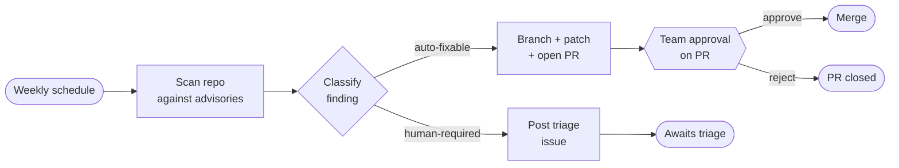
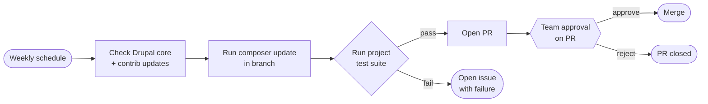

# Upsun Dispatch — future scope

This is what comes after V1. The long-term vision, the strategic test for whether the bet is live, and every specific capability deferred from V1 with rationale. V1 itself is documented in [v1-alignment.md](v1-alignment.md).

Items are grouped by theme. Within each theme, items are roughly ordered from near-term (first iterations after V1 ships) to longer-term (still being shaped). The roadmap is not a contract — this is a shopping list of capabilities we know we want, in roughly the order we'd build them if all priorities held equal.

---

## Mission

Upsun Dispatch is the platform for governed collaboration between AI agents and software teams. Agents handle the volume work. Humans make the decisions that matter. The platform routes those decisions to the right people at the right time, and keeps a record of every one of these activities.

## Vision

Engineering organizations should ship at agent speed as whole teams. Engineers, managers, product, design, and security all operate in the same flow. They stay in control of what reaches production: what it cost, who approved it, what the agent was trying to do. The trail of those decisions tells the whole story of what shipped and why.

## The core bet

Most products in this space put the agent at the center: assign it work, get a result, hope it's good. Dispatch puts the workflow at the center. A workflow has a clear goal, multiple steps where each composes humans, agents or both, each gate with the routing rule that makes sense, and the whole chain from trigger to merge is recorded. That structural bet survives every change in the underlying model or implementation.

## How we ship

We launch V1 and ship in small iterations against real usage. No Beta, no GA, no big-bang relaunch. After the June milestone we plan to deliver continuously with goals defined on a sprint basis. If there's a need to define a scope for other milestones, additional files will be added.

---

## Workflow library

V1 ships PR Review and Issue to PR. The rest of the library:

### Weekly CVE scan

Recurring schedule. Agent scans the repo against advisory feeds and the dependency tree. For each finding, classify as auto-fixable or human-required. Auto-fixables: branch, patch, open one PR per finding, gated by team approval. Human-required: post a structured triage issue, no gate.

### Weekly Drupal update

Recurring schedule. The wedge into existing Upsun customers. Agent checks Drupal core and contrib modules for updates, branches, runs `composer update`, executes the project's test suite. On pass, opens a PR for team approval. On fail, opens an issue with the failure trace.

### Custom and user-authored workflows

Once the engine is proven on first-party templates, expose authoring. Customers can build their own workflows on top of the same engine, same gates, same audit shape.

### Template editing

Customers can fork shipped templates and customize the prompts, gate placement, and step composition.

### Visual workflow builder

On hold until evidence the EM persona wants one. The V1 read-only template visualization is the seed.

### Workflow marketplace

Third-party templates published by partners. Same engine, same governance, same audit shape.

---

## Organizational depth

V1 auto-creates one Org, one Workspace, and one Team at signup, with no API/UI/CLI to create additional ones. The data model is full Org → Workspace → Team → Workflow as designed. The iterations that lift the lock:

- **Multi-workspace.** API, UI, and CLI to create additional workspaces inside an Org. Per-workspace integrations and secrets that override Org defaults.
- **Multi-team.** Multiple teams per Org, each attachable to one or more workspaces.
- **Multi-org.** Users belonging to multiple Orgs and switching between them.
- **Role granularity.** Beyond Owner / Member, surface roles for security reviewers, billing admins, observers.

---

## Trust and autonomy

The autonomy dial is wired in the V1 data model and feeds on the JSONL capture from day one. The iterations that expose it:

- **Autonomy dial in the UI.** Per workflow, per workspace, per Org — a human-decided autonomy level settable at any level of the hierarchy.
- **Evidence panel.** Track record per agent and per workflow: approval history, production incidents, test pass rates. The dial decision is informed by this evidence rather than vibes.
- **Automatic gate bypass.** Runs with high confidence and low risk skip gates without losing the audit trail. The agent flags its own uncertainty; the platform decides whether to escalate.
- **Continuous improvement loop.** Workflows and agents tune over time on the captured JSONL. Prompt drift, failure patterns, gate-skip thresholds adjusted automatically with human review.
- **Per-tenant and per-workflow agent identities.** V1 ships one shared `upsun-dispatch` GitHub identity. Future iterations split identity per workflow or per tenant for stronger audit isolation.

---

## Approval shapes

V1 ships single-stage approval gates with any-of-attached-team routing (first authorized decision wins). Iterations:

- **Multi-stage approval gates.** Multiple gates per workflow with different rules per gate.
- **Role-based routing.** Different roles approve different gates — security at the security gate, product at the spec gate, EM at the merge gate.
- **Threshold approvals.** N-of-M (e.g., 2 of 4 reviewers), all-of (every assigned reviewer required), conditional on diff size or risk classification.

---

## Context aggregation

V1 ships GitHub-only context (diff, linked issue, reviewer history). The iterations that broaden the context bundle:

- **Slack.** Threads, channels, DMs as context for the agent before code generation.
- **Linear and Jira.** Tickets, comments, linked issues, project goals.
- **Upsun.** Deployment history, environment state, observability data.
- **Blackfire.** Performance traces fed into the agent's reasoning.
- **Design docs and ADRs.** From Confluence, Notion, or repo-resident docs.

The pre-coding context bundle is the foundation. Each integration extends what the agent sees before writing a line of code.

---

## Integration breadth

V1 ships GitHub-only. Iterations:

- **GitLab.** Named fast-follow. Adapter behind the same Integrations layer interface.
- **Bitbucket.** Following GitLab.
- **Linear and Jira as ticket sources** (separate from context). Trigger workflows from ticket events.
- **Slack as an approval surface.** Approve in Slack via interactive components.
- **Microsoft Teams, email.** Approval and notification fan-out.

The integration list will grow.

---

## Model flexibility

V1 ships Anthropic and OpenAI via BYO key. Iterations:

- **Per-provider BYO.** Gemini, Mistral, open-source via Hugging Face, regional providers.
- **Model routing.** Smaller models for simple tasks, larger models for complex coding. Cost-and-quality optimization behind a "smart routing" mode.
- **Private LLM deployment.** Per-customer isolated model instances (the "client brain" pattern surfaced in the Yann Karl discovery interview). Higher tier.
- **Regional hosting.** Localized inference for regulated industries. Higher tier.

---

## Cost and billing

V1 records per-run, per-workflow, and per-org cost. The JSONL telemetry ledger is wired from day one. Iterations:

- **Billing production.** First paid month after launch (target July) bills against the ledger.
- **Per-workspace cost panel.** Cost visibility at the workspace level for buyers who care about team-level spend.
- **Cost prediction.** Pre-flight estimate of run cost before dispatch.
- **Budget alerts.** Slack and email alerts on budget thresholds (50 / 75 / 90% of daily Org spend).
- **Procurement-friendly export.** Cost data exportable in the formats finance and procurement teams expect.

---

## Operations

V1 ships a single-region deployment. Iterations:

- **Multi-region.** Deployments in EU and US for data-residency compliance.
- **Managed deployments and preview-environment workflows.** Agent-created preview environments alongside PR Review. Beta-track, not Alpha.
- **Self-hosted Dispatch.** Customer-VPC deployments for regulated industries.
- **Observability.** OTel ops metrics, audit-grade reconciliation, third-party SIEM integration.

---

## Notifications

V1 has no notifications system. Iterations:

- **Slack, Teams, email.** Configurable per workspace.
- **Webhook fan-out.** Send run events to customer-defined endpoints.

---

## Workspace navigation

V1 keeps the workspace navigation simple. Iterations:

- **Grouped-by-type view on the Workflows list (S-09).** V1 ships the Workflows list as a single flat list of every workflow instance. A second view — instances grouped by workflow type, with each type as a collapsible parent section — is deferred. Useful once the catalog grows (templates library, custom workflows) and a workspace can plausibly hold dozens of instances. Surfaces as a toggle on S-09 when reintroduced.

