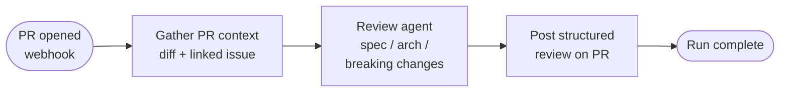
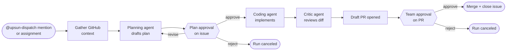
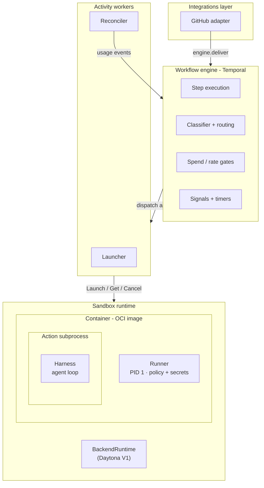
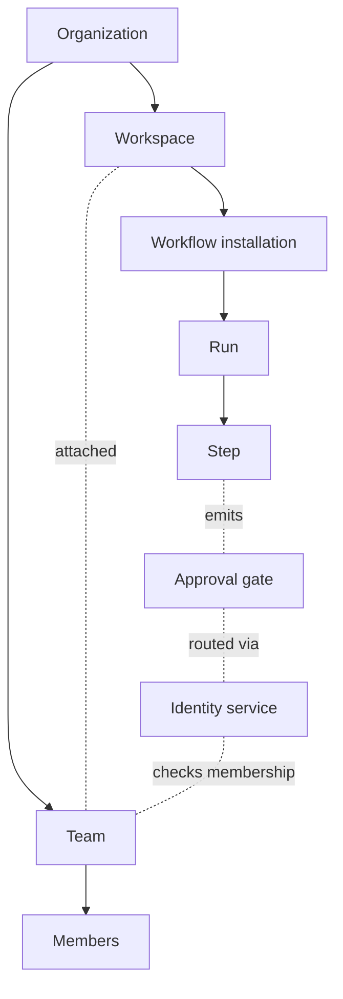
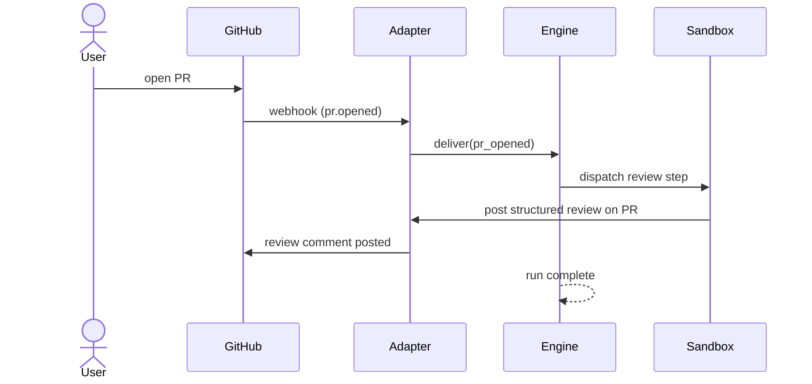
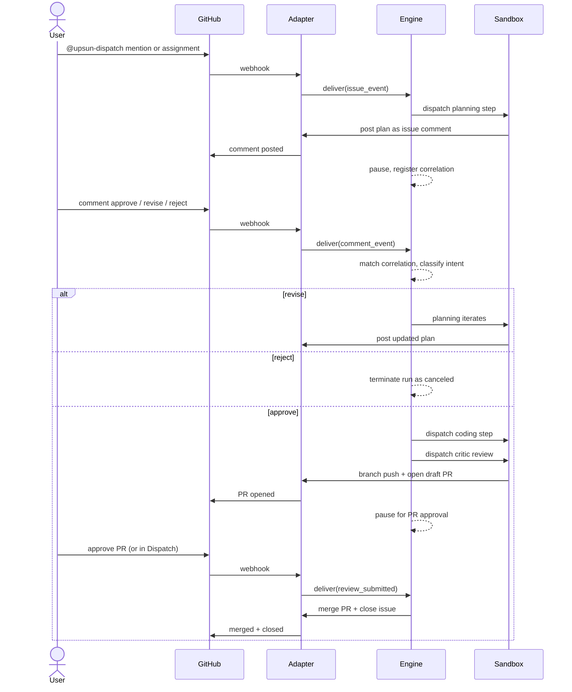

# Upsun Dispatch V1 — end-of-June scope

This document is what V1 ships for end of June. Everything beyond that scope — the longer-term vision and the specific capabilities deferred — lives in [future-scope.md](future-scope.md).

## 1. Mission, vision, solution

We are building **Upsun Dispatch**.

### 1.1 Mission

Upsun Dispatch is the platform for governed collaboration between AI agents and software teams. Agents handle the volume work. Humans make the decisions that matter. The platform routes those decisions to the right people at the right time, and keeps a record of every one of these activities.

### 1.2 Vision

Engineering organizations should ship at agent speed as whole teams. Engineers, managers, product, design, and security all operate in the same flow. They stay in control of what reaches production: what it cost, who approved it, what the agent was trying to do. The trail of those decisions tells the whole story of what shipped and why.

### 1.3 The core bet: workflow is the unit of governance

Most products in this space put the agent at the center: assign it work, get a result, hope it is good. Dispatch puts the **workflow** at the center. A workflow has a clear goal and is a multi-step process where each step involves humans, agents or both, where each gate has the routing rule that makes sense, and where the whole chain from trigger to merge is recorded.

This is the structural bet that survives every change in the underlying model or implementation.

The five other strategic bets all extend this one:

- **The team operates Dispatch as peers**, not just the engineer who set it up. Approval views are designed for the team's job, not as viewer add-ons to a developer tool.
- **Humans grant autonomy**, informed by evidence. Agentic trust-level control is a dial, not a switch. V1 captures every interaction as JSONL so workflows and agents can be improved over time. Later iterations expose the dial; long-term, runs with high confidence and low risk can skip gates automatically while keeping the full audit trail.
- **Working patterns, not frameworks**. A framework hands a team primitives and tells them to build their own workflow. We hand them a workflow that already works, with the opinionated bits (prompts, review steps, gate placement) all decided.
- **Cost can be monitored at every granularity (FinOps)** the buyer cares about (per run, per workflow, per workspace, per org). Per-run, per-workflow, and per-org land in V1.
- **Pre-coding context building.** The agent works from the same context the team has. V1 ships GitHub-only context; multi-source aggregation (Slack, Linear, Jira, Upsun, Blackfire, etc.) ships as iterations.

### 1.4 Why now

Five things are happening at once in engineering organizations that already adopted AI coding tools, and no platform addresses them together.

**The SDLC bottleneck moved.** Individuals are faster in code production than they were a year ago. Some organizations are shipping faster, most aren't. Code generation is becoming a commodity; review, test, security, and release did not. The bottleneck moved.

**Dark code.** Code reaches production with no traceable author, no traceable intent, no traceable approval. It passes tests. It merges. The reviewer was already drowning in agent PRs. Six months later it breaks and nobody can reconstruct what the agent was trying to do. Organizations need a way to enforce compliance directives.

**Agent unreliability without audit.** Agent output looks confident but may be completely wrong or outdated. Most teams have no decision audit, so risk accumulates invisibly. Workflows and agents need some continuous improvement loops based on human feedback and directives.

**No shared playbook.** Two engineers on the same team run different AI workflows, with different prompts, different rules files, different opinions on which model to fire at which problem. New hires inherit nothing. Knowledge transfer is anecdotal.

**Cost opacity.** Token spend is non-deterministic and unbounded. A workflow that cost $0.50 yesterday costs $5 today because the model retried, the prompt grew, or the agent explored. Finance has no per-workflow (task) budget. Engineering has no way to say "stop if this exceeds $X." Teams need to observe and fix flaky and volatile token consumption.

The closest thing the market has to a coherent answer today is GitHub Copilot Cloud Agent, which ships an issue-to-PR flow with approvals routed through per-repo `CODEOWNERS` files. That is one slice of one workflow with one form of routing. Dispatch is positioned to be the larger platform around agents: the workflow as the primitive, the team as the approver pool, the audit trail as a first-class artifact.

### 1.5 The strategic test for V1

V1 ships two workflows so the bet is tested on both shapes the engine has to serve.

PR Review is the no-gate shape: the agent does the work, posts a structured review, and the run completes. It tests whether the platform delivers value on a single high-volume webhook trigger, without any human approval ceremony.

Issue to PR is the two-gate shape: a plan-approval gate on the issue (iterative on revise feedback) and a team-approval gate on the draft PR. It tests whether named human gates, routed to a team and recorded with full audit detail, actually feel useful in practice — or whether they read as overhead.

The strategic test for V1: can a team set up Dispatch, run an issue all the way to a merged PR through both gates, and end with a fully traceable record their CTO would accept in a compliance review — quickly and with as little friction as possible? Can the same team, on the same setup, get a useful structured agent review on every PR opened on a connected repo? If both yes, the bet is live and the iteration roadmap (in [future-scope.md](future-scope.md)) has ground to stand on. If either no, the next iterations tighten around what we learned.

We launch V1. From there, we ship in small iterations against real usage. No Beta, no GA, no big-bang relaunch.

---

## 2. Feature set and user flow

### 2.1 The V1 product, one sentence

V1 ships **two workflows — PR Review and Issue to PR** — behind **one organization, one workspace, one team**, all auto-created at signup, and gives the user a single place where every run, decision, and cost is recorded.

### 2.2 What V1 ships

**An API and a UI built on it.** Independent of Upsun Cloud. The CLI will follow up right after.

**Two shipping workflows.** Both are opinionated and ready to install on a connected repo.

| Workflow | Trigger type | What it does |
|---|---|---|
| **PR Review** | Webhook (new PR) | When a PR is opened on a connected repo, an agent posts a structured adversarial review with spec compliance, architectural concerns, and breaking-change flags. No merge action; the agent's review is the artifact and the PR is now ready for human reviewers. |
| **Issue to PR** | User action (issue) | A user mentions `@upsun-dispatch` on an issue or assigns Dispatch as the issue assignee. The workflow gathers context, drafts a plan and posts it on the issue for approval, then on approval generates code and opens a draft PR. Two gates: plan-approval on the issue, team-approval on the PR. |

**One Org, one Workspace, one Team — auto-created at signup.** The full Org → Workspace → Team → Workflow hierarchy lives in the data model as designed. V1 simply does not expose API, UI, or CLI to create additional Orgs, Workspaces, or Teams. The new account lands with exactly one of each, named automatically. Anyone invited to the Team can approve workflow runs in the Workspace. Adding more workspaces, more teams, or a second org is a post-V1 iteration that lifts the lock without a data migration.

**Workspace dashboard.** Three primary views: in-flight runs, the approvals queue, and the recent-runs table. Each run has a detail page showing the trigger, the context bundle the agent saw, the agent's reasoning, the review findings, the diff (where applicable), the approval decision (where applicable), and the cost. The whole chain from trigger to result is reconstructable on one page and fully auditable.

**Governance, cost, and audit.**

- **Per-run cost** on every run page (tokens, model, time, total).
- **Per-workflow cost trends** on the workspace dashboard, with outlier flagging.
- **Decision audit**: every approval decision recorded with actor, timestamp, the diff at decision time, and a link back to the originating trigger.
- **Identity-separated agents.** Dispatch's agent acts under its own GitHub identity (`upsun-dispatch`), not the user's. For legal and compliance reasons, agentic actions are marked as co-authored between the agent and the human.
- **Spend gates** at the org level with hard caps: pending-to-dispatch and pre-action checks block runs that would exceed the budget.

**AI providers.** Anthropic and OpenAI via bring-your-own key. One BYO entry per provider at the Org level.

**Full data capture as JSONL.** Every interaction, prompt, response, decision, and lifecycle event is persisted as JSONL from day one. This data is the foundation for continuous improvement and for the future trust dial that lets high-confidence, low-risk runs skip gates without losing the audit trail. The dial and the improvement loop are later iterations; the data capture starts at V1 so we have the corpus when those iterations land.

### 2.3 What V1 deliberately does not ship

Each item is a real deferral with a known cost. Listed here so the team can point at the line when scope creeps. The full picture and rationale per item live in [future-scope.md](future-scope.md).

- **No workflows beyond PR Review and Issue to PR** (Weekly CVE scan and Weekly Drupal update later).
- **No multi-workspace, multi-team, or multi-org creation surfaces** (API, UI, or CLI to add more).
- **No custom or user-authored workflows.** The shipping workflows are first-party.
- **No visual workflow builder.** Read-only visualization only.
- **No template editing.** Customers install templates as shipped.
- **No multi-stage approval gates with role routing.**
- **No autonomy dial in the UI.** Wired in the data model so later iterations can expose it; not exposed at V1.
- **No automatic gate bypass.** All gates run synchronously in V1.
- **No multi-source context aggregation.** GitHub-only context (diff, linked issue, reviewer history). Slack, Linear, Jira, Upsun, Blackfire later.
- **No Linear, Jira, GitLab, or Bitbucket integration.** GitHub-only. GitLab is the named fast-follow.
- **No bring-your-own model beyond Anthropic and OpenAI.** Per-provider BYO and private LLMs are later.
- **No multi-region.**
- **No managed deployments or preview-environment workflows.**
- **No marketplace or third-party templates.**
- **No threshold approvals** (n-of-m, all-of). Any-of within an attached team; first authorized decision wins.
- **No notifications systems** to Slack, Teams, or email.
- **No billing in V1.** Telemetry ledger is wired so the first paid month after launch can bill against it.

### 2.4 The end-to-end user flow

This is the path from "signed-up account" to "first merged PR" (Issue to PR) or "first agent review" (PR Review). Steps 1 to 4 are one-time setup; step 5 onward is the recurring loop.

1. **Signup.** The user creates an account. The system auto-creates an Organization, a Workspace, and a Team that the user owns, all auto-named. The user lands on an empty workspace dashboard.
2. **GitHub install.** The user clicks "Connect GitHub" and installs the Upsun Dispatch GitHub App at the GitHub Org scope. Dispatch can now read and write to the repos selected at install time. These repos are added to the workspace.
3. **Workflow install.** The user installs PR Review and Issue to PR on the selected repos. Most users start with Issue to PR.
4. **Invite teammates.** The user invites colleagues to the Team. Anyone on the Team with GitHub repo write access can approve workflow runs (Issue to PR has two gates; PR Review has no approval gate).
5. **Trigger.** Issue to PR runs when a user mentions `@upsun-dispatch` on an issue or assigns Dispatch as the issue assignee. PR Review runs when a PR is opened on a connected repo. Runs can also be triggered manually.
6. **Plan (Issue to PR only).** The planning agent gathers context and drafts a plan, posts it as a comment on the issue, and pauses. The team reviews the plan and replies approve, reject, or revise with feedback. On revise, the agent iterates and posts an updated plan. Loop continues until approved, rejected, or max iterations hit.
7. **Implementation.** On plan approval (Issue to PR) or directly on webhook (PR Review), the agent does its work. The user can watch in real time on the run page: trigger, context bundle, reasoning trace, review findings, draft output. Cost ticks up live.
8. **Approval (Issue to PR only).** The workflow pauses at the team-approval gate on the draft PR. Team members see the pending approval as a structured comment on the GitHub PR with an "Approve in Dispatch" link, and in the Dispatch approvals queue. Anyone authorized can approve. First-approver wins.
9. **Merge and close (Issue to PR) or run complete (PR Review).** On Issue-to-PR approval, Dispatch merges the PR and the originating issue auto-closes through the PR's `Closes #` reference. A final summary comment posts on both issue and PR. For PR Review, no merge action — the structured review on the PR is the artifact. The run page is now a permanent record of the trigger, the plan, the implementation, the review, and the decision.

A rejection ends the run cleanly. The user manually starts a new one if they want to try again with different inputs.

### 2.5 The workflows in detail

**PR Review.** Trigger: webhook on `pull_request.opened`. Steps: gather PR context (diff + linked issue + reviewer history) → review agent runs spec-compliance, architecture, and breaking-change checks → posts structured review as a PR comment → no merge action; the PR is now ready for human reviewers with the agent's findings as a starting point.

**Issue to PR.** Trigger: `@upsun-dispatch` mention on an issue or Dispatch assigned as the issue assignee. Steps: gather GitHub context (issue + linked references + files) → planning agent drafts a structured plan (a candidate format is OpenSpec; engineering picks the final shape) and posts it as a comment on the issue → **plan approval gate on the issue** (approve, reject, or revise with feedback; the planning step iterates on revisions until approved, rejected, or max iterations exhausted) → coding agent implements against the approved plan → critic agent runs adversarial review against the diff → draft PR opened → **team approval gate on the PR** → merge and close.

Two approval shapes in one workflow. The plan gate is iterative (the planning action loops on revise feedback); the PR gate is binary and first-approver-wins. The plan that gets approved is recorded with the run, so the team can later read what was decided and what was actually built side by side.

The two workflows share the same engine, approval semantics (where applicable), audit record, and cost reporting. They differ only in trigger and step composition. That is the bet: workflows as the unit, parameterized for the job.

---

## 3. Architecture

The Dispatch project will be maintained as a monorepo on `lab.plat.farm`.

The main programming language will be Go. We will use Python and TypeScript as needed on some components. Upsunners are expected to leverage coding agents and AI tooling as much as they can (Opus 4.7 or GPT-5.5 recommended).

### 3.1 Layer model

Four cooperating layers, each replaceable independently. The boundary contract makes the independence real.

**Integrations layer.** Adapters per integration. V1 ships one (GitHub). Each adapter owns signature verification, actor permission checks, payload normalization into engine events, and outbound result publishing. The engine never imports provider-specific code.

**Workflow engine.** Temporal-based. Owns step execution, classifier and routing, durable state and signals, and spend/rate gates. The classifier interprets natural-language intent on inbound events (approve, "let's do it differently", "nevermind") so the routing verbs (`start`, `cancel`, `restart`, `coalesce`, `ignore`) work without pre-enumerated phrasings.

**Activity workers.** Launcher and reconciler. Claim activities from Temporal, submit them to the sandbox runtime via the `BackendRuntime` interface, poll for state, forward heartbeats back to Temporal. The reconciler also writes lifecycle events as the metering source for cost tracking.

**Sandbox runtime.** Container execution behind the `BackendRuntime` interface. V1 default is Daytona. Later iterations swap sandbox runtimes without touching the layers above.

Inside each container is a fifth concern that does not get its own layer number: the **in-container layer**, with two halves. The **runner** (PID 1) enforces capability allowlists, command-pattern filtering, output validation, and secret access. The **harness** (the agent loop inside the action subprocess — Pydantic AI in V1) handles LLM calls, tool dispatch, and in-loop cancel. Both ship as part of the OCI stack image, so they survive sandbox runtime swaps.

### 3.2 Main entities

Eight entities make V1. The first four are organizational; the next four are runtime.

- **Organization.** Top container, one per company. Auto-created at signup. Holds default integrations, secrets, tokens, and billing.
- **Workspace.** Unit inside the org with its own dashboard. Auto-created at signup. Can override org-level integrations and secrets. Privacy boundary for in-flight work.
- **Team.** Group of humans defined at the org. Auto-created at signup. Acts as an approver pool for workflow runs in the workspace it is attached to.
- **Workflow installation.** Instance of a template (PR Review or Issue to PR) bound to a specific GitHub repo inside the workspace.

- **Run.** One execution of a workflow against a specific trigger. Composite ID: `<entity>:<epoch>` (for example `acme/repo/pull/123:2`). Idempotency hinges on this key.
- **Step.** One action invocation inside a run. Has its own lifecycle, retries, timeout, and cost.
- **Approval.** Gate state captured against a step. Records actor, decision, decision time, and the diff or plan at decision time. (Issue to PR has two gates; PR Review has no approval gate.)
- **Identity.** Opaque principal references resolved by a separate identity service.

The hierarchy is one-deep at V1 (exactly one Org, one Workspace, one Team), but the data model is the full shape so the multi-tenancy iterations in [future-scope.md §organizational depth](future-scope.md#organizational-depth) lift the lock without migrations.

### 3.3 End-to-end sequences

**PR Review.** No approval gate, no merge action. The agent's review is the artifact. Run completes when the review comment posts.

**Issue to PR.** Two gates: plan approval on the issue, team approval on the PR. The plan loop is the iterative `planning` action; the engine pauses the run, registers a correlation handle, and resumes when a matching comment arrives.

### 3.4 Sandbox runtime and orchestration

The sandbox runtime runs containers; the orchestrator decides when.

**Sandbox runtime: Daytona, to be confirmed.** V1 default is Daytona. Foundation containers were evaluated and ruled out: the per-project container model means idle cost dominates for sparse, bursty workloads. Cloudflare Sandbox is cheaper only below ~62% utilization, and the integration tax (Worker shim plus Durable Object identity) eats the saving. Two pre-launch gates remain: confirm Daytona quota with the uplift path for the 4 vCPU / 8 GB baseline, and run a Daytona-vs-E2B benchmark on 20 to 50 representative jobs. The `BackendRuntime` interface (`Launch`, `Get`, `Cancel`, `Cleanup`) is the way to swap to E2B for fan-out, to Fargate for cost-at-scale, or to a self-hosted stack later is an adapter change, not a re-platform.

**Orchestration: Temporal, selected for V1.** Temporal is the V1 workflow orchestrator. Temporal handles as primitives instead of as engineering we would have to build.

1. **Long-running waits with no worker held.** A plan-approval gate can sit open for days. Naive orchestration either holds a worker (wasteful) or polls (fragile). Temporal pauses the workflow as durable state; no worker is held, the wait is free.
2. **Signal-based resumption.** When a human approves a plan or a PR, the engine signals the paused workflow and it resumes from exactly where it stopped, with full state intact. The signal mechanism is native.
3. **Iterative actions as child workflows.** The `planning`, `coding`, and `conversation` actions each loop with explicit stop criteria (approve, reject, max iterations, timeout). Each is implemented as a Temporal child workflow with its own timer, signals, and durable state. The parent workflow does not need to know how the loop is structured.
4. **Crash recovery and horizontal scaling.** Workers can restart, scale up, or scale down without losing in-flight work. Temporal replays event history to restore state. We get this for free instead of building it.

**How we map our architecture to Temporal.**

| Our concept | Temporal concept |
|---|---|
| Workflow run | Workflow execution |
| Step | Activity |
| Iterative action (planning, coding, conversation) | Child workflow |
| Plan or PR approval gate | Signal + timer |
| Run lease and heartbeat | Activity heartbeat |
| Restart at next epoch | New workflow execution; prior artifacts in blob storage |
| Filesystem affinity (clone + implement + commit) | Session pinning to a worker |

**What Temporal does not own.** Action code (lives in OCI images; the harness invokes it). Cost and rate gates (engine logic on top of Temporal, not Temporal-native). Identity resolution (separate identity service). Sandbox execution (a `BackendRuntime` call inside an activity, not a Temporal primitive). Temporal is the workflow runtime and nothing more; the agent runtime, the integration adapters, and the policy gates are ours.

**Cost shape at V1 scale.** 100 teams × 5 to 20 runs/day puts Daytona or E2B around $1k to $6k per month against Fargate. The cost risk is not sandbox runtime price; it is unbounded growth without billing. Quotas are the shield: 2 concurrent per tenant (5 by allowlist), 20 runs per day, 45-minute wall-clock cap on code-gen, 100-turn agent loop cap. Org-level spend gates fire at two checkpoints: pending-to-dispatch (before a new run starts) and pre-action (before each step within a run). Mid-run exhaustion fails the run as `budget_exhausted`.

### 3.5 Secrets, identity, egress

**Secret delivery.** KEK/DEK envelope, five components: `SecretCatalog` (declares what each step needs), `SecretValueStore` (encrypted blob), `KeyService` (the KEK), `WorkloadIdentity` (binds a running container to the secrets it is allowed to redeem), `SecretBroker` (the late-injection mechanism: tmpfs or local socket, no long-lived environment variables). Plaintext credentials never sit in container env. Every redemption is recorded in the audit log with timestamp, actor, and secret class.

**Agent identity.** Dispatch's agents act under their own GitHub identity (`upsun-dispatch`), distinct from the operator's. The audit trail never collapses to "the user did it." V1 ships a single shared agent identity; per-workflow or per-tenant agent identities are a later iteration.

**Identity contract.** The workflow engine never knows who any human is by name. Names in `assignees:` and approval routing are opaque principal references; an external identity service answers three calls: `resolve(ref)` returns the list of identities to notify, `can_decide(actor, refs)` authorizes a decision event, `display_name(id)` provides the audit-log label. V1 integrates this contract with Upsun's existing org/team components.

---

## 4. Timelines

### 4.1 V1 launch target

**End of June 2026.** That is the date the team is now building toward. The model is a rolling launch, so V1 going live is a quiet flip rather than a marketing public unveiling.

Early Design Partners will be invited to join and evaluate the solution. A waitlist system can be added to manually approve accounts until billing is integrated.

The exact implementation path (milestone dates, sequencing across the workstreams) is being worked through with the team and is not in scope for this document. What is in scope here is the architectural critical path.

### 4.2 Critical path and dependencies

Five things are on the critical path. Any one of them slipping is a launch slip.

- **Sandbox runtime adapter (Daytona) and the `BackendRuntime` interface.** Blocks both workflows. Daytona quota confirmation and the Daytona-vs-E2B benchmark are pre-conditions for build start.
- **Workflow engine core + GitHub integration adapter.** Blocks both workflows. The engine has to handle webhook event delivery, the review step type, the `planning` action's iterative loop, the standalone `approval` action, and the `pr_opened` / `pr_drafted` / `review_submitted` event types from the start.
- **Harness minimum security floor.** Blocks code-writing work (Issue to PR) and required for PR Review's sandbox isolation. Capability allowlists, command-pattern filtering, in-loop cancel, output validation, secret-delivery gates.
- **Identity service integration.** Blocks the team-approval flow on Issue to PR. The engine has the three-call contract; the integration with Upsun's existing org/team components has no clear owner today.
- **UI.** A user interface to give a general overview of workflows, workflow runs, setup, and integrations.

Two non-blocking dependencies that still need to land:

- **Cost gates and per-tenant quotas.** Required for V1's open-signup posture without billing. Pending-to-dispatch and pre-action checkpoints, hard caps, alert thresholds at 50 / 75 / 90% of daily org spend.
- **Telemetry ledger.** Required for the first paid month after launch (billing system comes online July) but not for the launch itself.
